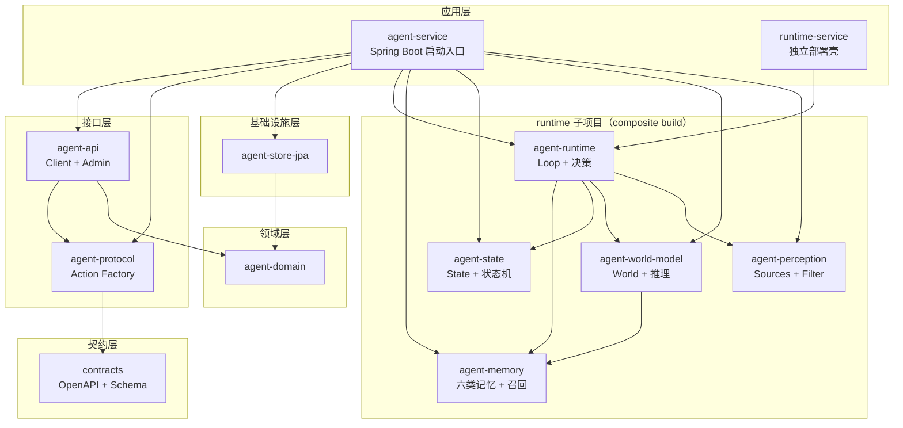
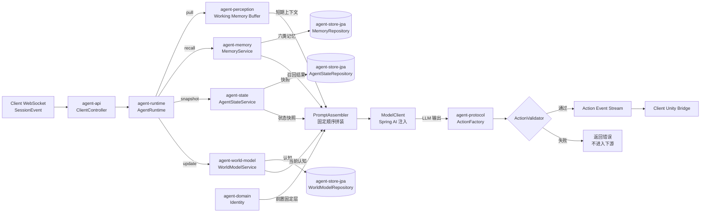
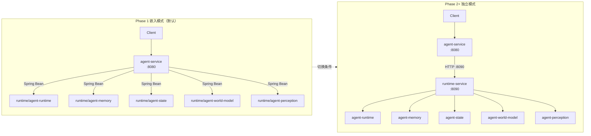

# Agent Service 工程架构（Gradle 模块拆分）

> 上位架构：[项目整体架构设计](项目整体架构设计.md)
> 服务端设计：[AgentService架构设计](AgentService架构设计.md)
> 契约域：[Contracts 架构设计](Contracts架构设计.md)
> 客户端：[客户端架构设计](客户端架构设计.md)
> 管理后台：[管理后台架构设计](管理后台架构设计.md)
> 基础设施：[基础设施架构设计](基础设施架构设计.md)
> 身体层：[Unity身体架构设计](Unity身体架构设计.md)
> 产品目标：[产品愿景与总纲](../product/产品愿景与总纲.md)

## 文档导览（三张图先看）

本文档涉及 13 个 Gradle 模块与两套运行时模式，正文按设计原则、依赖矩阵、Gradle 配置、启动入口、测试、演进的顺序展开。为了让读者在进入正文前先建立心智模型，下面三张图覆盖三个最常被问到的视角：

1. **模块依赖拓扑**：13 个模块分 6 层，谁依赖谁、运行时子项目怎么挂进主服务。
2. **请求处理链路**：一次 Session 事件从 WebSocket 进入到 Action Protocol 产出的完整数据流。
3. **嵌入 vs 独立两种模式**：Phase 1 单进程（Bean 调用）与 Phase 2+ 多进程（HTTP 调用）的部署差异。

### 图 1：模块依赖拓扑



**图注**：13 模块分 6 层（应用 / 接口 / 契约 / 基础设施 / 领域 / runtime 核心）。runtime 子项目通过 `includeBuild("runtime")` 引用，可独立 clone、单独发布。详细分层原则见 §1。

### 图 2：请求处理链路



**图注**：对应 [AgentService架构设计 §9 Runtime 核心](AgentService架构设计.md) 的运行链路。Runtime 先拉取四份上下文（Perception / Memory / State / World Model），再按固定顺序拼装 Prompt，调用 Model 拿到 LLM 输出，最后走 ActionFactory + ActionValidator 校验后才进入下游 Action Event Stream。

### 图 3：嵌入 vs 独立两种运行模式



**图注**：嵌入模式（Phase 1 默认）单进程，agent-service 通过 Spring Bean 调用 runtime 核心；独立模式（Phase 2+）双进程，agent-service 通过 HTTP 调用 runtime-service（:8090）的 REST API。通过 `@ConditionalOnProperty(name = "runtime.mode")` 切换，**不改业务代码**。两种模式启动细节见 §5。

---

## 0. 文档目的与读者

**目的**：把 [AgentService架构设计](AgentService架构设计.md) 中确定的子系统、协议边界、运行时拓扑，落实为 Gradle 多模块仓库的**具体目录、依赖矩阵、构建配置与启动入口**，供工程师直接落地。

**读者**：

- Phase 1 后端工程师：按本文档建仓、拆模块、跑通嵌入模式启动。
- Phase 2+ 平台工程师：按本文档切换"runtime 独立部署"，接入新的 Perception / Memory 实现。
- 跨端工程师：通过本文档理解服务端模块边界，确认哪些产物可被客户端 / 管理后台消费。

**非目的**：本文档不重复 [AgentService架构设计](AgentService架构设计.md) 中的运行链路、协议定义、子系统职责——只回答"代码怎么放、模块怎么拆、构建怎么配"。

---

## 1. 设计总览

### 1.1 拆分原则

| 原则 | 含义 |
|---|---|
| **依赖单向** | `service → api / protocol → runtime → domain ← store`；任何反向依赖都视为破坏边界 |
| **领域接口与实现分离** | `agent-domain` 只定义接口，存储实现放在 `agent-store-*` |
| **contracts 不反向依赖** | contracts 是纯 OpenAPI / Schema，与 Kotlin / Spring / Spring AI 零耦合 |
| **protocol 独立** | Action Protocol 构造与校验独立成模块，禁止 runtime 直接拼字符串 |
| **runtime 完全框架无关** | `runtime/` 子项目不引入 `spring-boot-starter-*`、JPA、Web，单测不依赖 Spring Context |
| **runtime 可独立运行** | 通过 `runtime-service` 模块提供 REST API，主服务可走"HTTP 调用"而非"进程内 Bean" |
| **Perception SPI 化** | Phase 2+ 新增摄像头、麦克风、智能家居只需新增实现模块，不改核心 |

### 1.2 模块地图（13 个）

```
ayane-agent-service/                                 ← 主服务子项目
├── settings.gradle.kts                              ← 顶层 include + includeBuild("runtime")
├── build.gradle.kts                                  ← root：插件版本、Java toolchain 21
├── gradle/libs.versions.toml                        ← 版本目录
│
├── agent-service/                                   ← [应用层] 主进程 HTTP/WS 入口
├── agent-api/                                       ← [接口层] Client API + Admin API
├── contracts/                                       ← [契约层] OpenAPI + Schema
├── agent-domain/                                    ← [领域层] 纯 Kotlin 领域模型 + 仓储接口
├── agent-store-jpa/                                 ← [基础设施层] JPA 实现
├── agent-protocol/                                  ← [协议层] Action Protocol 构造 + 校验
│
└── runtime/                                         ← ★ runtime 子项目（composite build）
    ├── settings.gradle.kts
    ├── build.gradle.kts
    ├── agent-runtime/                              ← [核心层] Loop + 决策 + Prompt 拼装
    ├── agent-memory/                               ← [核心层] 六类记忆 + 召回
    ├── agent-state/                                ← [核心层] State + 状态机
    ├── agent-world-model/                         ← [核心层] World Model + 推理
    ├── agent-perception/                          ← [感知层] Sources + Filter + Buffer
    └── runtime-service/                           ← ★ 可独立部署的 runtime REST 壳
```

### 1.3 运行时两种模式

| 模式 | 触发方式 | runtime-service | 适用阶段 |
|---|---|---|---|
| **嵌入模式** | `agent-service` 直接依赖 `runtime:agent-runtime`，通过 Spring Bean 调用 | 不启动 | Phase 1（推荐起步） |
| **独立模式** | `agent-service` 通过 HTTP 客户端调用 `runtime-service` 的 REST API | `gradle :runtime:runtime-service:bootRun` | Phase 2+（多团队、水平扩展） |

两种模式通过 Gradle Profile 切换，不改业务代码。

---

## 2. 依赖矩阵

### 2.1 主服务模块依赖

| 模块 | 依赖 |
|---|---|
| `agent-service` | `agent-api`, `agent-domain`, `agent-store-jpa`, `agent-protocol`, `runtime:agent-runtime`（嵌入模式） |
| `agent-api` | `agent-domain`, `agent-protocol`, `contracts` |
| `agent-domain` | （无业务依赖） |
| `agent-store-jpa` | `agent-domain` |
| `agent-protocol` | `contracts` |
| `contracts` | （无业务依赖，纯 Schema） |

### 2.2 runtime 子项目依赖

| 模块 | 依赖 |
|---|---|
| `agent-runtime` | `agent-domain`, `agent-protocol`, `runtime:agent-memory`, `runtime:agent-state`, `runtime:agent-world-model`, `runtime:agent-perception` |
| `agent-memory` | `agent-domain` |
| `agent-state` | `agent-domain` |
| `agent-world-model` | `agent-domain`, `runtime:agent-memory` |
| `agent-perception` | `agent-domain` |
| `runtime-service` | `runtime:agent-runtime`, Spring Web |

**关键约束**：`runtime/` 下任何模块**禁止**依赖 `spring-boot-starter-*`、JPA、Web、JSON 序列化框架——单测使用纯 Kotlin JUnit 5 + kotlinx-coroutines-test。

---

## 3. 模块边界详解

### 3.1 `agent-domain`（领域层）

**职责**：定义所有业务概念和持久化接口，无任何技术框架。

```kotlin
// 包结构
agent.domain.identity.AgentId
agent.domain.identity.Identity              // 人格、价值观、说话方式
agent.domain.identity.IdentityRepository    // 接口

agent.domain.memory.Memory                  // 六类记忆基类
agent.domain.memory.MemoryRepository

agent.domain.state.AgentState               // 心情、精力、亲密度、孤独感
agent.domain.state.AgentStateRepository

agent.domain.world.WorldModel
agent.domain.world.WorldModelRepository

agent.domain.event.PerceptionEvent          // ClockSignal / SessionSignal / ClientSignal
agent.domain.event.SessionEvent
```

**对外接口示例**：

```kotlin
interface IdentityRepository {
    suspend fun findById(id: AgentId): Identity?
    suspend fun save(identity: Identity): Identity
}

interface MemoryRepository {
    suspend fun recall(agentId: AgentId, query: MemoryQuery, limit: Int): List<Memory>
    suspend fun store(agentId: AgentId, memory: Memory): Memory
}
```

**依赖**：`kotlinx-coroutines-core`（用于 `suspend`），无 Spring / JPA。

### 3.2 `agent-store-jpa`（基础设施层）

**职责**：实现 `agent-domain` 里的 Repository 接口。

**包结构**：

```kotlin
agent.store.jpa.identity.JpaIdentityRepository       : IdentityRepository
agent.store.jpa.memory.JpaMemoryRepository           : MemoryRepository
agent.store.jpa.state.JpaAgentStateRepository         : AgentStateRepository
agent.store.jpa.world.JpaWorldModelRepository         : WorldModelRepository
```

**关键约束**：

- 不暴露 `EntityManager` / `JpaRepository` 给上层
- 通过 `internal` 修饰符隐藏 JPA 实体
- 实体类放在 `agent.store.jpa.entity` 子包，DTO 与领域对象之间的映射放在 `agent.store.jpa.mapping`

### 3.3 `agent-protocol`（协议层）

**职责**：构造、校验、版本化 Agent Action Protocol。

**包结构**：

```kotlin
agent.protocol.action.SpeakAction
agent.protocol.action.EmotionAction
agent.protocol.action.GestureAction
agent.protocol.action.LookAtAction
agent.protocol.action.WaitAction
agent.protocol.action.ListenAction

agent.protocol.factory.ActionFactory              // 构造入口
agent.protocol.validator.ActionValidator          // JSON Schema 校验
agent.protocol.version.ProtocolVersion           // v1 / v2 ...
agent.protocol.migrator.ActionMigrator            // 跨版本迁移
```

**关键约束**：

- 不依赖 `agent-runtime` / `agent-api`
- 仅依赖 `contracts`（Schema 来源）
- runtime 必须通过 `ActionFactory.create(...)` 产出 Action，禁止运行时拼字符串

**对应文档**：[AgentService架构设计 §10 Embodiment Protocol](AgentService架构设计.md)

### 3.4 `contracts`（契约层）

**职责**：跨仓库 OpenAPI + WebSocket Schema 定义。

**内容**：

```yaml
# src/main/resources/openapi/ayane-client-api.yaml
# src/main/resources/openapi/ayane-admin-api.yaml
# src/main/resources/schema/perception-event.schema.json
# src/main/resources/schema/session-event.schema.json
# src/main/resources/schema/agent-action-protocol.schema.json
```

**生成产物**：通过 OpenAPI Generator Gradle Plugin 生成 DTO，输出到 `build/generated/`（不提交）。

**对应文档**：[Contracts 架构设计](Contracts架构设计.md)

### 3.5 `agent-api`（接口层）

**职责**：暴露 Client API（REST + WebSocket）和 Admin API。

**包结构**：

```kotlin
agent.api.client.ClientController                 // REST
agent.api.client.ClientWebSocketHandler           // WS
agent.api.client.dto.*                            // 由 contracts 生成

agent.api.admin.AdminController
agent.api.admin.dto.*
```

**关键约束**：

- Controller 不写业务逻辑，只做协议转换与请求分发
- 业务逻辑调用 `runtime:agent-runtime`（嵌入模式）或 HTTP 客户端（独立模式）

### 3.6 `agent-service`（应用层）

**职责**：Spring Boot 启动、装配、配置、Profile 管理。

**核心类**：

```kotlin
@SpringBootApplication
class AgentServiceApplication

@Configuration
class AgentServiceModuleConfig {
    // 嵌入模式：直接装配 runtime:agent-runtime 的 Bean
    // 独立模式：装配 RuntimeServiceClient（HTTP 客户端）
}
```

**Profile 配置**：

```yaml
# application.yml（嵌入模式，默认）
spring.profiles.active: embedded

# application-standalone.yml（独立模式）
runtime-service.url: http://localhost:8090
```

### 3.7 `runtime/`（核心决策子项目）

**职责**：所有"决策核心"逻辑，独立于主服务，可单独部署。

#### 3.7.1 `runtime:agent-runtime`（Loop 与决策）

**包结构**：

```kotlin
agent.runtime.core.AgentRuntime                   // 入口
agent.runtime.core.ReactiveLoop                   // 响应用户
agent.runtime.core.ProactiveLoop                  // 主动发起
agent.runtime.decision.PromptAssembler            // §9.3 固定顺序拼装
agent.runtime.decision.ModelClient                // 接口，运行时注入
agent.runtime.decision.DecisionEngine             // 决策编排
```

**关键约束**：

- `ModelClient` 是接口，由 `agent-service`（嵌入模式）或 `runtime-service`（独立模式）注入
- 不依赖 Spring AI 的具体实现

**对应文档**：[AgentService架构设计 §9 Runtime 核心](AgentService架构设计.md)

#### 3.7.2 `runtime:agent-memory`（六类记忆 + 召回）

**包结构**：

```kotlin
agent.runtime.memory.MemoryService                // 入口
agent.runtime.memory.episodic.EpisodicMemory
agent.runtime.memory.semantic.SemanticMemory
agent.runtime.memory.profile.UserProfile
agent.runtime.memory.emotional.EmotionalMemory
agent.runtime.memory.contextual.ContextualMemory
agent.runtime.memory.procedural.ProceduralMemory
agent.runtime.memory.recall.RecallStrategy        // 召回策略
```

**关键约束**：

- `MemoryRepository` 来自 `agent-domain`，本模块只做"召回编排"
- 召回策略可替换：Phase 1 用关键词，Phase 2+ 用向量

#### 3.7.3 `runtime:agent-state`（State + 状态机）

**包结构**：

```kotlin
agent.runtime.state.AgentStateService
agent.runtime.state.machine.StateMachine           // 状态机
agent.runtime.state.rule.StateRule                // 状态更新规则
agent.runtime.state.snapshot.StateSnapshot
```

**关键约束**：

- LLM **不能直接写 State**，必须经过 `StateRule` 校验
- 规则接口定义在 `agent-domain.state.rule`，实现在本模块

**对应文档**：[AgentService架构设计 §6 Agent State](AgentService架构设计.md)

#### 3.7.4 `runtime:agent-world-model`（World Model）

**包结构**：

```kotlin
agent.runtime.world.WorldModelService
agent.runtime.world.context.WorldContext          // 当前认知
agent.runtime.world.inference.WorldInference      // 推理引擎
agent.runtime.world.update.WorldUpdater
```

**关键约束**：

- Phase 1：WorldContext = 用户 + 时间 + 设备 + 最近会话摘要
- Phase 2+：升级为 Belief Store，存储持久化认知

**对应文档**：[AgentService架构设计 §8 World Model](AgentService架构设计.md)

#### 3.7.5 `runtime:agent-perception`（感知层）

**包结构**：

```kotlin
agent.runtime.perception.source.PerceptionSource    // SPI 接口
agent.runtime.perception.source.impl.ClockSignalSource
agent.runtime.perception.source.impl.SessionSignalSource
agent.runtime.perception.source.impl.ClientSignalSource
agent.runtime.perception.filter.AttentionFilter
agent.runtime.perception.buffer.WorkingMemoryBuffer
```

**关键约束**：

- 通过 `java.util.ServiceLoader` 注册 `PerceptionSource` 实现
- Phase 2+ 新增设备（摄像头、麦克风、智能家居）只需新增 `:runtime:agent-perception-camera` 模块，不改核心

**对应文档**：[AgentService架构设计 §7 Perception Layer](AgentService架构设计.md)

#### 3.7.6 `runtime:runtime-service`（独立部署壳）

**职责**：把 `runtime:agent-runtime` 暴露为 REST API，让 `agent-service` 通过 HTTP 调用。

**REST 端点**：

| 端点 | 方法 | 用途 |
|---|---|---|
| `/api/runtime/process` | POST | 处理感知事件 |
| `/api/runtime/memory/recall` | POST | 记忆召回 |
| `/api/runtime/state/snapshot` | GET | 状态快照 |
| `/api/runtime/world/update` | POST | 更新 World Model |
| `/api/runtime/action/factory` | POST | 构造 Action Protocol |
| `/api/runtime/health` | GET | 健康检查 |

**关键约束**：

- 仅做"协议转换"，业务逻辑全部委托给 `runtime:agent-runtime`
- Phase 1 不打包进最终镜像（嵌入模式）

---

## 4. Gradle 配置

### 4.1 顶层 `settings.gradle.kts`

```kotlin
rootProject.name = "ayane-agent-service"

pluginManagement {
    includeBuild("runtime")
}

include(
    "agent-service",
    "agent-api",
    "agent-domain",
    "agent-store-jpa",
    "agent-protocol",
    "contracts",
)

includeBuild("runtime")
```

### 4.2 顶层 `build.gradle.kts`

```kotlin
plugins {
    kotlin("jvm") version "2.0.21" apply false
    kotlin("plugin.spring") version "2.0.21" apply false
    kotlin("plugin.serialization") version "2.0.21" apply false
    springboot { version = "3.3.5" } apply false
    id("org.springframework.boot") version "3.3.5" apply false
    id("io.spring.dependency-management") version "1.1.6" apply false
}

subprojects {
    group = "com.ayane.agent"
    version = "0.1.0"

    java {
        toolchain {
            languageVersion.set(JavaLanguageVersion.of(21))
        }
    }

    kotlin {
        jvmToolchain(21)
    }
}
```

### 4.3 `gradle/libs.versions.toml`

```toml
[versions]
spring-boot = "3.3.5"
spring-ai = "1.0.0-M6"
kotlin = "2.0.21"
coroutines = "1.8.1"
serialization = "1.7.3"
jpa = "3.1.5"
h2 = "2.2.224"
postgres = "42.7.4"
jackson = "2.17.2"

[libraries]
# Spring Boot
spring-boot-starter-web = { module = "org.springframework.boot:spring-boot-starter-web" }
spring-boot-starter-websocket = { module = "org.springframework.boot:spring-boot-starter-websocket" }
spring-boot-starter-data-jpa = { module = "org.springframework.boot:spring-boot-starter-data-jpa" }
spring-boot-starter-actuator = { module = "org.springframework.boot:spring-boot-starter-actuator" }

# Spring AI
spring-ai-openai = { module = "org.springframework.ai:spring-ai-openai" }

# Kotlin
kotlinx-coroutines-core = { module = "org.jetbrains.kotlinx:kotlinx-coroutines-core", version.ref = "coroutines" }
kotlinx-coroutines-test = { module = "org.jetbrains.kotlinx:kotlinx-coroutines-test", version.ref = "coroutines" }
kotlinx-serialization-json = { module = "org.jetbrains.kotlinx:kotlinx-serialization-json", version.ref = "serialization" }

# Database
h2 = { module = "com.h2database:h2", version.ref = "h2" }
postgresql = { module = "org.postgresql:postgresql", version.ref = "postgres" }

# OpenAPI Generator
openapi-generator-gradle = { module = "org.openapi.generator:openapi-generator-gradle-plugin", version = "7.7.0" }

[bundles]
spring-web = ["spring-boot-starter-web", "spring-boot-starter-websocket", "spring-boot-starter-actuator"]
spring-data = ["spring-boot-starter-data-jpa"]
```

### 4.4 主服务各模块 `build.gradle.kts` 示例

#### `agent-service/build.gradle.kts`

```kotlin
plugins {
    id("org.springframework.boot")
    id("io.spring.dependency-management")
    kotlin("jvm")
    kotlin("plugin.spring")
}

dependencies {
    implementation(project(":agent-api"))
    implementation(project(":agent-domain"))
    implementation(project(":agent-store-jpa"))
    implementation(project(":agent-protocol"))

    // 嵌入模式：直接依赖 runtime 核心
    implementation(project(":runtime:agent-runtime"))
    implementation(project(":runtime:agent-memory"))
    implementation(project(":runtime:agent-state"))
    implementation(project(":runtime:agent-world-model"))
    implementation(project(":runtime:agent-perception"))

    implementation(libs.spring.boot.starter.web)
    implementation(libs.spring.boot.starter.actuator)

    runtimeOnly(libs.postgresql)
    runtimeOnly(libs.h2)
}
```

#### `agent-api/build.gradle.kts`

```kotlin
plugins {
    kotlin("jvm")
    kotlin("plugin.spring")
}

dependencies {
    implementation(project(":agent-domain"))
    implementation(project(":agent-protocol"))
    implementation(project(":contracts"))

    implementation(libs.spring.boot.starter.web)
    implementation(libs.spring.boot.starter.websocket)
}
```

#### `agent-domain/build.gradle.kts`

```kotlin
plugins {
    kotlin("jvm")
    kotlin("plugin.serialization")
}

dependencies {
    implementation(libs.kotlinx.coroutines.core)
    implementation(libs.kotlinx.serialization.json)

    testImplementation(libs.kotlinx.coroutines.test)
}
```

#### `agent-store-jpa/build.gradle.kts`

```kotlin
plugins {
    kotlin("jvm")
    kotlin("plugin.spring")
    id("io.spring.dependency-management")
    kotlin("plugin.serialization")
    id("com.google.devtools.ksp") version "2.0.21-1.0.25"
}

dependencies {
    implementation(project(":agent-domain"))
    implementation(libs.spring.boot.starter.data.jpa)

    testImplementation(libs.h2)
}
```

#### `agent-protocol/build.gradle.kts`

```kotlin
plugins {
    kotlin("jvm")
    kotlin("plugin.serialization")
}

dependencies {
    implementation(project(":contracts"))
    implementation(libs.kotlinx.serialization.json)
}
```

#### `contracts/build.gradle.kts`

```kotlin
plugins {
    kotlin("jvm")
    id("org.openapi.generator") version "7.7.0"
}

openapiGenerate {
    generatorName.set("kotlin-spring")
    inputSpec.set("$rootDir/src/main/resources/openapi/ayane-client-api.yaml")
    outputDir.set("$buildDir/generated")
    apiPackage.set("com.ayane.contracts.client.api")
    modelPackage.set("com.ayane.contracts.client.dto")
    configOptions.set(mapOf(
        "library" to "spring-boot",
        "useTags" to "true",
    ))
}
```

### 4.5 `runtime/` 子项目配置

#### `runtime/settings.gradle.kts`

```kotlin
rootProject.name = "runtime"

include(
    "agent-runtime",
    "agent-memory",
    "agent-state",
    "agent-world-model",
    "agent-perception",
    "runtime-service",
)
```

#### `runtime/build.gradle.kts`

```kotlin
plugins {
    kotlin("jvm") version "2.0.21" apply false
    kotlin("plugin.spring") version "2.0.21" apply false
    springboot { version = "3.3.5" } apply false
    id("org.springframework.boot") version "3.3.5" apply false
}

subprojects {
    group = "com.ayane.agent.runtime"
    version = "0.1.0"

    java {
        toolchain {
            languageVersion.set(JavaLanguageVersion.of(21))
        }
    }

    kotlin {
        jvmToolchain(21)
    }
}
```

#### `runtime/agent-runtime/build.gradle.kts`

```kotlin
plugins {
    kotlin("jvm")
    kotlin("plugin.serialization")
}

dependencies {
    api(project(":agent-domain"))                   // 暴露领域模型
    api(project(":agent-protocol"))                 // 暴露协议工厂
    implementation(project(":agent-memory"))
    implementation(project(":agent-state"))
    implementation(project(":agent-world-model"))
    implementation(project(":agent-perception"))

    implementation(libs.kotlinx.coroutines.core)
    implementation(libs.kotlinx.serialization.json)

    compileOnly(libs.spring.ai.openapi)              // ModelClient 接口，运行时注入

    testImplementation(libs.kotlinx.coroutines.test)
}
```

#### `runtime/agent-memory/build.gradle.kts`

```kotlin
plugins {
    kotlin("jvm")
}

dependencies {
    api(project(":agent-domain"))

    implementation(libs.kotlinx.coroutines.core)

    testImplementation(libs.kotlinx.coroutines.test)
}
```

> `agent-state`、`agent-world-model`、`agent-perception` 配置类似，仅 `api(project(":agent-domain"))` + `kotlinx-coroutines`。

#### `runtime/runtime-service/build.gradle.kts`

```kotlin
plugins {
    id("org.springframework.boot")
    id("io.spring.dependency-management")
    kotlin("jvm")
    kotlin("plugin.spring")
}

dependencies {
    implementation(project(":agent-runtime"))
    implementation(project(":agent-domain"))
    implementation(project(":agent-protocol"))

    implementation(libs.spring.boot.starter.web)
    implementation(libs.spring.boot.starter.actuator)

    implementation(libs.spring.ai.openapi)            // 注入 ModelClient 实现
}
```

---

## 5. 启动入口

### 5.1 嵌入模式（Phase 1 默认）

```bash
# 单一进程：agent-service 启动，内部直接调用 runtime 核心
./gradlew :agent-service:bootRun
```

**应用端口**：`http://localhost:8080`

**生效配置**：

```yaml
# application.yml
spring.profiles.active: embedded
runtime.mode: embedded
```

### 5.2 独立模式（Phase 2+）

**终端 1**：启动 runtime-service

```bash
./gradlew :runtime:runtime-service:bootRun
```

**端口**：`http://localhost:8090`

**生效配置**：

```yaml
# runtime-service/src/main/resources/application.yml
server.port: 8090
runtime.mode: standalone
```

**终端 2**：启动 agent-service

```bash
./gradlew :agent-service:bootRun
```

**生效配置**：

```yaml
# agent-service/src/main/resources/application-standalone.yml
spring.profiles.active: standalone
runtime.mode: standalone
runtime-service.url: http://localhost:8090
```

**关键切换**：`agent-service` 通过 `@ConditionalOnProperty(name = "runtime.mode", havingValue = "standalone")` 注入 `RuntimeServiceClient`（HTTP 客户端），调用 `runtime-service` 的 REST API。

### 5.3 健康检查

```bash
# 嵌入模式
curl http://localhost:8080/actuator/health

# 独立模式
curl http://localhost:8090/api/runtime/health
curl http://localhost:8080/actuator/health
```

---

## 6. 测试策略

### 6.1 模块测试层级

| 模块 | 测试类型 | 是否需要 Spring Context |
|---|---|---|
| `agent-domain` | 纯单测（值对象、领域事件） | ❌ |
| `agent-store-jpa` | 集成测试（H2 + JPA） | ✅（最小化） |
| `agent-protocol` | 纯单测（构造、校验、迁移） | ❌ |
| `contracts` | Schema 校验测试 | ❌ |
| `runtime:agent-memory` | 纯单测（召回策略用假仓储） | ❌ |
| `runtime:agent-state` | 纯单测（状态机 + 规则） | ❌ |
| `runtime:agent-world-model` | 纯单测（推理逻辑用假 Client） | ❌ |
| `runtime:agent-perception` | 纯单测（Filter + Buffer） | ❌ |
| `runtime:agent-runtime` | 纯单测（Loop 编排用假依赖） | ❌ |
| `runtime:runtime-service` | `@WebMvcTest` | ✅（最小化） |
| `agent-api` | `@WebMvcTest` | ✅（最小化） |
| `agent-service` | `@SpringBootTest` | ✅（仅配置装配） |

### 6.2 Test Fixtures 模块

建议创建 `test-fixtures/` 顶级模块，提供领域对象构造器（如 `TestIdentity.createDefault()`），避免各模块重复构造逻辑。

```kotlin
// test-fixtures/src/main/kotlin/com/ayane/test/identity/TestIdentity.kt
object TestIdentity {
    fun createDefault(): Identity = Identity(
        id = AgentId("test-agent"),
        personality = "测试人格",
        // ...
    )
}
```

**配置**：

```kotlin
// settings.gradle.kts
include("test-fixtures")
```

```kotlin
// runtime/agent-memory/build.gradle.kts
dependencies {
    testImplementation(testFixtures(project(":test-fixtures")))
}
```

---

## 7. 演进路径

### 7.1 Phase 1 → Phase 2 切换点

| 模块变化 | 触发条件 |
|---|---|
| `:runtime:agent-perception-camera` 新模块 | 接入摄像头 |
| `:runtime:agent-store-vector` 新模块 | 接入向量库 |
| `agent-mode.mode: standalone` | runtime-service 单独部署 |

### 7.2 Phase 2 → Phase 3 切换点

| 模块变化 | 触发条件 |
|---|---|
| `:runtime:agent-state-redis` 新模块 | Agent State 接入 Redis（多实例共享） |
| `runtime:agent-world-model` 拆分出 `agent-world-belief` | Belief Store 独立 |

### 7.3 contracts 拆仓

Phase 1 末：当客户端 / 管理后台 / 第三方 SDK 都开始消费 contracts 时，把 `contracts/` 拆为独立顶层仓库。

**操作**：

1. 新建 `ayane-contracts` 仓库
2. 把 `contracts/` 复制过去
3. 在 `ayane-agent-service/settings.gradle.kts` 改为 `includeBuild("../ayane-contracts")` 或 Maven 依赖

**关键约束**：所有引用 `com.ayane.contracts.*` 的代码**不需要修改 import 路径**。

---

## 8. 与其他文档的对应

| 工程模块 | 对应设计文档 |
|---|---|
| `agent-domain` | [AgentService架构设计 §3 子系统总览](AgentService架构设计.md)、§5 Identity、§6 State、§7 Memory |
| `runtime:agent-memory` | [AgentService架构设计 §7 Memory](AgentService架构设计.md) |
| `runtime:agent-state` | [AgentService架构设计 §6 Agent State](AgentService架构设计.md) |
| `runtime:agent-world-model` | [AgentService架构设计 §8 World Model](AgentService架构设计.md) |
| `runtime:agent-perception` | [AgentService架构设计 §7 Perception Layer](AgentService架构设计.md) |
| `runtime:agent-runtime` | [AgentService架构设计 §9 Runtime 核心](AgentService架构设计.md) |
| `agent-protocol` | [AgentService架构设计 §10 Embodiment Protocol](AgentService架构设计.md)、[Contracts 架构设计](Contracts架构设计.md) |
| `agent-api` | [AgentService架构设计 §11 API 接口](AgentService架构设计.md) |
| `agent-store-jpa` | [AgentService架构设计 §14 持久化](AgentService架构设计.md)、[基础设施架构设计](基础设施架构设计.md) |
| `runtime-service` | [AgentService架构设计 §15 运行时拓扑](AgentService架构设计.md) |
| `contracts` | [Contracts 架构设计](Contracts架构设计.md) |

---

## 9. 落地清单

### 9.1 第一周：最小可运行

- [ ] 建仓 `ayane-agent-service/`，配置顶层 `settings.gradle.kts` + `build.gradle.kts` + `gradle/libs.versions.toml`
- [ ] 创建 `agent-service/`、`contracts/`，跑通 Spring Boot 启动 + OpenAPI 暴露
- [ ] 在 `agent-service/` 内临时写一个最简 `/api/runtime/process` 端点，验证 Spring Boot + OpenAPI 链路

### 9.2 第二周：抽取核心

- [ ] 抽 `agent-domain`、把领域对象移过去
- [ ] 抽 `agent-protocol`、把 Action Factory 移过去
- [ ] 抽 `agent-api`、把 Controller 移过去

### 9.3 第三周：runtime 子项目独立

- [ ] 建 `runtime/` 子项目，`includeBuild` 进顶层
- [ ] 抽 `runtime:agent-runtime`、把决策逻辑移过去
- [ ] 抽 `runtime:agent-memory`、`runtime:agent-state`、`runtime:agent-world-model`

### 9.4 第四周：感知与存储

- [ ] 抽 `runtime:agent-perception`，定义 SPI 接口
- [ ] 抽 `agent-store-jpa`，把 Repository 实现移过去
- [ ] 建 `runtime:runtime-service`（暂不启用）

### 9.5 第五周：测试与 CI

- [ ] 配置 `test-fixtures` 模块
- [ ] 配置 GitHub Actions：编译 + 单测 + 集成测试
- [ ] 配置 Spotless、Detekt、ktlint

---

## 10. 风险与约束

| 风险 | 缓解 |
|---|---|
| **拆分过早**：模块过多导致单人维护成本高 | 按"每周一抽"的节奏，每步纯重构 + 单测通过即视为成功 |
| **依赖反向**：runtime 误引入 spring-boot-starter | 通过 `gradle/dependency-analysis` 插件检测 |
| **contracts 漂移**：服务端和客户端各持一份 | 拆仓前只在 `agent-service` 仓维护；拆仓后用 Git Tag 锁定版本 |
| **运行时模式切换漏配置** | 通过 `@ConditionalOnProperty` 强制显式声明 `runtime.mode` |
| **Gradle 构建慢**：13 模块导致增量编译变慢 | 启用 Gradle Configuration Cache + Kotlin Incremental Compilation |

---

## 11. 相关文档

- [AgentService架构设计](AgentService架构设计.md) — 子系统职责、协议定义、运行链路
- [项目整体架构设计](项目整体架构设计.md) — 上位架构与跨仓库边界
- [Contracts 架构设计](Contracts架构设计.md) — 跨仓库契约详情
- [客户端架构设计](客户端架构设计.md) — 客户端如何消费 `contracts/`
- [管理后台架构设计](管理后台架构设计.md) — 管理后台如何消费 `agent-api/admin`
- [基础设施架构设计](基础设施架构设计.md) — 数据库、消息总线、对象存储
- [Unity身体架构设计](Unity身体架构设计.md) — Action Protocol 下游消费者
- [产品愿景与总纲](../product/产品愿景与总纲.md) — 产品目标与阶段划分
