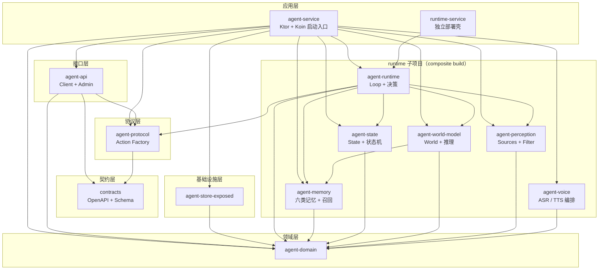
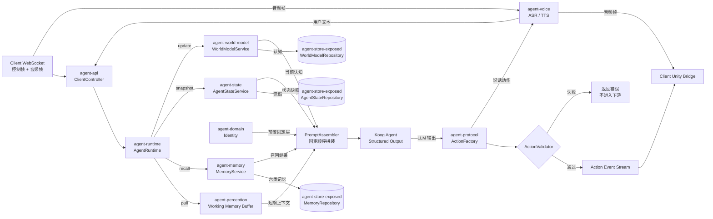
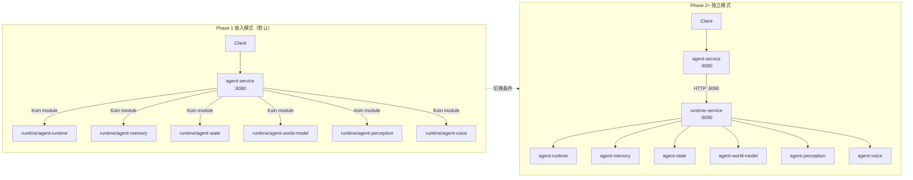

# Agent Service 工程架构（Gradle 模块拆分）

> 上位架构：[项目整体架构设计](项目整体架构设计.md)
> 服务端设计：[Agent Service 架构设计](AgentService架构设计.md)
> 契约域：[Contracts 架构设计](Contracts架构设计.md)
> 客户端：[客户端架构设计](客户端架构设计.md)
> 管理后台：[管理后台架构设计](管理后台架构设计.md)
> 基础设施：[基础设施架构设计](基础设施架构设计.md)
> 身体层：[Unity身体架构设计](Unity身体架构设计.md)
> 产品目标：[产品愿景与总纲](../product/产品愿景与总纲.md)

## 文档导览（三张图先看）

本文档涉及 13 个生产 Gradle 模块（另有 1 个可选测试模块 `test-fixtures`）与两套运行时模式，正文按设计原则、依赖矩阵、Gradle 配置、启动入口、测试、演进的顺序展开。为了让读者在进入正文前先建立心智模型，下面三张图覆盖三个最常被问到的视角：

1. **模块依赖拓扑**：13 个模块分 7 层，谁依赖谁、运行时子项目怎么挂进主服务。
2. **请求处理链路**：一次控制帧 + 音频帧从 WebSocket 进入到 Action Protocol 产出与音频回传的完整数据流。
3. **嵌入 vs 独立两种模式**：Phase 1 单进程（RuntimeGateway 调用）与 Phase 2+ 多进程（HTTP 调用）的部署差异。

### 图 1：模块依赖拓扑



**图注**：13 个模块分 7 层（应用 / 接口 / 协议 / 契约 / 基础设施 / 领域 / runtime 核心）；runtime 子项目内含核心层与感知层两组模块，通过 `includeBuild("runtime")` 引用，可独立 clone、单独发布。详细分层原则见 §1。

### 图 2：请求处理链路



**图注**：对应 [Agent Service 架构设计 §9 Agent Runtime](AgentService架构设计.md) 的运行链路。Runtime 先拉取四份上下文（Perception / Memory / State / World Model），再按固定顺序拼装 Prompt，调用 Model 拿到 LLM 输出，最后走 ActionFactory + ActionValidator 校验后才进入下游 Action Event Stream。上行音频帧由 `agent-voice` 识别为用户文本后进入 Client API；说话动作由 `agent-voice` 合成音频帧后回传客户端。

### 图 3：嵌入 vs 独立两种运行模式



**图注**：嵌入模式（Phase 1 默认）单进程，agent-service 通过 Koin module 调用 runtime 核心；独立模式（Phase 2+）双进程，agent-service 通过 HTTP 调用 runtime-service（:8090）的 REST API。通过 `RuntimeMode 配置(name = "runtime.mode")` 切换，**不改业务代码**。两种模式启动细节见 §5。

---

## 0. 文档目的与读者

**目的**：把 [Agent Service 架构设计](AgentService架构设计.md) 中确定的子系统、协议边界、运行时拓扑，落实为 Gradle 多模块仓库的**具体目录、依赖矩阵、构建配置与启动入口**，供工程师直接落地。

**读者**：

- Phase 1 后端工程师：按本文档建仓、拆模块、跑通嵌入模式启动。
- Phase 2+ 平台工程师：按本文档切换"runtime 独立部署"，接入新的 Perception / Memory 实现。
- 跨端工程师：通过本文档理解服务端模块边界，确认哪些产物可被客户端 / 管理后台消费。

**非目的**：本文档不重复 [Agent Service 架构设计](AgentService架构设计.md) 中的运行链路细节、协议定义与子系统职责——图 2 只作为模块视角的概览，详细链路见该文档 §2 运行链路；本文档只回答"代码怎么放、模块怎么拆、构建怎么配"。

---

## 1. 设计总览

### 1.1 拆分原则

| 原则 | 含义 |
|---|---|
| **依赖单向** | `service → api / protocol`、`service → runtime`、`runtime → domain`、`store → domain`；任何反向依赖都视为破坏边界 |
| **领域接口与实现分离** | `agent-domain` 只定义接口，存储实现放在 `agent-store-exposed` |
| **contracts 不反向依赖** | contracts 是纯 OpenAPI / Schema，与 Kotlin、Ktor、Koog、Koin、Exposed 零耦合 |
| **protocol 独立** | Action Protocol 构造、校验和版本迁移独立成模块，禁止 runtime 拼接协议字符串 |
| **Koog 输出有边界** | `agent-runtime` 通过输出适配器取得结构化 `AgentAction`，再交给 `agent-protocol` 校验 |
| **runtime 核心轻量** | runtime 核心不依赖 Ktor Server、Koin 或 Exposed；可用 Fake 依赖独立测试 |
| **runtime 可独立运行** | `runtime-service` 提供 Ktor API，主服务通过 `RuntimeGateway` 在进程内实现和 HTTP 实现之间切换 |
| **Perception SPI 化** | Phase 2+ 新增摄像头、智能家居只需新增实现模块，不改核心 |

### 1.2 模块地图（13 个生产模块 + 可选 test-fixtures）

```
ayane-agent-service/                                 ← 主服务子项目
├── settings.gradle.kts                              ← 顶层 include + includeBuild("runtime")
├── build.gradle.kts                                  ← root：插件版本、Java toolchain 21
├── gradle/libs.versions.toml                        ← 版本目录
│
├── agent-service/                                   ← [应用层] 主进程 HTTP/WS 入口
├── agent-api/                                       ← [接口层] Client API + Admin API
├── contracts/                                       ← [契约层] OpenAPI + Schema
├── agent-domain/                                    ← [领域层] 纯 Kotlin 领域模型 + 仓储接口
├── agent-store-exposed/                                 ← [基础设施层] Exposed JDBC 实现（含账号与归属登记）
├── agent-protocol/                                  ← [协议层] Action Protocol 构造 + 校验
│
└── runtime/                                         ← ★ runtime 子项目（composite build）
    ├── settings.gradle.kts
    ├── build.gradle.kts
    ├── agent-runtime/                              ← [核心层] Loop + 决策 + Prompt 拼装
    ├── agent-memory/                               ← [核心层] 六类记忆 + 召回
    ├── agent-state/                                ← [核心层] State + 状态机
    ├── agent-world-model/                         ← [核心层] World Model + 推理
    ├── agent-perception/                          ← [感知层] Sources + Filter + Buffer
    ├── agent-voice/                               ← [感知层] 云端 ASR / TTS 编排 + 音频留存
    └── runtime-service/                           ← ★ 可独立部署的 runtime REST 壳
```

### 1.3 运行时两种模式

| 模式 | 触发方式 | runtime-service | 适用阶段 |
|---|---|---|---|
| **嵌入模式** | `agent-service` 通过 Koin 绑定 `EmbeddedRuntimeGateway`，直接调用 `runtime:agent-runtime` | 可不启动 | Phase 1（默认） |
| **独立模式** | `agent-service` 通过 Koin 绑定 `HttpRuntimeGateway`，调用 runtime-service Ktor API | `gradle :runtime:runtime-service:run` | Phase 2+（多团队、水平扩展） |

Phase 1 同时保留可启动的 `runtime-service` Ktor 入口，用于独立健康检查和路由验证，但默认请求仍走嵌入模式。两种模式通过 `runtime.mode` 配置和 Koin binding 切换，不改业务接口。

---

## 2. 依赖矩阵

### 2.1 主服务模块依赖

| 模块 | 依赖 |
|---|---|
| `agent-service` | `agent-api`, `agent-domain`, `agent-store-exposed`, `agent-protocol`、`runtime:agent-runtime`、`runtime:agent-memory`、`runtime:agent-state`、`runtime:agent-world-model`、`runtime:agent-perception`、`runtime:agent-voice`、Ktor、Koin、Koog（嵌入模式） |
| `agent-api` | `agent-domain`, `agent-protocol`, `contracts`、Ktor Auth / JWT |
| `agent-domain` | （无业务依赖） |
| `agent-store-exposed` | `agent-domain` |
| `agent-protocol` | `contracts` |
| `contracts` | （无业务依赖，纯 Schema） |

### 2.2 runtime 子项目依赖

| 模块 | 依赖 |
|---|---|
| `agent-runtime` | `agent-domain`, `agent-protocol`, `runtime:agent-memory`, `runtime:agent-state`, `runtime:agent-world-model`, `runtime:agent-perception`、Koog Core |
| `agent-memory` | `agent-domain` |
| `agent-state` | `agent-domain` |
| `agent-world-model` | `agent-domain`, `runtime:agent-memory` |
| `agent-perception` | `agent-domain` |
| `agent-voice` | `agent-domain`（媒体端口）、云端语音 HTTP 客户端、音频编解码 |
| `runtime-service` | `runtime:agent-runtime`、Ktor Server、Koin、`koog-ktor` |

**关键约束**：`runtime/` 核心模块禁止依赖 Ktor Server、Koin 和 Exposed；`runtime-service` 作为边界模块可以依赖 Ktor、Koin 和 `koog-ktor`。单测使用纯 Kotlin JUnit 5 + kotlinx-coroutines-test。

---

## 3. 模块边界详解

### 3.1 `agent-domain`（领域层）

**职责**：定义业务概念、领域事件和持久化端口，不依赖 Ktor、Koin、Koog 或 Exposed。

**核心边界**：

| 领域区域 | 主要内容 |
|---|---|
| Identity | `UserId`、`AgentId`、`AgentRef`、`Identity`、`IdentityRepository`、`AgentRegistration`、`AgentRegistryRepository` |
| Account | `User`、`UserCredential`、`UserRepository`、`RefreshTokenRepository`、口令哈希端口 |
| Memory | `Memory`、`MemoryQuery`、`MemoryRepository` |
| State | `AgentState`、`AgentStateRepository`、状态更新规则端口 |
| World | `WorldModel`、`WorldModelRepository` |
| Event | `PerceptionEvent`、`SessionEvent` 及相关值对象 |
| 媒体 | `AudioRecord`、`AudioStore`（对象存储端口）、`AudioIndexRepository` |

Repository 只表达领域需要的读写能力；数据库连接、事务、序列化和 Web 请求对象不得进入领域层。

### 3.2 `agent-store-exposed`（基础设施层）

**职责**：使用 Exposed JDBC 实现 `agent-domain` 中的 Repository 接口。

**实现区域**：

- `agent.store.exposed.identity`：Identity 持久化。
- `agent.store.exposed.account`：用户、凭据与刷新 Token 的持久化。
- `agent.store.exposed.registry`：Agent 归属与状态。
- `agent.store.exposed.audio`：留存音频的索引行与对象存储访问。
- `agent.store.exposed.memory`：六类 Memory 的存储和召回（Phase 1 实装四类）。
- `agent.store.exposed.state`：Agent State 快照读写。
- `agent.store.exposed.world`：World Model 读写。
- `agent.store.exposed.table`：Exposed Table 定义，仅模块内部可见。
- `agent.store.exposed.mapping`：数据库行与领域对象之间的映射。

**关键约束**：

- 不向上层暴露 Exposed `Table`、`ResultRow`、`Database` 或事务对象。
- Phase 1 使用 Exposed JDBC，不采用 R2DBC。
- 协程 Repository 通过挂起事务封装 JDBC 调用，并将阻塞式数据库操作隔离到 IO 调度器。
- 数据库表、索引、映射和迁移属于本模块，`agent-domain` 只保留领域接口。
- 账号相关表只保存口令哈希；明文口令与 Token 明文不得入库或进日志。

### 3.3 `agent-protocol`（协议层）

**职责**：构造、校验、版本化 Agent Action Protocol，并为 Koog Structured Output 提供稳定的动作模型。

**协议区域**：

- Action：`SpeakAction`、`EmotionAction`、`GestureAction`、`LookAtAction`、`WaitAction`、`ListenAction`。
- Factory：系统规则产生的动作构造入口。
- Validator：Schema 校验和业务约束校验。
- Version：协议版本管理。
- Migrator：跨版本动作迁移。

**关键约束**：

- 只依赖 `contracts` 和协议自身的序列化支持，不依赖 `agent-runtime`、`agent-api` 或 Koog。
- Koog 输出适配器以协议动作作为结构化输出目标，再调用迁移器和校验器。
- 只有完整动作通过校验后才能进入 `Flow<AgentActionEvent>`，禁止运行时拼接协议字符串。

**对应文档**：[Agent Service 架构设计 §10 Embodiment Protocol](AgentService架构设计.md)

### 3.4 `contracts`（契约层）

**职责**：维护跨仓库 OpenAPI、WebSocket Event Schema 和 Agent Action Protocol Schema，保持框架无关。

**契约资源**：

- `src/main/resources/openapi/ayane-client-api.yaml`
- `src/main/resources/openapi/ayane-admin-api.yaml`
- `src/main/resources/schema/perception-event.schema.json`
- `src/main/resources/schema/session-event.schema.json`
- `src/main/resources/schema/agent-action-protocol.schema.json`

生成产物只提供纯 Kotlin DTO 和序列化类型，不生成 Web 框架 Controller、Ktor Route 或其他具体适配器。API 路由由 `agent-api` 和 `runtime-service` 手写适配。

**对应文档**：[Contracts 架构设计](Contracts架构设计.md)

### 3.5 `agent-api`（接口层）

**职责**：使用 Ktor 暴露 Client API（REST + WebSocket）和 Admin API。

**接口区域**：

- `agent.api.client.ClientRoutes`：Client REST 路由。
- `agent.api.client.ClientWebSocketRoutes`：Client WebSocket 路由。
- `agent.api.admin.AdminRoutes`：Admin API 路由。
- `agent.api.*.dto`：由 contracts 生成或适配的 DTO。
- `agent.api.client.AuthRoutes`：登录、刷新与登出。
- `agent.api.security`：归属解析，把登录凭据与请求中的 `AgentId` 解析为确定的「用户 + Agent」。
- `agent.api.voice`：WebSocket 音频帧分流与校验（大小、时长、轮次归属）。

**关键约束**：

- Route 只做协议转换、鉴权边界和请求分发，不写领域业务逻辑。
- 业务逻辑统一调用 `RuntimeGateway`，不直接依赖具体 runtime 实现。
- Phase 1 默认绑定 `EmbeddedRuntimeGateway`；独立模式再绑定 `HttpRuntimeGateway`。
- Route 不得自行解析用户身份，也不得把请求中的 `AgentId` 直接传给 Runtime；必须先经归属解析并通过校验。
- 音频帧只在已鉴权的 Session 内接受；超出大小或时长上限的帧被丢弃，不进入语音层。

### 3.6 `agent-service`（应用层）

**职责**：提供 Ktor Application 入口、Koin 组合根、配置加载和运行模式选择。

**启动装配顺序**：

1. 创建 Ktor Application 并安装 HTTP、WebSocket、序列化和错误处理能力。
2. 由 Koin 装配 Repository、Runtime、Koog 输出适配器和 API 路由依赖。
3. 装配鉴权：从环境 Secret 加载 Token 签名密钥，注册认证能力并绑定归属解析。
4. 根据 `runtime.mode` 绑定 `EmbeddedRuntimeGateway` 或 `HttpRuntimeGateway`。
5. 注册 Client API、Admin API、WebSocket 和健康检查路由。
6. 将请求交给 `RuntimeGateway`，不让接口层感知嵌入式或独立式实现。

Phase 1 默认使用 `runtime.mode = embedded`，runtime 在同一进程内运行；独立模式只替换 Koin binding 和服务端地址配置。

### 3.7 `runtime/`（核心决策子项目）

runtime 子项目承载决策核心。核心模块不依赖 Ktor Server、Koin 或 Exposed；只有 `runtime-service` 作为边界模块负责 Ktor 入口和 Koin 装配。

#### 3.7.1 `runtime:agent-runtime`（Loop 与决策）

**职责**：编排 Reactive Loop、Proactive Loop、Prompt 组装、Koog 输出和 Action Event Stream。

**核心能力**：

- `AgentRuntime`：统一 runtime 入口。
- `ReactiveLoop`：响应用户事件。
- `ProactiveLoop`：评估和发起主动行为。
- `PromptAssembler`：按固定顺序组装上下文。
- `AgentActionOutput`：结构化动作输出端口。
- `KoogStructuredActionOutput`：Koog 适配器，取得完整动作后交给 `agent-protocol` 校验。
- `DecisionEngine`：决策编排。

`agent-runtime` 可以依赖 Koog Core，但不依赖 Ktor Server、Koin 或 Exposed；具体依赖装配由应用入口负责。

**对应文档**：[Agent Service 架构设计 §9 Agent Runtime](AgentService架构设计.md)

#### 3.7.2 `runtime:agent-memory`（六类记忆 + 召回）

**职责**：实现六类记忆的召回编排和 Memory 生命周期逻辑。Phase 1 实装 Episodic / Preference / Relationship / Emotional 四类，Semantic 与 Procedural 属 Phase 1 内延后项。

**能力区域**：Episodic、Semantic、Preference、Relationship、Emotional、Procedural，以及 `RecallStrategy`。

Memory Repository 来自 `agent-domain`；Phase 1 使用关键词和规则召回，Phase 2+ 可替换为向量召回，不改变上层端口。

#### 3.7.3 `runtime:agent-state`（State + 状态机）

**职责**：实现 Agent State 快照、状态机和确定性状态更新规则。

LLM 只能读取 State；所有 State 变化必须经过 `StateRule` 和状态机校验。该模块不直接暴露数据库实现。

#### 3.7.4 `runtime:agent-world-model`（World Model）

**职责**：维护时间、用户、活跃 Session、设备和最近事件等当前认知。

Phase 1 的 `WorldContext` 保持轻量；Phase 2+ 再演进为带置信度和更新时间的 Belief Store。

#### 3.7.5 `runtime:agent-perception`（感知层）

**职责**：接收不同来源的原始信号，经 Attention Filter 和 Working Memory Buffer 转换为语义化 PerceptionEvent。

Phase 1 支持 ClientSignal、ClockSignal 和 SessionSignal；麦克风音频在 Phase 1 由客户端采集、经音频通道进入语音层，识别文本再作为 ClientSignal 进入本模块，基础视觉同样走 ClientSignal。Phase 2+ 通过新增 PerceptionSource 接入摄像头（完整视觉理解）和智能家居，不修改 runtime 核心。

#### 3.7.6 `runtime:runtime-service`（Ktor 独立部署壳）

**职责**：将 `runtime:agent-runtime` 暴露为可启动的 Ktor API，负责 Koin 装配、请求转换、健康检查和运行时适配。业务逻辑全部委托给 runtime 核心。

**Phase 1 端点**：

| 端点 | 方法 | 用途 |
|---|---|---|
| `/api/runtime/process` | POST | 处理感知事件并产生运行结果 |
| `/api/runtime/memory/recall` | POST | 记忆召回 |
| `/api/runtime/state/snapshot` | GET | 获取状态快照 |
| `/api/runtime/world/update` | POST | 更新 World Model |
| `/api/runtime/action/factory` | POST | 构造 Agent Action Protocol |
| `/api/runtime/health` | GET | 健康检查 |

Phase 1 可以独立启动和验证该入口，但 `agent-service` 默认仍通过嵌入模式调用 runtime。`koog-ktor` 只属于 Ktor 边界层，协议模型和校验仍属于 `agent-protocol`。

#### 3.7.7 `runtime:agent-voice`（语音层）

**职责**：编排云端语音识别与合成，维护语音轮次状态，产出并留存音频与口型时间轴。

**能力区域**：

- 音频编解码：链路使用 PCM16 16 kHz 单声道，留存副本使用 Opus。
- 识别适配：把上行音频转交云端识别，产出用户文本。
- 合成适配：把说话动作的文本与表现参数转交云端合成，产出行音频与口型时间轴。
- 轮次状态机：采集、识别、思考、合成、播放与打断取消。
- 留存旁路：音频异步写入对象存储并登记媒体索引；失败只记指标，不影响对话链路。

**关键约束**：

- 不依赖 Ktor Server、Koin 或 Exposed；云端引擎凭据由应用入口从 Secret 注入。
- 口型时间轴由合成引擎产出；引擎不提供时标记为缺失，回落到 Unity 侧音素分析。
- 音频字节不进入记忆、不下发客户端展示、不写应用日志；日志只记录媒体标识与耗时。
- 播报单播到最后一次用户输入的设备。

---

## 4. Gradle 配置

本文只规定构建边界和依赖类别，不固化完整 `build.gradle.kts`、Version Catalog 或具体插件版本。实际构建脚本应随 `ayane-agent-service` 工程版本一起维护。

### 4.1 项目结构

- 顶层项目包含 `agent-service`、`agent-api`、`agent-domain`、`agent-store-exposed`、`agent-protocol` 和 `contracts`。
- 顶层通过 `includeBuild("runtime")` 接入 runtime composite build。
- runtime 子项目包含 `agent-runtime`、`agent-memory`、`agent-state`、`agent-world-model`、`agent-perception`、`agent-voice` 和 `runtime-service`。
- 存储实现模块统一使用 `agent-store-exposed` 命名。

### 4.2 构建和工具链边界

| 构建区域 | 允许内容 |
|---|---|
| 基础工具链 | Kotlin/JVM、Java 21、Kotlin Serialization、JUnit 5 |
| HTTP 入口 | Ktor Server、WebSocket、Content Negotiation、Status Pages |
| Agent 输出 | Koog Core；`koog-ktor` 仅用于 Ktor 边界集成 |
| 依赖注入 | Koin Core、Koin Ktor |
| 持久化 | Exposed Core / DAO / JDBC、HikariCP、PostgreSQL、H2 |
| 认证与凭据 | Ktor Auth、Ktor Auth JWT、Argon2id 口令哈希 |
| 媒体存储 | S3 兼容对象存储客户端 |
| 语音引擎 | 云端 ASR / TTS 的 HTTP 客户端 |
| 契约生成 | OpenAPI Generator，目标为纯 Kotlin DTO / Serialization 类型 |

版本必须统一由 Version Catalog 管理，禁止在模块脚本中重复声明版本。具体版本以实际工程的兼容性验证结果为准。

### 4.3 模块依赖规则

| 模块 | 允许依赖 | 禁止依赖 |
|---|---|---|
| `agent-domain` | Kotlin、协程、序列化 | Ktor、Koin、Koog、Exposed、数据库驱动、认证库 |
| `agent-protocol` | `contracts`、序列化 | `agent-runtime`、`agent-api`、Koog、Ktor |
| `agent-store-exposed` | `agent-domain`、Exposed、数据库基础设施 | Ktor、API 路由、产品层模块 |
| `runtime:agent-runtime` | 领域、协议、runtime 核心模块、Koog Core | Ktor Server、Koin、Exposed |
| `runtime:runtime-service` | runtime 核心、Ktor、Koin、`koog-ktor` | 具体数据库实现和客户端业务模块 |
| `agent-api` | 领域、协议、contracts、Ktor、Ktor Auth | Exposed、数据库表和 Koog 具体调用 |
| `runtime:agent-voice` | 领域媒体端口、云端语音 HTTP 客户端、音频编解码 | Ktor Server、Koin、Exposed |
| `agent-service` | API、Store、Protocol、Runtime、Ktor、Koin、Koog | 反向依赖客户端或 Unity 源码 |

### 4.4 构建验证边界

- 核心 runtime 模块可以脱离 Ktor Application 进行纯单元测试。
- `agent-store-exposed` 通过 H2 和 Exposed JDBC 做集成测试。
- `agent-api` 和 `runtime-service` 使用 Ktor `testApplication` 验证路由和序列化。
- contracts 验证 OpenAPI / JSON Schema 与 DTO 序列化，不验证 Web 框架行为。
- 依赖分析必须阻止 runtime 核心反向引入 Ktor Server、Koin 或 Exposed。
- 语音层使用假识别与假合成引擎做纯单元测试，不依赖真实云端引擎。

---

## 5. 启动入口

### 5.1 `agent-service` 嵌入模式（Phase 1 默认）

启动命令：`./gradlew :agent-service:run`

- 端口：`8080`
- `runtime.mode`：`embedded`
- Runtime：进程内 `EmbeddedRuntimeGateway`
- 用途：Phase 1 默认运行方式

### 5.2 `runtime-service` Ktor 入口（Phase 1 可启动骨架）

启动命令：`./gradlew :runtime:runtime-service:run`

- 端口：`8090`
- 入口模式：Ktor Application + Koin Modules
- 必须可验证：`/api/runtime/health`、`/api/runtime/process`
- 用途：独立 runtime 边界验证，不改变 Phase 1 默认嵌入模式

### 5.3 独立模式（Phase 2+）

独立模式由 `runtime.mode = standalone` 触发：

```text
agent-service :8080
    └── HttpRuntimeGateway
            ↓ HTTP
runtime-service :8090
    └── runtime:agent-runtime
```

Koin 根据 `runtime.mode` 绑定 `EmbeddedRuntimeGateway` 或 `HttpRuntimeGateway`；Route 和领域业务接口不需要修改。

### 5.4 健康检查

- `agent-service`：`curl http://localhost:8080/health`
- `runtime-service`：`curl http://localhost:8090/api/runtime/health`

---

## 6. 测试策略

### 6.1 模块测试层级

| 模块                          | 测试类型                                      | 是否需要 Ktor / Koin |
|-----------------------------|-------------------------------------------|------------------|
| `agent-domain`              | 纯单测（值对象、领域事件）                             | ❌                |
| `agent-store-exposed`       | 集成测试（H2 + Exposed JDBC、账号与归属登记）             | ❌，仅使用数据库测试工具     |
| `agent-protocol`            | 纯单测（结构化动作、校验、迁移）                          | ❌                |
| `contracts`                 | Schema、DTO 序列化测试                          | ❌                |
| `runtime:agent-memory`      | 纯单测（召回策略用假仓储）                             | ❌                |
| `runtime:agent-state`       | 纯单测（状态机 + 规则）                             | ❌                |
| `runtime:agent-world-model` | 纯单测（推理逻辑用假 Client）                        | ❌                |
| `runtime:agent-perception`  | 纯单测（Filter + Buffer）                      | ❌                |
| `runtime:agent-voice`       | 纯单测（假识别 / 假合成引擎、轮次状态机与打断取消）      | ❌                |
| `runtime:agent-runtime`     | 纯单测（Fake Koog Agent + Fake Repository）    | ❌                |
| `runtime:runtime-service`   | Ktor `testApplication` 路由测试               | ✅ 最小 Koin 装配     |
| `agent-api`                 | Ktor `testApplication` API / WebSocket 与鉴权归属测试（401 / 403） | ✅ 最小 Koin 装配     |
| `agent-service`             | Ktor Application + Koin 装配测试              | ✅                |

Koog 输出层至少覆盖：

1. 合法 `AgentAction` 进入 `Flow<AgentActionEvent>`。
2. 缺少必填字段的结构化输出被拒绝，且不发出协议事件。
3. 旧协议版本先经过 `ActionMigrator`，再进入校验器。
4. `SPEAK`、`EMOTION`、`GESTURE` 等动作保持协议版本一致。
5. Proactive 输出被用户输入打断时，不产生半个协议动作。

### 6.2 Test Fixtures 模块

建议创建 `test-fixtures/` 顶级模块，集中提供默认 Identity、Memory、State 和事件构造器，供各模块测试复用。该模块只服务测试，不进入生产运行时，也不改变领域模块的正式依赖方向。

---
## 7. 演进路径

### 7.1 Phase 1 → Phase 2 切换点

| 模块变化 | 触发条件 |
|---|---|
| `:runtime:agent-perception-camera` 新模块 | 接入完整视觉理解（图像摘要与多模态感知） |
| `:runtime:agent-store-vector` 新模块 | 接入向量库 |
| `runtime.mode: standalone` | runtime-service 单独部署 |

**Phase 1 内延后项**：多 Agent 自助创建、Agent 配额门与跨 Agent 切换；Phase 1 每用户固定一个默认 Agent。

**语音层 Phase 1 内延后项**：多设备播报仲裁、引擎热切换、口型时间轴精度优化。

Phase 1 的基础视觉（屏幕内容、在场检测）由客户端完成，不需要服务端新模块；语音层是 Phase 1 新增的模块。

### 7.2 Phase 2 → Phase 3 切换点

| 模块变化 | 触发条件 |
|---|---|
| `:runtime:agent-state-redis` 新模块 | Agent State 接入 Redis（多实例共享） |
| `runtime:agent-world-model` 拆分出 `agent-world-belief` | Belief Store 独立 |

### 7.3 contracts 拆仓

Phase 1 末：满足 [Contracts 架构设计 §7 契约独立的触发条件](Contracts架构设计.md) 时，把 `contracts/` 拆为独立顶层仓库。

**操作**：

1. 新建 `ayane-contracts` 仓库
2. 把 `contracts/` 复制过去
3. 在 `ayane-agent-service/settings.gradle.kts` 改为 `includeBuild("../ayane-contracts")` 或 Maven 依赖

**关键约束**：所有引用 `com.ayane.contracts.*` 的代码**不需要修改 import 路径**。

---

## 8. 与其他文档的对应

| 工程模块 | 对应设计文档 |
|---|---|
| `agent-domain` | [Agent Service 架构设计 §3 子系统总览](AgentService架构设计.md)、§4 AI Identity、§5 Memory、§6 Agent State Store |
| 账号与归属（`agent-api` / `agent-store-exposed`） | [Agent Service 架构设计 §3 子系统总览](AgentService架构设计.md)、[管理后台架构设计 §2 功能范围](管理后台架构设计.md) |
| `runtime:agent-voice` | [Agent Service 架构设计 §3 子系统总览](AgentService架构设计.md)、§7.2 PerceptionEvent 类型、§10 Embodiment Protocol、§13 数据权属与安全 |
| `runtime:agent-memory` | [Agent Service 架构设计 §5 Memory](AgentService架构设计.md)、§12 记忆生命周期 |
| `runtime:agent-state` | [Agent Service 架构设计 §6 Agent State Store](AgentService架构设计.md) |
| `runtime:agent-world-model` | [Agent Service 架构设计 §8 World Model](AgentService架构设计.md) |
| `runtime:agent-perception` | [Agent Service 架构设计 §7 Perception Layer](AgentService架构设计.md) |
| `runtime:agent-runtime` | [Agent Service 架构设计 §9 Agent Runtime](AgentService架构设计.md) |
| `agent-protocol` | [Agent Service 架构设计 §10 Embodiment Protocol](AgentService架构设计.md)、[Contracts 架构设计 §5 Action Protocol 边界](Contracts架构设计.md) |
| `agent-api` | [Agent Service 架构设计 §14 协议边界](AgentService架构设计.md)、§15 运行时拓扑 |
| `agent-store-exposed` | [Agent Service 架构设计 §13 数据权属与安全](AgentService架构设计.md)、§15 运行时拓扑、[基础设施架构设计 §3 部署对象](基础设施架构设计.md) |
| `runtime-service` | [Agent Service 架构设计 §15 运行时拓扑](AgentService架构设计.md) |
| `contracts` | [Contracts 架构设计](Contracts架构设计.md) |

---

## 9. 落地清单

### 9.1 第一周：最小可运行

- [ ] 建仓 `ayane-agent-service/`，配置顶层 `settings.gradle.kts` + `build.gradle.kts` + `gradle/libs.versions.toml`
- [ ] 创建 `agent-service/`、`contracts/`，跑通 Ktor 启动 + OpenAPI 暴露
- [ ] 在 `agent-service/` 内临时写一个最简 `/api/runtime/process` 端点，验证 Ktor + OpenAPI 链路

### 9.2 第二周：抽取核心

- [ ] 抽 `agent-domain`、把领域对象移过去
- [ ] 抽 `agent-protocol`、把 Action Factory 移过去
- [ ] 抽 `agent-api`、把 Ktor Routes 移过去
- [ ] 抽账号与归属登记（`User` / `AgentRegistration`）与鉴权入口

### 9.3 第三周：runtime 子项目独立

- [ ] 建 `runtime/` 子项目，`includeBuild` 进顶层
- [ ] 抽 `runtime:agent-runtime`、把决策逻辑移过去
- [ ] 抽 `runtime:agent-memory`、`runtime:agent-state`、`runtime:agent-world-model`

### 9.4 第四周：感知与存储

- [ ] 抽 `runtime:agent-perception`，定义 SPI 接口
- [ ] 抽 `runtime:agent-voice`，接入云端识别与合成，跑通一次全语音对话
- [ ] 抽 `agent-store-exposed`，把 Repository 实现移过去
- [ ] 建 `runtime:runtime-service`，完成 Ktor 入口、Koin 装配和健康检查

### 9.5 第五周：测试与 CI

- [ ] 配置 `test-fixtures` 模块
- [ ] 配置 GitHub Actions：编译 + 单测 + 集成测试
- [ ] 配置 Spotless、Detekt、ktlint

---

## 10. 风险与约束

| 风险                                         | 缓解                                                             |
|--------------------------------------------|----------------------------------------------------------------|
| **拆分过早**：模块过多导致单人维护成本高                     | 按"每周一抽"的节奏，每步纯重构 + 单测通过即视为成功                                   |
| **依赖反向**：runtime 误引入 Ktor Server / Exposed | 通过依赖分析和模块边界检查检测                                                |
| **contracts 漂移**：服务端和客户端各持一份               | 拆仓前只在 `agent-service` 仓维护；拆仓后用 Git Tag 锁定版本                    |
| **运行时模式切换漏配置**                             | 通过 `runtime.mode` 配置和 Koin binding 强制显式选择 RuntimeGateway       |
| **Gradle 构建慢**：13 模块导致增量编译变慢               | 启用 Gradle Configuration Cache + Kotlin Incremental Compilation |
| **音频带宽与合成成本**：上行音频与云端引擎按量计费             | 留存副本使用 Opus；单轮时长与全局并发设上限                                  |
| **语音引擎不可用**：对话链路中断                        | 识别不可用退回文本输入；合成不可用只出文本与动作                                  |
| **越权访问**：`AgentId` 来自请求                        | 统一经归属解析并校验，401 / 403 路径纳入单测                                   |

---

## 11. 相关文档

- [Agent Service 架构设计](AgentService架构设计.md) — 子系统职责、协议定义、运行链路
- [项目整体架构设计](项目整体架构设计.md) — 上位架构与跨仓库边界
- [Contracts 架构设计](Contracts架构设计.md) — 跨仓库契约详情
- [客户端架构设计](客户端架构设计.md) — 客户端如何消费 `contracts/`
- [管理后台架构设计](管理后台架构设计.md) — 管理后台如何消费 `agent-api/admin`
- [基础设施架构设计](基础设施架构设计.md) — 数据库、对象存储、Secret 与监控
- [Unity身体架构设计](Unity身体架构设计.md) — Action Protocol 下游消费者
- [产品愿景与总纲](../product/产品愿景与总纲.md) — 产品目标与阶段划分
