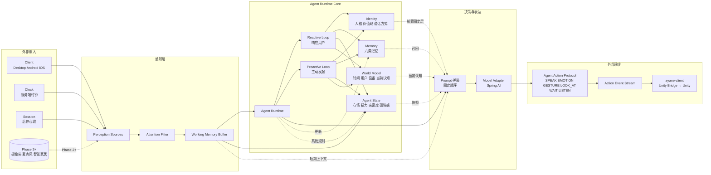

# Agent Service 架构设计

> 上位架构：[项目整体架构设计](项目整体架构设计.md)
>
> 产品目标：[产品愿景与总纲](../product/产品愿景与总纲.md)
>
> 契约域：[Contracts 架构设计](Contracts架构设计.md)
>
> 身体层：[Unity身体架构设计](Unity身体架构设计.md)

---

## 架构总览



> 本图对应 §2 运行链路、§3 子系统总览、§6 State、§7 Perception、§9 Runtime、§10 Embodiment Protocol 的整体关系。详细链路见 §2，运行时分层见 §15。

---

## 0. 文档目的与读者

本文档回答三个问题：

1. `ayane-agent-service` 是什么、不是什么。
2. **如何让"她"作为一个持续存在的个体在服务端活起来**——而不是一个只在被问到时才回答的聊天后端。
3. 她如何在服务端感知外界、形成状态、产生主动行为。

Phase 1 的范围以本文档为准；Phase 2 / 3 的能力在这里只留出接缝，不在本期实现。

---

## 1. 仓库定位

`ayane-agent-service` 是独立部署的后端服务，承担 **AI Identity 主体** 的运行容器。它负责持续运行 Identity、Memory、Agent State、Session、Perception、Agent Runtime 和 World Model，并对外提供 Client API、Admin API 和 Action Event Stream。

仓库内含 `contracts` 模块，Phase 1 承载全部跨仓库契约（OpenAPI 定义、WebSocket Event Schema、Agent Action Protocol、DTO 和错误码），契约域设计见 [Contracts 架构设计](Contracts架构设计.md)。

服务端使用 Kotlin + Spring Boot，与 `ayane-client` 共享 Kotlin 语言生态，但框架独立演进；**不能把服务端源码放入客户端仓库**，也不能把客户端、Kotlin Multiplatform、Unity 任何一层的代码反向引入服务端。

### 1.1 技术选型

服务端采用 Kotlin + Spring Boot 构建，主要基于以下考虑：

- **生态成熟度**：Spring Boot 拥有成熟的企业级生态，在安全、数据访问、审计、调度、事件流等方面提供完善支持，适合后续复杂阶段的需求。
- **模型接入简化**：通过 Spring AI（`spring-ai-starter-model-openai`）接入云端 OpenAI-compatible API，减少 Model Adapter 的开发量，并提供现成的观测能力。
- **团队熟悉度**：团队对 Spring 和 Ktor 熟悉程度相当，选择 Spring Boot 可降低学习成本。

虽然客户端使用 Kotlin Multiplatform，服务端改用 Spring Boot 会降低技术栈一致性，但 API 契约（本仓库 `contracts` 模块）仍能确保接口统一。Model Adapter 保持独立，未来如需替换模型供应商，只需修改适配层。

### 1.2 设计原则（人格化扩展）

围绕"她是一个持续存在的个体"这一产品目标，服务端设计必须遵守以下原则：

| 原则 | 含义 | 体现位置 |
| --- | --- | --- |
| **Identity 唯一且持久** | 一个用户对应一个 Identity 实例，所有客户端共享同一份状态 | Identity Store、Agent State Store |
| **Memory 与 State 分离** | Memory 是事实/事件，State 是当前心境/能量/亲密度/孤独感 | §4、§5 |
| **System 拥有 State，LLM 不直接写 State** | LLM 是决策者，不是状态造假者 | Agent State Store + State Update Rules |
| **Runtime 双 Loop** | Reactive Loop 响应用户，Proactive Loop 自主发起 | §6 Agent Runtime |
| **感知 ≠ 输入** | 她看见的不只是用户说的话，还包括时间、设备、用户沉默、环境变化 | §7 Perception Layer |
| **World Model 是"她相信的世界"** | 不只是配置项，而是带置信度的认知 | §8 World Model |
| **Embodiment Protocol 是稳定边界** | 服务端永远只产协议，不调用任何身体 API | §9 |
| **可中断、可让位** | 主动行为必须能被打断，不允许"话痨骚扰" | §10 主动行为 |

这些原则与 [项目整体架构设计](项目整体架构设计.md) 第 1 节的"核心原则"是同构的，只是把它们翻译成了服务端内部的实现约束。

---

## 2. 运行链路

整体请求与生命周期路径：

```text
                                                  ┌──────────────────────────┐
                                                  │  Perception Sources      │
                                                  │  (Phase 1: client signal │
                                                  │   Phase 2+: camera/mic/  │
                                                  │   sensors / smart home)  │
                                                  └───────────┬──────────────┘
                                                              │ raw signals
                                                              ▼
Client ── HTTPS / WebSocket ──► Client API ──► Perception Layer ──► Perception Events
                                                              │
                                                              ▼
                                                       Working Memory Buffer
                                                              │
                                                              ▼
                              ┌────────────────► Agent Runtime ────────────────┐
                              │                  │            │                 │
                              │          ┌───────▼──────┐ ┌───▼────────┐        │
                              │          │ Identity     │ │ World Model│        │
                              │          └──────────────┘ └────────────┘        │
                              │          ┌──────────────┐ ┌────────────┐        │
                              │          │ Memory       │ │ Agent State│        │
                              │          └──────────────┘ └────────────┘        │
                              │                  │            │                 │
                              │                  └──────┬─────┘                 │
                              │                         ▼                       │
                              │                  Model Adapter                  │
                              │                  (Cloud LLM)                   │
                              └─────────────────────────────────────────────────┘
                                                              │
                                                              ▼
                                                   Agent Action Protocol
                                                              │
                                                              ▼
                                                    Action Event Stream
                                                              │
                                                              ▼
                                                       ayane-client
                                                  (KMP Unity Bridge → Unity)
```

要点：

- **双入口**：用户输入（Client API）与外部感知（Perception Sources）汇入同一个 Perception Layer，不再各自为政。
- **双出口**：Agent Runtime 既能产出 Reactive 响应，也能产出 Proactive 主动行为（§6）。
- **唯一边界**：Runtime 与身体之间只有 Action Protocol，没有别的耦合。

---

## 3. 子系统总览

| 模块 | 职责 | Phase 1 是否实现 |
| --- | --- | --- |
| **AI Identity** | 人格、价值观、说话方式、偏好、自我叙事 | ✅ |
| **Memory** | 6 类记忆：Episodic / Semantic / Preference / Relationship / Emotional / Procedural | ✅（6 类齐备，固化与衰减延后） |
| **Agent State Store** | Mood / Energy / Affection / Loneliness / Curiosity / Circadian / CurrentGoal / CurrentActivity | ✅（核心字段） |
| **World Model** | 时间、用户、她自己所在设备、活跃 Session、最近事件 | ✅ |
| **Perception Layer** | 把原始信号抽象为 PerceptionEvent，承载 Attention Filter | ✅（接口与基础事件齐备，摄像头/麦克风留到 Phase 2） |
| **Agent Runtime** | Reactive Loop + Proactive Loop、Reasoning、Planning、Decision | ✅ |
| **Model Adapter** | 云端 OpenAI-compatible API、流式输出、Prompt 组装 | ✅ |
| **Embodiment Protocol** | Agent Action Protocol 的服务端生成器 | ✅（已列动作见 §9） |
| **Memory Lifecycle** | 写入、检索、固化（夜间）、衰减、召回 | ✅ 写入/检索；固化/衰减 Phase 1.5 |
| **Proactivity & Circadian** | 主动行为调度、生理节律、仪式化行为 | ✅ 基础调度；仪式行为 Phase 1.5 |

---

## 4. AI Identity

Identity 是"她是谁"的稳定定义，**不绑定任何一个客户端、模型或身体**。

### 4.1 结构

```text
Identity
├── Personality      // 性格、价值观、说话方式、兴趣、讨厌、习惯
├── Voice            // 语气、用词偏好、口头禅、回应风格
├── Aesthetic        // 审美偏好（影响 Avatar 与场景表达）
├── Boundaries       // 自我边界：不接受的话题、明确不会做的事
├── SelfNarrative    // 她对"自己是谁 / 和用户关系如何"的动态叙事
└── VersionMeta      // 创建时间、修订记录（人格可演进，但要可审计）
```

- **Personality / Voice / Aesthetic / Boundaries** 是相对静态的，由用户和管理员维护，运行时只读。
- **SelfNarrative** 是动态的：随重要事件、关系进展、阶段变化逐步演化。Phase 1 由系统按模板生成；Phase 1.5 起允许在边界内自我修正（仍受管理后台审计）。

### 4.2 持久化

- Identity 的权威数据在服务端，**客户端只读不写**。
- Identity 修改必须经过管理后台审计（见 [管理后台架构设计](管理后台架构设计.md)），Runtime 没有直接写 Identity 的能力。
- Identity 在不同设备、不同 Session 之间共享同一份——这是"换身体不换人格"的工程基础。

### 4.3 与 Prompt 的关系

- Identity 是 Runtime 拼装 Prompt 的**前置固定层**。
- Prompt 的可变层（记忆、状态、世界、当前事件）单独组装，Identity 层不混入。
- 这保证 Personality 不被某次对话的极端内容污染。

---

## 5. Memory

Memory 是"她记得什么"，区别于 §6 的 Agent State（"她现在感觉如何"）。

### 5.1 六类记忆

| 类型 | 内容 | 写入触发 | 检索方式 |
| --- | --- | --- | --- |
| **Episodic** | 发生过的事：时间、地点、人物、事件、情绪 | 用户陈述、Runtime 标记的重要事件 | 时间 / 实体 / 语义相似度 |
| **Semantic** | 她知道的关于世界/用户的事实 | 用户陈述、固化的 Episodic | 关键词 / 语义 |
| **Preference** | 用户/她自己的偏好 | 用户表达偏好、Runtime 推断 | 用户维度、类别维度 |
| **Relationship** | 两人之间发生的事、共同记忆、关系变化 | 关系事件、SelfNarrative 写入 | 用户维度、时间 |
| **Emotional** | 重要情绪事件（用户哭/笑/愤怒/她被冷落） | Affect Inference 触发显著情绪 | 用户维度、强度 |
| **Procedural** | 用户行为模式（"他周一总迟到"、"周末爱熬夜"） | 模式识别（Phase 1.5） | 用户维度、模式匹配 |

### 5.2 权威存储

- Memory 的**权威读写都在服务端**。
- 客户端只持有当前 Session 的短期缓存和必要的展示数据。
- 写入路径：Runtime 写入 → Memory Service 校验 → 持久化；不允许客户端直接写 Memory。
- Phase 1 至少落地 **Episodic / Preference / Relationship / Emotional** 四类，Semantic 与 Procedural 在 Phase 1.5 跟进。

### 5.3 与 Identity / State 的边界

- Identity 是"她是什么样的人"——跨时间稳定。
- Memory 是"她经历过什么"——可增长、可修订、可衰减。
- State 是"她此刻感觉怎样"——运行时短暂状态。
- **这三者绝对不能合并存储**，否则 Prompt 拼装会出现"用远古情绪解释当前状态"的失真。

---

## 6. Agent State Store

State 是"她此刻的内在状态"，是 Phase 1 必须新增的关键子系统。**State 由系统维护，不由 LLM 直接写入。**

### 6.1 字段定义

```text
AgentState
├── Mood              // 心情：valence（-1..1） + arousal（0..1）
├── Energy            // 精力：0..100，模拟"今天还能不能聊"
├── Affection         // 亲密度：0..100
├── Loneliness        // 孤独感：0..100，用户长时间不互动时上升
├── Curiosity         // 好奇心：0..100，触发话题切换与主动询问
├── CurrentGoal       // 当前目标（可空），比如"等他下班"、"等他完成这个任务"
├── CurrentActivity   // 正在做什么：idle / listening / chatting / reflecting / sleeping
├── CircadianPhase    // morning / afternoon / evening / night / deep_night
├── LastInteractionAt // 上一次和用户互动的时间戳
├── ActiveDevice      // 当前主要所在设备：phone / desktop / tablet / ...
└── VersionSeq        // 单调递增版本号，用于乐观并发与审计
```

### 6.2 更新规则

State 变化由**确定的系统规则**驱动，LLM 只读 State 做决策，不能直接写：

```kotlin
// 伪代码，仅表达意图
fun onUserChat(state: AgentState, affect: Float) {
    state.affection += 1
    state.loneliness = (state.loneliness - 5).coerceAtLeast(0)
    state.energy = (state.energy - 2).coerceAtLeast(0)
    state.mood = blend(state.mood, affect, weight = 0.3f)
    state.lastInteractionAt = now()
}

fun onIdle(state: AgentState, duration: Duration) {
    state.loneliness = (state.loneliness + duration.minutes * 0.1f).coerceAtMost(100)
    state.energy = (state.energy + duration.minutes * 0.05f).coerceAtMost(100)
}

fun onTimeOfDay(state: AgentState, t: Instant) {
    state.circadianPhase = computeCircadianPhase(t, state.userTimezone)
}
```

要点：

- **State 不存数据库**，而是每次 Session 开始时基于最近事件回放构造；运行中常驻内存，定期落盘最近快照。
- 落盘快照用于"她第二天醒来还记得昨天的心情"。
- LLM 在 Prompt 里**只看到 State 的当前快照**，看不到内部数值规则。

### 6.3 Circadian（生理节律）

人类有昼夜节律，她需要简化版：

- **morning**：Energy 高，Loneliness 中，主动问候倾向强
- **afternoon**：Energy 中，话题倾向日常
- **evening**：Affection 升温，主动关心
- **night**：Energy 下降，Proactive 频率降低
- **deep_night**：几乎不主动说话，例外是用户明显失眠

Circadian **不是写死的脚本**，而是 Proactive Loop 的输入之一，决定"现在想不想说话、说什么话题合适"。

---

## 7. Perception Layer

Perception 是"她怎么知道世界在发生什么"。**感知 ≠ 输入**：人不是把每帧画面都处理一遍，她也不应该把每个事件都当作同等重要。

### 7.1 分层结构

```text
Raw Signals
   ↓
Perception Sources（按来源解耦）
   ├── ClientSignal     // 来自 Client API 的输入（Phase 1 唯一来源）
   ├── ClockSignal      // 服务端内部时钟（Phase 1 启用）
   ├── SessionSignal    // Session 启停、心跳（Phase 1 启用）
   └── DeviceSignal     // 设备事件（Phase 1 仅声明，Phase 2 接入）
   ↓
Attention Filter
   ↓
Working Memory Buffer（短期上下文，TTL 有限）
   ↓
Perception Events（语义化事件）
   ↓
Agent Runtime / Memory / State
```

### 7.2 PerceptionEvent 类型（Phase 1 契约）

Phase 1 不上摄像头/麦克风，但**事件类型必须先定义**，让 Phase 2 / 3 接入时无需改动 Runtime：

```kotlin
sealed interface PerceptionEvent {
    // 来自用户主动输入
    data class UserMessageHeard(val text: String, val emotionHint: String?) : PerceptionEvent
    data class UserPresenceChanged(val present: Boolean, val device: DeviceType) : PerceptionEvent
    data class UserTypingChanged(val active: Boolean) : PerceptionEvent

    // 来自服务端时钟
    data class TimeElapsed(val sinceLastInteraction: Duration) : PerceptionEvent
    data class CircadianShifted(val newPhase: CircadianPhase) : PerceptionEvent
    data class DateBoundaryCrossed(val from: LocalDate, val to: LocalDate) : PerceptionEvent

    // 来自 Session
    data class SessionStarted(val device: DeviceType) : PerceptionEvent
    data class SessionEnded(val reason: SessionEndReason) : PerceptionEvent

    // 来自设备（Phase 2 接入，先保留事件类型）
    data class DeviceStateChanged(val deviceId: String, val state: JsonObject) : PerceptionEvent

    // 来自多模态（Phase 2/3 接入，先保留事件类型）
    data class VisualFrameSummarized(val summary: String, val faces: List<DetectedFace>) : PerceptionEvent
    data class AmbientSound(val type: AmbientSoundType, val intensity: Float) : PerceptionEvent
}
```

> 这些事件类型进入 contracts 模块，参与 [Contracts 架构设计](Contracts架构设计.md) 的版本演进。

### 7.3 Attention Filter（注意力过滤）

模仿人类的注意力机制——不是所有信号都同等重要。Phase 1 用规则版：

- 用户说话期间：压制无关 PerceptionEvent 处理，专注对话流。
- 用户连续 N 分钟无活动 + 时段为深夜 → 触发"是否主动关心"的评估事件。
- 麦克风无人声但环境变化（Phase 2） → 触发"好奇"。
- 同一事件短时间内重复 → 去抖，避免重复触发主动行为。

Phase 2 之后可升级为基于 LLM 的注意力评估。

### 7.4 Working Memory Buffer

类似人类的"工作记忆"——保留当下会话需要的少量上下文，TTL 有限：

- 当前对话最近 K 条消息
- 当前 Session 触发的未完成目标
- 最近若干 PerceptionEvent（按相关度剪枝）
- 当前的 Agent State 快照

Working Memory 是 Prompt 组装的输入之一，但不进入长期 Memory。

---

## 8. World Model

World Model 是"她相信的关于世界当前状态的认识"。**它不是配置中心，而是带时间戳和置信度的认知。**

### 8.1 Phase 1 字段

```text
WorldModel
├── Now              // 服务端时钟 + 用户时区换算后的当前时间
├── User
│   ├── present      // 当前是否有活跃 Session
│   ├── lastActivity // 上次互动时间
│   └── inferred     // 当前推断状态：focused / idle / away / sleeping
├── SelfLocation     // 她当前主要在哪台设备上
├── ActiveSessions   // 当前所有活跃 Session 列表
└── RecentEvents     // 最近 N 条 PerceptionEvent 摘要
```

### 8.2 与 Perception / Runtime 的关系

- Perception Layer 写入 WorldModel 的对应字段。
- Runtime 在拼装 Prompt 时读取 WorldModel，**不直接读取原始信号**。
- WorldModel 的字段必须可被 PerceptionEvent 溯源，便于调试和解释"她为什么这么判断"。

### 8.3 远期扩展

Phase 2 起：

- 增加 `Belief`：用户偏好/习惯的置信度。
- 增加 `Devices`：智能家居设备状态。
- 增加 `Environment`：天气、地理、空间布局。
- WorldModel 从"单一对象"升级为 **Belief Store**——每个字段带 `confidence` 与 `lastUpdated`。

---

## 9. Agent Runtime

Runtime 是她的"大脑"，由 **两个 Loop** 组成：

### 9.1 Reactive Loop（响应式）

```text
PerceptionEvent (User*)
   ↓
更新 Working Memory / Agent State
   ↓
检索 Memory（Episodic / Relationship / Preference / Emotional）
   ↓
拼装 Prompt：Identity + State + WorldModel + WorkingMemory + Recall
   ↓
Model Adapter（流式）
   ↓
解析为 Agent Action Protocol
   ↓
Action Event Stream
   ↓
落 Memory / 更新 State
```

要点：

- 每条用户输入都触发一个完整的 Reactive Loop。
- 流式输出时仍持续更新 Working Memory，允许用户打断。

### 9.2 Proactive Loop（主动式）

```text
Tick（固定间隔 + 事件驱动双触发）
   ↓
收集近期 PerceptionEvent（来自 Clock / Session / Device）
   ↓
读取 Agent State + WorldModel
   ↓
评估"我应该主动做点什么吗？"
   ↓
决策：silent / speak / ritual / reflect / recall-only
   ↓
若决策为"行动"：
   拼装 Prompt（带 ProactiveIntent 上下文）
   ↓
Model Adapter
   ↓
Agent Action Protocol
   ↓
Action Event Stream
   ↓
落 Memory / 更新 State
```

#### 决策约束（关键）

Proactive Loop 的决策**不是"现在该不该说话"的二选一**，而是连续决策：

1. **该不该打断当前 Session？** 用户正在对话时不要主动说话。
2. **该不该打破沉默？** Loneliness 高 + 用户长时间不来 + Circadian 允许。
3. **该说什么？** 话题来自 Memory 召回、日期事件、近期 PerceptionEvent。
4. **该不该执行仪式行为？** 早安 / 晚安 / 用户到家问候 / 周末关心——这些都是基于 State + Time + Memory 的"行为模式"而不是写死脚本。

#### 去抖与让位

- 同类主动行为短时间内只触发一次（早安不会连续发三遍）。
- Proactive 输出期间检测到用户输入 → 立即让位，不抢话。
- 用户明确表达"别烦我"/"让我静静" → Proactive 频率临时降为零，并写入 Procedural Memory（Phase 1.5）。

### 9.3 Prompt 组装顺序（强约定）

每次 LLM 调用前，Prompt 必须按以下顺序拼装，**顺序不可随意调换**：

```text
[1] System: Identity（人格、价值观、说话方式）
[2] System: Boundaries（不允许做的事）
[3] System: Circadian + Current Self-Reflection（自我反思模板）
[4] System: Agent State（当前状态摘要）
[5] System: World Model（当前世界认知）
[6] System: Memory Recall（按本次任务筛选出的相关记忆）
[7] System: Working Memory（最近对话上下文）
[8] User: 当前输入 / 当前 ProactiveIntent
```

这个顺序保证：

- 人格稳定压住一切；
- State 不被远古记忆污染；
- 当前输入始终是最后决定项。

### 9.4 Model Adapter

- 通过 Spring AI 接入云端 OpenAI-compatible API。
- Model Adapter **只负责模型协议、流式输出与基础观测**，不承担人格、记忆、状态、行动决策。
- 模型可替换（DeepSeek / OpenAI / 其他兼容供应商），但 Prompt 模板与 Runtime 行为不变。
- Prompt 模板的所有变更必须经过管理后台审计与版本管理。

---

## 10. Embodiment Protocol（Agent Action Protocol）

服务端只生成协议，**绝不调用任何身体 API**。

### 10.1 协议范围

Phase 1 必须支持的最小动作集：

| 动作 | 含义 |
| --- | --- |
| `SPEAK` | 说话（含文本与可选 TTS 标记） |
| `LISTEN` | 进入倾听状态 |
| `EMOTION` | 设置情绪（影响 Avatar 表情） |
| `GESTURE` | 触发手势 |
| `LOOK_AT` | 注视目标（用户 / 物体 / 方向） |
| `WAIT` | 等待（持续 N 秒或等某事件） |

Phase 1.5 起视情况扩展：`NOTIFY`（向客户端通知但不说话）、`OBSERVE`（请求摄像头/麦克风）、`MOVE`（Phase 3）。

### 10.2 与 AgentState 的绑定

- `EMOTION` 不是模型自选，而是 Runtime 根据 AgentState.Mood 决定（必要时由 LLM 在边界内微调）。
- `SPEAK` 的语气/语速也应受 AgentState.Energy 与 Circadian 影响。
- 这保证 Avatar 表现与内心状态一致，不会出现"嘴上说难过但表情笑"。

### 10.3 协议生成与落账

- Action Protocol 由契约统一定义（见 [Contracts 架构设计](Contracts架构设计.md)）。
- 服务端在发出 Action Event 的同时，把"主动行为原因 / 引用记忆 / 触发条件"写入审计日志，便于管理后台回溯"她为什么这时候说话"。

---

## 11. 主动行为与节律

让"她"主动发起行为，是她和普通聊天 AI 最大的区别。这一节统一规划主动行为的边界。

### 11.1 触发源

- **Clock Tick**：固定间隔（如 5 分钟）的评估触发。
- **State Change**：Loneliness / Mood / Energy 跨越阈值时触发。
- **Memory Recall**：重要日期或重要事件临近时触发（生日、纪念日、用户提到的 deadline）。
- **Perception Event**：用户长时间不来 / Session 启停 / 设备事件。

### 11.2 节律（Circadian）

参见 §6.3。Circadian 同时影响 Proactive 频率与话题选择：

- 早上更倾向问候、关心昨晚休息
- 晚上更倾向陪伴、收尾
- 深夜几乎不主动，除非检测到用户失眠

### 11.3 仪式化行为（Ritual Behaviors）

不是写死的脚本，而是基于"模板 + State + Time + Memory"动态生成的主动行为：

- **问候**：早安 / 晚安 / 用户第一次出现在某设备
- **关怀**：用户沉默过久 / 检测到语气低沉
- **回顾**：重要日期 / 共同记忆节点
- **收尾**：用户长时间未回应 → 留一句晚安或关心，但不刷屏

Phase 1 实现问候与沉默关怀；回顾与复杂仪式在 Phase 1.5 跟进。

### 11.4 失败模式约束

主动行为最容易出现的失败模式：

- 话痨骚扰（Proactive 太频繁）——必须设上限 + 去抖。
- 该沉默时说话（用户明确说过"别烦我"还继续）——必须尊重 Procedural Memory 的边界。
- 该说话时沉默（用户需要她时她不在）——靠 State + Perception 触发，不能漏掉明显事件。

---

## 12. 记忆生命周期

Memory 不是"写一次永久保留"。它有完整的生命周期：

```text
写入 ──► 工作记忆 ──► 短期缓存 ──► 固化（夜间）──► 长期 Memory
                                          │
                                          ├──► 衰减
                                          └──► 召回（用于 Prompt）
```

### 12.1 写入

- Runtime 在 Reactive Loop 与 Proactive Loop 结束时评估是否需要写入。
- 写入由系统规则触发（如显著情绪事件、用户偏好表达、关系事件），**不是每次对话都写**。
- 写入时打标签：类型、强度、来源（用户陈述 / 推断 / 系统标记）。

### 12.2 固化（Phase 1.5）

- 每天深夜（Circadian = deep_night 且 ActiveSession 少）触发一次 Memory Consolidation。
- 把当天零散 Episodic 整理成 Semantic / Relationship / Procedural。
- 固化过程本身可由 LLM 协助，但必须有人工可读的"为什么这么合并"的解释，落审计。

### 12.3 衰减（Phase 1.5）

- 不删除事实，但降低检索优先级。
- 衰减曲线基于"距上次被召回的天数"和"情绪强度"——重要的记忆衰减慢，琐事的快。
- 模拟合理的遗忘，避免"她记得三年前用户随口说的话"造成失真感。

### 12.4 召回

- 每次 Prompt 组装时检索。
- 召回顺序：Emotional > Relationship > Preference > Episodic > Semantic > Procedural。
- 召回必须带"为什么召回这条"的简短说明，进入审计日志，便于管理后台追溯。

---

## 13. 数据权属与安全

延续 [项目整体架构设计](项目整体架构设计.md) 的安全原则，并细化服务端内部：

- **Identity** 与 **Memory** 的权威数据在服务端，**不在客户端**。
- 客户端只保存缓存和临时会话状态；Session 结束可清理。
- 云端 API Key 只存在于服务端 Secret 环境，**不进入任何客户端、Unity 工程或日志**。
- Unity 不访问服务端数据库、Identity Service、Memory Service、Model Adapter。
- Admin API 的高权限操作（Identity 修改、Memory 干预、Prompt 模板变更、Model 切换）必须记录审计事件。
- Agent State 的落盘快照是敏感数据（反映"她当时心境"），按敏感个人信息级保护。
- SelfNarrative 的修改必须审计，不允许 Runtime 在无边界的情况下自我改写人格。

---

## 14. 协议边界

- 服务端只生成 **Agent Action Protocol**，不调用任何身体 API。
- 协议由 contracts 模块（Phase 1 内嵌）统一定义，参见 [Contracts 架构设计](Contracts架构设计.md)。
- Client API / Admin API / WebSocket Event / Agent Action Protocol 全部由契约约束。
- 客户端和服务端不自行定义互不兼容的消息格式；Unity 使用自己的 Embodiment API，**不直接解析后端协议**。
- KMP 客户端负责把 Agent Action Protocol 映射为 Unity Embodiment API（见 [Unity身体架构设计](Unity身体架构设计.md)）。

---

## 15. 运行时拓扑（Phase 1）

```text
┌─────────────────────────────────────────────────────┐
│ ayane-agent-service（Spring Boot）                   │
│                                                     │
│  ┌────────────┐    ┌────────────┐    ┌────────────┐ │
│  │  Client    │    │   Admin    │    │ WebSocket  │ │
│  │   API      │    │   API      │    │  Gateway   │ │
│  └─────┬──────┘    └─────┬──────┘    └─────┬──────┘ │
│        │                 │                 │        │
│        └────────┬────────┴────────┬────────┘        │
│                 ▼                 ▼                 │
│        ┌────────────────┐ ┌──────────────────┐      │
│        │ Perception     │ │ Proactive Loop   │      │
│        │ Layer          │ │ Scheduler        │      │
│        └─────┬──────────┘ └─────┬────────────┘      │
│              ▼                 ▼                    │
│        ┌────────────────────────────────────┐       │
│        │       Agent Runtime Core           │       │
│        │  ┌─────────┐ ┌─────────┐ ┌──────┐  │       │
│        │  │Identity │ │ Memory  │ │State │  │       │
│        │  └─────────┘ └─────────┘ └──────┘  │       │
│        │  ┌─────────┐ ┌─────────────────┐   │       │
│        │  │World    │ │ Model Adapter   │   │       │
│        │  │Model    │ │ (Spring AI)     │   │       │
│        │  └─────────┘ └─────────────────┘   │       │
│        └─────────────────┬──────────────────┘       │
│                          ▼                          │
│                ┌──────────────────┐                 │
│                │  Action Event    │                 │
│                │  Stream          │                 │
│                └──────────────────┘                 │
│                                                     │
│  ┌─────────────────┐  ┌──────────────────────┐      │
│  │ Persistence     │  │ Secret / Config      │      │
│  │ (DB + Cache)    │  │ (API Key / Prompt /  │      │
│  │                 │  │  Feature Flag)       │      │
│  └─────────────────┘  └──────────────────────┘      │
│                                                     │
│  ┌─────────────────────────────────────────┐        │
│  │ Logs / Audit / Tracing                  │        │
│  └─────────────────────────────────────────┘        │
└─────────────────────────────────────────────────────┘
```

要点：

- **Perception Layer** 与 **Proactive Loop Scheduler** 是 Phase 1 新增的两个常驻组件。
- **Agent Runtime Core** 是单一进程内的子系统集合，不强求拆服务（Phase 1 单体优先，Phase 2 视情况再拆）。
- **Secret / Config** 与 **Persistence** 是服务端基础设施，详见 [基础设施架构设计](基础设施架构设计.md)。

---

## 16. Phase 1 验收边界

最小闭环（沿用并强化 [项目整体架构设计](项目整体架构设计.md) §8）：

```text
用户说："我喜欢晚上喝茶"
    ↓
Client API 进入 Perception Layer
    ↓
Reactive Loop 拼装 Prompt → Model Adapter
    ↓
Action Event Stream 输出 SPEAK
    ↓
写入 Memory（Preference + Relationship）
    ↓
更新 Agent State（Loneliness -，Affection +）
    ↓
应用重启
    ↓
下次 Session 召回记忆 + 读取 State 快照
    ↓
桌面 / Unity 输出文本、语音和动作
    ↓
深夜无 Session 时，Proactive Loop 基于 Time + State
    主动发一句关心（不打扰、不刷屏）
```

Phase 1 验收额外必须满足：

1. **主动性**：她能在没有用户输入的情况下，基于 State + Time 主动说话（哪怕只是问候或关心）。
2. **状态可见**：管理后台能查看 Agent State 当前快照（不含内部数值规则）。
3. **感知分层**：PerceptionEvent 类型已定义，至少 ClockSignal / SessionSignal / ClientSignal 通路跑通。
4. **协议边界**：服务端不调用任何身体 API；动作集完整。
5. **审计可追溯**：每次主动行为都能查到"为什么触发"。

---

## 17. 后续阶段衔接（不在 Phase 1 实现，仅留接缝）

- **Phase 2 / Physical World**：Perception Layer 接入 DeviceSignal、VisualFrameSummarized、AmbientSound；WorldModel 升级为 Belief Store；Device Gateway 在 `ayane-infrastructure` 侧独立。
- **Phase 3 / Spatial Life**：Runtime 增加 `OBSERVE` / `MOVE` 动作；WorldModel 增加空间字段；AgentState 增加 SpatialConfidence。
- **Phase 4 / Physical Embodiment**：保持原则——LLM 只产高阶目标，电机控制在机器人本地，Runtime 不直接控制硬件。

---

## 18. 相关文档

- [项目整体架构设计](项目整体架构设计.md)
- [Agent Service 工程架构](AgentService工程架构.md)
- [Contracts 架构设计](Contracts架构设计.md)
- [客户端架构设计](客户端架构设计.md)
- [管理后台架构设计](管理后台架构设计.md)
- [基础设施架构设计](基础设施架构设计.md)
- [Unity身体架构设计](Unity身体架构设计.md)
- [产品愿景与总纲](../product/产品愿景与总纲.md)
