# 二次元 AI 数字生命：项目整体架构设计

产品目标：[产品愿景与总纲](../product/产品愿景与总纲.md)

## 1. 文档定位

本文档以 Notion 项目总纲《二次元 AI 数字生命》为产品目标，固定第一阶段及后续阶段的工程边界。

核心架构主链：

```mermaid
flowchart TB
    subgraph Client["客户端仓库：ayane-client（基于 NomiKit）"]
        direction LR
        Input["用户输入<br/>Desktop / Android / iOS"] --> Shared["Shared Client Layer<br/>Session · UI State · API Client"]
        Platform["平台能力<br/>Audio · Permission · Notification · Storage"] --> Shared
        Shared --> Desktop["Desktop Client<br/>主验证端"]
        Shared --> Android["Android Client<br/>移动端 UI 与平台能力"]
        Shared --> IOS["iOS Client<br/>移动端 UI 与平台能力"]
        DesktopBridge["Desktop Unity Bridge"]
        AndroidBridge["Android Unity Bridge"]
        IOSBridge["iOS Unity Bridge"]
    end

    subgraph Contract["跨仓库契约：ayane-contracts"]
        direction TB
        Schema["Client API · Admin API<br/>Event Schema · Action Protocol"]
    end

    subgraph Admin["管理后台前端：ayane-admin-web"]
        direction TB
        AdminWeb["Identity · Memory · Session<br/>Config · Logs"]
    end

    subgraph Backend["后端服务：ayane-agent-service"]
        direction TB
        ClientGateway["Client API / WebSocket"]
        AdminGateway["Admin API"]
        Runtime["Agent Runtime"]
        Identity["AI Identity"]
        Memory["Memory"]
        World["World Model"]
        Model["Cloud OpenAI-compatible API"]
        Actions["Embodiment Protocol<br/>Agent Action Protocol"]
        Config["Model / Prompt / Feature Config"]
        Audit["Logs / Audit"]

        ClientGateway --> Runtime --> Actions
        Runtime --> Identity
        Runtime --> Memory
        Runtime --> World
        Runtime --> Model
        Runtime --> Audit
        AdminGateway --> Identity
        AdminGateway --> Memory
        AdminGateway --> Config
        AdminGateway --> Audit
        Config --> Runtime
    end

    subgraph Body["Unity 独立仓库：ayane-unity-embodiment"]
        direction TB
        Unity["Unity Project<br/>Avatar · Animation · Emotion · Gesture · Lip Sync"]
        DesktopRuntime["Desktop Unity Runtime"]
        AndroidLibrary["Android Unity Library"]
        IOSFramework["iOS Unity Framework"]
        Unity --> DesktopRuntime
        Unity --> AndroidLibrary
        Unity --> IOSFramework
    end

    Shared -->|HTTPS / WebSocket 请求| ClientGateway
    Actions -->|Action Event Stream| Shared
    AdminWeb --> AdminGateway
    Desktop -->|动作映射| DesktopBridge
    Android -->|动作映射| AndroidBridge
    IOS -->|动作映射| IOSBridge
    DesktopBridge -. "引用版本化产物" .-> DesktopRuntime
    AndroidBridge -. "引用版本化产物" .-> AndroidLibrary
    IOSBridge -. "引用版本化产物" .-> IOSFramework

    Schema -. "约束 Client API" .-> ClientGateway
    Schema -. "约束 Admin API" .-> AdminGateway

    classDef client fill:#e8f1ff,stroke:#4c78a8,color:#111;
    classDef backend fill:#edf7ed,stroke:#5b8c5a,color:#111;
    classDef contract fill:#fff4d6,stroke:#b8871b,color:#111;
    classDef admin fill:#f4eafd,stroke:#8b5fbf,color:#111;
    classDef body fill:#fce8e8,stroke:#b85c5c,color:#111;
    class Input,Shared,Platform,Desktop,Android,IOS,DesktopBridge,AndroidBridge,IOSBridge client;
    class ClientGateway,AdminGateway,Runtime,Identity,Memory,World,Model,Actions,Config,Audit backend;
    class Schema contract;
    class AdminWeb admin;
    class Unity,DesktopRuntime,AndroidLibrary,IOSFramework body;
```



### 客户端归属

- 用户输入、音频采集、权限、通知、本地缓存属于各平台客户端。
- `commonMain` / `app:shared` 负责共享 Session、状态、网络和业务模型。
- Desktop 是第一阶段的完整验证端。
- Android 和 iOS 负责各自平台入口与平台能力，不互相依赖。
- 各端通过自己的 Unity Bridge 引用 `ayane-unity-embodiment` 发布的版本化产物，不引用 Unity 源码。

### 后端归属

- API、WebSocket、Session、Identity、Memory、Agent Runtime 和 World Model 属于 `ayane-agent-service`。
- 云端 OpenAI-compatible API 只作为后端模型适配层。
- 客户端不保存云端 API Key，不直接调用模型。
- Memory 的权威读写在后端。

### 管理后台归属

- `ayane-admin-web` 是独立管理前端，不进入面向用户的客户端仓库。
- 管理后台负责用户、Identity、Memory、Session、模型配置、Prompt 配置、日志和审计界面。
- 管理后台只访问独立 Admin API，不使用 Client API 代替管理权限边界。

### 协议归属

- `ayane-contracts` 是 API、Event 和 Action Protocol 的唯一来源。
- 客户端和后端不自行定义互不兼容的消息格式；Unity 使用自己的 Embodiment API。
- KMP 客户端负责将 Agent Action Protocol 映射为 Unity Embodiment API。
- 协议升级顺序为 Contracts → Service / Client；Unity Runtime 按自身 API 版本独立演进。

### Unity 归属

- Unity 只消费 KMP Unity Bridge 转换后的 Unity Embodiment API，不直接解析后端协议。
- Unity 负责 Avatar、动画、表情、动作和 Lip Sync。
- Unity 不负责 Identity、Memory、Prompt、模型调用或用户账号。
- Unity 仓库独立构建并发布 Desktop Runtime、Android Library 和 iOS Framework。
- 客户端依赖发布产物的固定版本，不把 Unity 仓库作为源码依赖或长期 Git Submodule。

核心原则：

- AI Identity 是持续存在的主体，不绑定某一个客户端、模型或身体。
- Agent Runtime 负责感知、推理、规划、决策和主动行为。
- World Model 负责维护用户、时间、设备和当前上下文。
- Embodiment Protocol 是 Agent 与不同身体之间的稳定边界。
- Desktop、Android、iOS 是三个独立客户端，共享同一个 `ayane-client` 仓库。
- Unity 是身体表现层，不拥有 Identity、Memory 或 LLM 调用逻辑。
- Unity 与 KMP 客户端分属独立仓库，客户端通过平台 Bridge 和版本化发布产物集成；Unity 不依赖 Contracts。
- 管理后台是独立 Web 前端，通过 Admin API 管理后端资源。
- 模型路线使用云端 OpenAI-compatible API，API Key 只存在于服务端。

## 2. 产品阶段边界

### Phase 1 / Digital Life

第一阶段的目标是让 AI 成为一个持续存在的数字个体。

实现范围：

- AI Identity
- Personality
- Memory
- Relationship State
- Session
- 文字对话
- 云端模型调用
- Agent Action Protocol
- Desktop 主客户端
- Unity Avatar 的基础表现
- Android、iOS 的 KMP 客户端基础结构

第一阶段暂不实现：

- Smart Home
- Device Gateway 的真实设备控制
- VRChat
- Spatial Display
- 全息投影
- 机器人电机控制
- 本地模型推理
- 多设备复杂协同

### 后续阶段

```text
Phase 1  Digital Life
    ↓
Phase 2  Physical World
    ↓
Phase 3  Spatial Life
    ↓
Phase 4  Physical Embodiment
```

后续阶段不得反向污染 Phase 1 的客户端和协议边界。

## 3. 仓库总览

从项目开始就按职责拆分仓库，但 Android、Desktop、iOS 统一位于一个 `ayane-client` 客户端仓库。

客户端仓库以 [Ci-Yin/NomiKit](https://github.com/Ci-Yin/NomiKit) 为基础搭建，沿用它的 Kotlin Multiplatform、Compose Multiplatform、模块化和单向依赖方式。NomiKit 已提供 Android、Desktop、iOS 和 shared 应用层入口，并包含 `business`、`component`、`core`、`feature` 等可复用层。

```text
ayane-ai/
├── ayane-contracts
├── ayane-client
├── ayane-agent-service
├── ayane-unity-embodiment
├── ayane-admin-web
├── ayane-infrastructure
└── ayane-docs
```

### 3.1 [ayane-contracts](Contracts架构设计.md)

跨仓库唯一协议来源，负责：

- HTTP API Schema
- WebSocket Event Schema
- Identity DTO
- Memory DTO
- Session DTO
- Agent Action Protocol
- 错误码
- 协议版本

该仓库只存放契约、Schema 和生成模型，不放业务实现。

### 3.2 [ayane-client](客户端架构设计.md)

以 NomiKit 为基线派生的统一跨平台客户端仓库，Android、Desktop、iOS 共用，负责：

- 跨端业务模型
- API 和 WebSocket 客户端
- Session 状态
- Identity 和 Memory 客户端访问
- Agent Action Protocol 消费
- MVI 状态和事件
- 可复用 Compose UI
- 平台能力接口
- Desktop、Android、iOS 的 Unity Bridge
- Agent Action Protocol 到 Unity Embodiment API 的映射
- Unity 发布产物的版本管理

该仓库不包含后端实现，不包含 Unity 工程，不直接调用 LLM。它只通过各端 Bridge 引用 Unity 仓库发布的版本化产物。

### 3.3 [ayane-agent-service](AgentService架构设计.md)

独立部署的 Agent 后端，建议使用 Kotlin/Ktor，负责：

- 用户鉴权
- Session 管理
- AI Identity
- Memory
- Agent Runtime
- World Model
- Prompt 组装
- 云端 OpenAI-compatible API
- 流式响应
- Agent Action Protocol 生成
- 服务端日志和追踪

### 3.4 [ayane-unity-embodiment](Unity身体架构设计.md)

独立 Unity 仓库，负责：

- VRM Avatar
- 3D 场景
- Animation
- Facial Expression
- BlendShape
- Lip Sync
- Gesture
- Camera
- 3D Audio
- Unity Embodiment API
- Desktop Unity Runtime 发布
- Android Unity Library 发布
- iOS Unity Framework 发布

Unity 不访问后端数据库、Identity Service、Memory Service、LLM API 或 `ayane-contracts`。

### 3.5 [ayane-admin-web](管理后台架构设计.md)

独立管理后台前端，负责：

- 用户和权限管理
- Identity 管理
- Memory 管理
- Session 查看
- 模型和 Prompt 配置
- 功能开关
- 日志和审计查看

管理后台只访问 Agent Service 的 Admin API，不进入客户端仓库，也不依赖 Unity。

### 3.6 [ayane-infrastructure](基础设施架构设计.md)

负责部署和运行环境：

- 服务端部署
- 数据库部署
- 环境变量
- Secret 管理
- 日志和监控
- CI/CD 基础设施

### 3.7 [ayane-docs](文档仓库架构设计.md)

负责长期文档：

- 产品总纲
- 架构决策
- 协议说明
- API 文档
- 开发手册
- 发布手册
- 安全边界

## 4. 客户端仓库结构

客户端仓库 `ayane-client` 沿用 NomiKit 的基础工程结构，在 `app/shared` 中承载本项目页面、导航、状态和资源，在 `business`、`component`、`core`、`feature` 中复用或扩展 NomiKit 能力。详细职责见[客户端架构设计](客户端架构设计.md)。

```text
ayane-client/
├── app/
│   ├── android/
│   ├── desktop/
│   ├── ios/
│   └── shared/
├── business/
├── component/
│   └── unity-bridge/
│       ├── desktop/
│       ├── android/
│       └── ios/
├── core/
├── feature/
├── gradle/
├── build.gradle.kts
├── settings.gradle.kts
└── README.md
```

Unity 工程不放入该目录。`component/unity-bridge` 只保存客户端侧适配层和产物引用配置，实际 Unity 工程位于 `ayane-unity-embodiment`。

## 5. 独立架构文档索引

- [客户端架构设计](客户端架构设计.md)：`ayane-client` 的 NomiKit 基础、三端职责、共享层和 Unity Bridge。
- [Contracts 架构设计](Contracts架构设计.md)：跨仓库 API、Event 和 Action Protocol 契约。
- [Agent Service 架构设计](AgentService架构设计.md)：Identity、Memory、Runtime、World Model 和服务端 API。
- [Unity 身体架构设计](Unity身体架构设计.md)：独立 Unity 工程、Embodiment API 和平台产物。
- [管理后台架构设计](管理后台架构设计.md)：Admin Web、权限、配置、日志和审计。
- [基础设施架构设计](基础设施架构设计.md)：部署、环境、Secret、CI/CD 和监控。
- [文档仓库架构设计](文档仓库架构设计.md)：架构文档、决策记录和文档关联规则。

## 6. 依赖方向

仓库之间只能保持单向依赖：

```text
ayane-contracts
       ↑
       ├── ayane-agent-service
       ├── ayane-client
       └── ayane-admin-web

ayane-client
       ↑
       ├── androidApp
       ├── desktopApp
       └── iosApp

ayane-unity-embodiment
       ↓ 发布版本化产物
       ├── Desktop Unity Runtime
       ├── Android Unity Library
       └── iOS Unity Framework
               ↓
       ayane-client 各端 Unity Bridge

ayane-client Unity Bridge
       ↓ 动作协议映射
       Unity Embodiment API

ayane-admin-web
       ↓ Admin API
ayane-agent-service
```

禁止以下依赖：

```text
androidApp  ✕ desktopApp
androidApp  ✕ iosApp
desktopApp  ✕ iosApp
客户端      ✕ 后端数据库
客户端      ✕ LLM API
客户端      ✕ Unity 工程源码
Unity       ✕ ayane-contracts
Unity       ✕ Agent Service 源码
Unity       ✕ Identity / Memory 数据库
管理后台    ✕ Client API 权限边界
```

## 7. 跨端契约与协议

### 7.1 平台能力边界

平台能力只在 KMP 共享层定义抽象，在各端 source set 中实现：

- 音频采集和播放
- 麦克风权限
- 通知
- 本地存储
- 生命周期
- Avatar 连接
- 网络恢复

共享层只依赖抽象，不依赖 Android、Desktop 或 iOS 具体 API。

### 7.2 Agent Action Protocol

协议由 `ayane-contracts` 统一定义，至少包含协议版本、Session 标识、动作序列和动作参数。

第一阶段动作范围：

- `SPEAK`
- `EMOTION`
- `GESTURE`
- `LOOK_AT`
- `WAIT`

规则：

- Agent Service 只生成协议。
- KMP 客户端只接收、展示和转发协议。
- KMP Unity Bridge 将 Agent Action Protocol 转换为 Unity Embodiment API。
- Unity 只执行 Unity Embodiment API，并通过独立仓库发布的平台产物提供能力。
- Desktop、Android、iOS 分别通过自己的 Bridge 消费对应 Unity 产物。
- Identity 和 Memory 不进入 Unity。
- 云端 API Key 不进入任何客户端。

## 8. 后端与 Unity 边界

### 8.1 后端

```text
Client
  ↓ HTTPS / WebSocket
Agent Service
  ├── Identity
  ├── Memory
  ├── Session
  ├── Agent Runtime
  ├── World Model
  └── OpenAI-compatible API Adapter
```

### 8.2 Unity Embodiment API

```text
KMP Unity Bridge
          ↓
Unity Embodiment API
  ├── Avatar
  ├── Animation
  ├── Emotion
  ├── Gesture
  └── Lip Sync
```

Unity 不直接访问或解析：

- 数据库
- Identity Service
- Memory Service
- LLM API
- 用户账号系统
- ayane-contracts

### 8.3 Unity 与客户端集成

- Desktop 引用 Desktop Unity Runtime，优先采用独立进程和本地通信方式。
- Android 引用 Unity 导出的 Android Library，由 Android Bridge 管理容器和生命周期。
- iOS 引用 Unity 导出的 iOS Framework，由 iOS Bridge 管理加载和生命周期。
- 各端 Unity Bridge 负责把 Agent Action Protocol 映射为 Unity Embodiment API。
- 三个平台引用固定版本的 Unity 发布产物，不能直接引用 Unity 工程源码。
- Unity 功能不可用时，聊天、Identity 和 Memory 等非 Avatar 功能仍应正常运行。

## 9. 第一阶段开发顺序

```text
1. Desktop 文字对话
2. Identity 数据结构
3. SQLite 基础 Memory
4. Session 和流式响应
5. Agent Action Protocol
6. Unity Avatar 接收并执行动作
7. Desktop 语音输入输出
8. Android 客户端基础接入
9. iOS 客户端基础接入
10. 主动行为和后台调度
```

最小验收闭环：

```text
用户说：“我喜欢晚上喝茶”
    ↓
Agent 回复
    ↓
Memory 保存
    ↓
应用重启
    ↓
Agent 召回记忆
    ↓
Desktop / Unity 输出文本、语音和动作
```

## 10. 版本、分支和发布规则

- `ayane-contracts` 使用 SemVer。
- 协议变更必须先升级 Contracts。
- 客户端共享模块、Agent Service、Unity Runtime 和 Admin Web 分别发布版本。
- Unity 仓库分别产出 Desktop Runtime、Android Library 和 iOS Framework，并维护兼容版本表。
- KMP 客户端通过各端 Bridge 固定引用 Unity 产物版本，不跟踪 Unity 仓库分支或提交。
- Android、Desktop、iOS 使用独立 CI 和独立发布流程。
- 共享代码变更必须同时验证 Android、Desktop、iOS。
- 每个仓库包含 README、LICENSE、CONTRIBUTING 和 SECURITY。
- 发布前检查协议版本、API 兼容性和客户端最低版本。

升级顺序：

```text
ayane-contracts
    ↓
    ├── ayane-agent-service
    ├── ayane-admin-web
    └── ayane-client

ayane-unity-embodiment
    ↓ 独立发布
Unity 平台发布产物
    ↓
ayane-client 各端 Unity Bridge
```

## 11. 第一阶段明确不做的事情

- 不拆成三个独立客户端仓库。
- 不让客户端直接访问 LLM。
- 不让客户端直接写核心 Memory。
- 不让 Unity 承载人格和记忆。
- 不让 Unity 直接依赖 `ayane-contracts`。
- 不把后端源码复制进客户端仓库。
- 不把 Unity 工程源码复制进客户端仓库。
- 不使用 Git Submodule 作为客户端长期依赖 Unity 的正式方式。
- 不把 Android、Desktop、iOS 互相作为依赖。
- 不在 Phase 1 引入 Smart Home、VR、全息和机器人控制。
- 不同时维护云端模型和本地模型两条运行时路线。

## 12. 架构验收标准

- Android、Desktop、iOS 均位于同一个 `ayane-client` 仓库。
- 三个客户端拥有独立入口、平台实现、构建配置和发布流程。
- 三个客户端之间没有直接依赖。
- `commonMain` 包含跨端业务和协议，不包含平台 API。
- `ayane-agent-service` 独立部署并持有模型调用权。
- `ayane-contracts` 是 API、Event 和 Action Protocol 的唯一来源。
- `ayane-client` 负责将 Agent Action Protocol 映射为 Unity Embodiment API。
- `ayane-unity-embodiment` 独立发布 Desktop、Android、iOS 产物。
- `ayane-client` 只通过平台 Bridge 和固定版本产物引用 Unity 功能。
- 客户端仓库不直接依赖 Unity 工程源码。
- Unity 仓库不依赖 `ayane-contracts`、Agent Service 或客户端源码。
- `ayane-admin-web` 独立于 KMP 客户端，并只访问 Admin API。
- Desktop 是 Phase 1 的主验证平台。
- 模型路线是云端 OpenAI-compatible API。
- AI Identity 不绑定任何具体客户端或身体。
- 协议升级可以按 Contracts → Service / Client；Unity Runtime 按自身 Embodiment API 版本独立演进。
