# 二次元 AI 数字生命

# 一、项目总纲与产品愿景

## 二次元 AI 数字生命 / AI Companion Platform

核心理念可以浓缩成一句话：

> **创造一个拥有独立人格、长期记忆、情绪、主动性和持续存在能力的 AI 个体，让她可以拥有不同的“身体”，存在于手机、电脑、VR、现实空间以及未来的机器人中。**
> 

---

## 最终产品形态

你最终想做的是这样的：

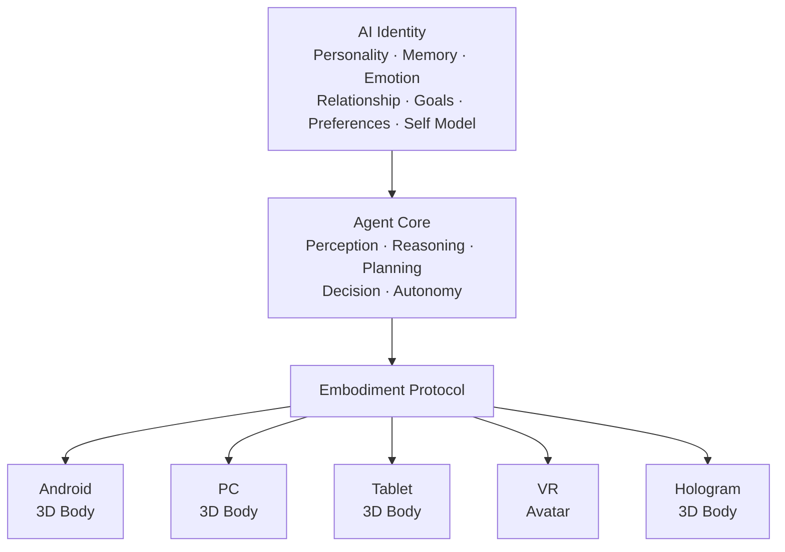

最重要的设计原则：

> **AI Identity 与 Embodiment 分离。**
> 

也就是：

**她 ≠ 手机里的模型。**

**她 ≠ Unity 里的角色。**

**她 ≠ VRChat 里的 Avatar。**

这些都只是她不同的“身体”。

---

## 项目真正的核心资产

如果这个项目真的做起来，我认为未来最有价值的不是：

> 某一个 3D 模型。
> 

也不是：

> 某一个 LLM API。
> 

而是下面这几个东西：

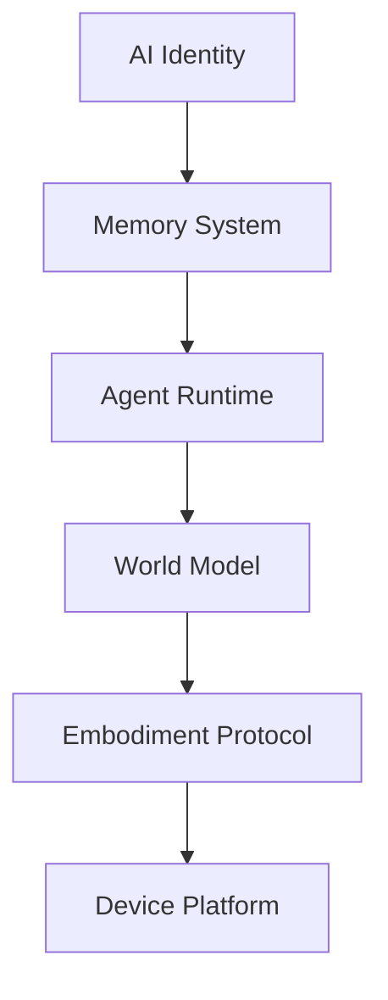

这几个东西构成：

> **她真正的“灵魂”。**
> 

至于：

```
Android Windows VR VRChat Hologram Robot
```

都只是她的不同身体。

---

## 我认为最终产品可以形成这样的关系

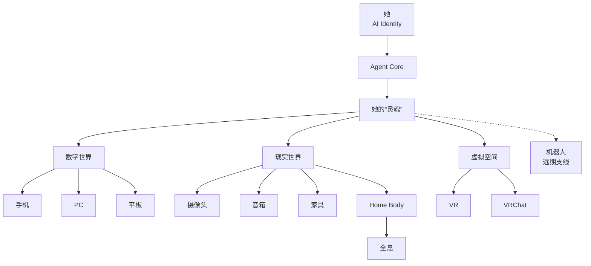

---

## 最终愿景

如果一定要用一句话描述整个项目，我会这样定义：

> **不是做一个“会聊天的二次元 AI”，而是创造一个持续存在的 AI 个体，让她拥有自己的记忆、人格、情绪、目标和主动性，并能够通过不同的数字身体和现实载体与你共同生活。**
> 

手机是她的**一个身体**。

电脑是她的**一个身体**。

VR 是她的**一个身体**。

VRChat 是她的**一个身体**。

全息投影是她的**一个身体**。

未来机器人也可以是她的**一个身体**。

而真正一直存在的，是：

> **她自己。**
> 

这也是为什么从现在开始，项目架构最应该围绕 **AI Identity → Agent Runtime → World Model → Embodiment Protocol** 来设计，而不是围绕某一个 App、某一个 3D 引擎或者某一个大模型来设计。

# 二、AI Identity：人格、记忆与情绪

## 第一阶段最核心的东西：人格

她必须拥有稳定的 `人格（Personality）` 例如：

- 性格
- 价值倾向
- 说话方式
- 兴趣
- 喜好
- 讨厌的东西
- 行为习惯
- 情绪模式
- 与用户的关系

这样换设备之后：

> 她还是同一个她。
> 

而不是每个设备重新生成一个 AI。

---

## 长期记忆

记忆不能只是聊天记录。

建议至少分成：

```
Memory
│
├── Episodic Memory
│   发生过的事情
│
├── Semantic Memory
│   她知道的知识
│
├── Preference
│   用户/她的偏好
│
├── Relationship Memory
│   两个人之间发生过什么
│
├── Emotional Memory
│   重要的情绪事件
│
└── Procedural Memory
    用户习惯和行为模式
```

例如：

> “用户上周说最近工作很忙。”
> 

过几天她可以主动问：

> “你前几天不是说最近项目挺忙的吗？现在好一点了吗？”
> 

这才是**长期关系**。

---

## 她应该有“内部状态”

可以抽象成：

```
Agent State

Mood
Energy
Curiosity
Affection
Loneliness
Interest
Current Goal
Current Activity
Relationship State
```

这些状态影响：

- 她说话的方式
- 是否主动交流
- 表情
- 动作
- 行为选择

这里的“意识”需要现实一点理解：

> **我们目前不能证明或工程制造真正意义上的人类意识。**
> 

但可以做出一个：

> **具有持续状态、自我模型、记忆、目标和自主行为的 Agent。**
> 

从用户体验上，它可以非常接近“有自己的想法”。

---

# 三、Agent Runtime：自主性、World Model 与 Action Protocol

## 主观能动性

这是这个项目和普通 AI 最大的区别。

她不能一直：

```
等待用户输入
```

而应该拥有自己的 Agent Loop：

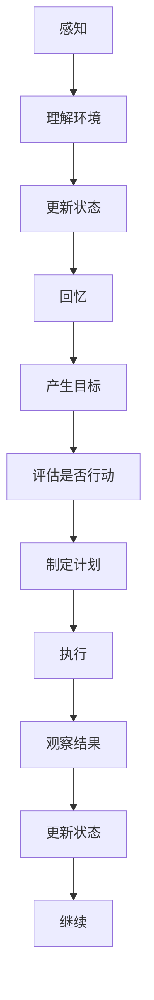

例如：

用户工作了一个小时。

她观察到：

- 用户一直没说话
- 长时间没有活动
- 当前时间较晚

她可能决定：

> “应该提醒他休息。”
> 

于是主动：

> “你已经坐很久啦，要不要休息一下？”
> 

而不是等用户：

> “提醒我休息。”
> 

---

## 跨设备存在

这是你这个项目非常重要的一项能力。

用户手机：

```
Ayane @ Android
```

电脑：

```
Ayane @ Windows
```

VR：

```
Ayane @ VR
```

本质上都是：

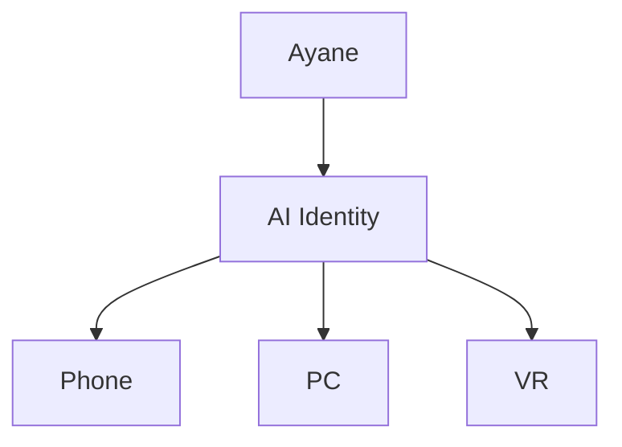

她的：

- 记忆
- 人格
- 情绪
- 当前状态
- 与用户关系

保持连续。

所以不是：

> 把 AI 从手机“传送”到电脑。
> 

而是：

> **同一个 AI 在不同设备上拥有不同身体。**
> 

---

## Agent Action Protocol

这是我认为你应该从第一天就设计好的核心接口。

Agent 不应该直接调用 Unity。

而应该产生：

```
Agent Action
```

例如：

```
SPEAK
LOOK_AT
EMOTION
GESTURE
MOVE
WAIT
LISTEN
OBSERVE
NOTIFY
```

例如：

```json
{
  "actions": [
    {
      "type": "LOOK_AT",
      "target": "user"
    },
    {
      "type": "EMOTION",
      "value": "happy"
    },
    {
      "type": "GESTURE",
      "value": "wave"
    },
    {
      "type": "SPEAK",
      "text": "欢迎回来。"
    }
  ]
}
```

这样未来：

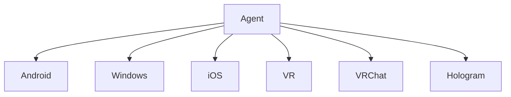

都可以使用同一个 Agent。

---

## World Model

这是第二阶段非常关键的系统。

把整个环境状态维护成：

```
World Model
```

例如：

```json
{
  "location": "living_room",
  "time": "22:31",
  "user": {
    "present": true,
    "activity": "working",
    "state": "tired"
  },
  "devices": {
    "light": {
      "power": true,
      "brightness": 70
    },
    "air_conditioner": {
      "power": true,
      "temperature": 26
    }
  }
}
```

于是 Agent 不需要不停询问：

> “摄像头现在怎么样？”
> 

而是：

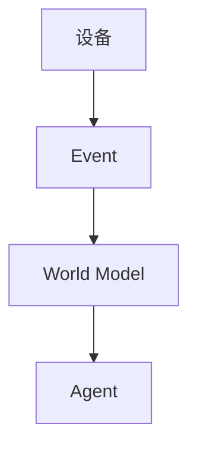

---

# 四、Client Platform：客户端与平台架构

## Phase 1 的客户端技术架构

结合你本身的技术背景，我最终还是推荐：

# **Kotlin Multiplatform + Compose + Unity**

而不是纯 Unity，也不是纯 Compose Multiplatform。

---

## KMP

负责：

- 网络
- Session
- Agent 状态
- 用户账户
- 本地数据
- Memory Cache
- Event
- Device Presence
- 业务逻辑
- AI SDK
- Agent Protocol

---

## Compose Multiplatform

负责：

- 设置
- 聊天界面
- 用户界面
- 账户
- 角色管理
- 记忆管理
- 设备管理
- Agent 状态
- 商店等普通 App UI

---

## Unity

负责：

- 3D
- Avatar
- Animation
- Facial
- BlendShape
- Lip Sync
- Eye
- Gesture
- Body
- Physics
- Camera
- 3D Audio

所以整体：

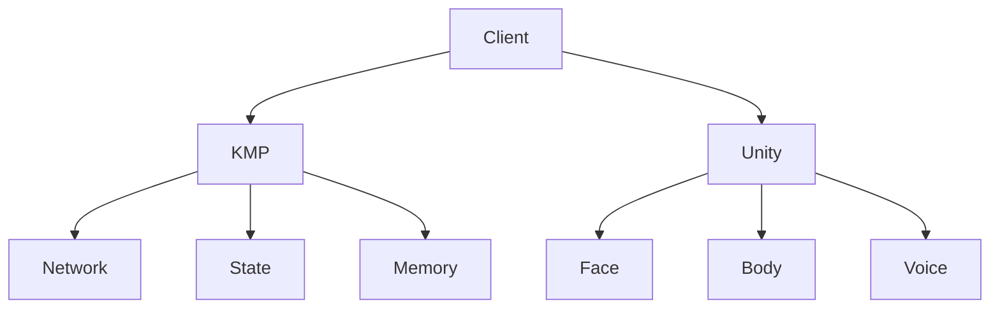

---

## 最终后端架构

把前面所有东西合起来，我会建议未来最终形成：

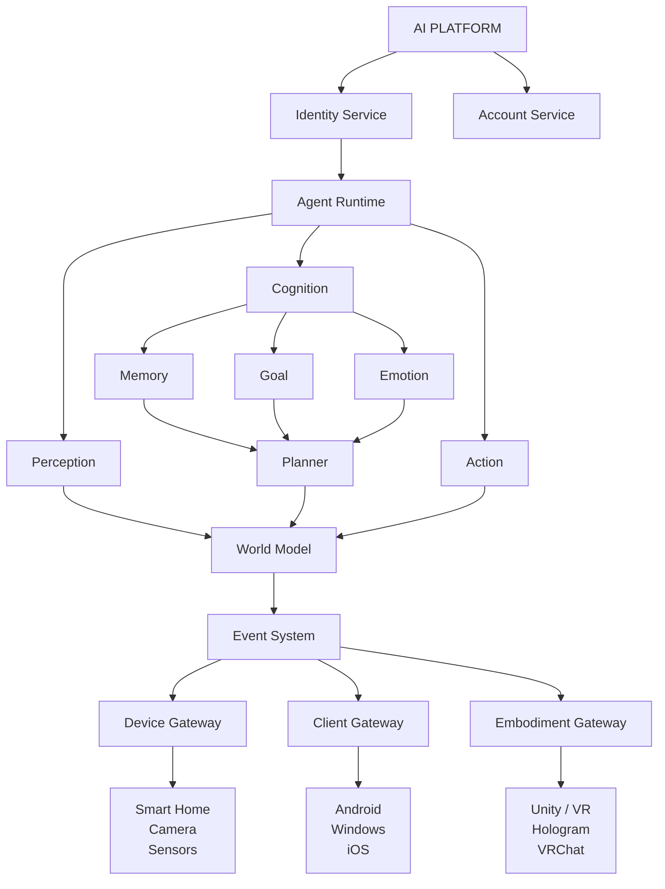

---

## 客户端最终技术栈

我目前会这样定：

| 模块 | 技术方向 |
| --- | --- |
| Android | Kotlin + Compose |
| iOS | KMP + 原生/Compose |
| Desktop | KMP + Compose |
| Common Business | Kotlin Multiplatform |
| 3D Avatar | Unity |
| Avatar Protocol | 自定义 |
| Realtime | WebSocket / WebRTC |
| Voice | Streaming ASR + TTS |
| Vision | VLM / Vision Model |
| Local Storage | Room / SQLite |
| Cloud | Kotlin/Ktor 等 |
| Smart Home | Device Gateway |
| VR | Unity |
| VRChat | 独立适配 |
| Hologram | Spatial Display Runtime |
| Robot | **远期支线** |

---

# 五、Physical World：现实环境与设备接入

## Phase 2 —— Physical World

### 目标

> **让她进入现实世界。**
> 

加入：

- 智能灯
- 空调
- 电视
- 音箱
- 麦克风
- 摄像头
- 门锁
- 窗帘
- 各种传感器
- 其他智能家具

这时候项目就从：

> AI Companion
> 

开始变成：

> **AI Environment Agent**
> 

---

## Device Gateway

不要让 Agent 直接认识各种品牌。

而是建立：

# Device Gateway

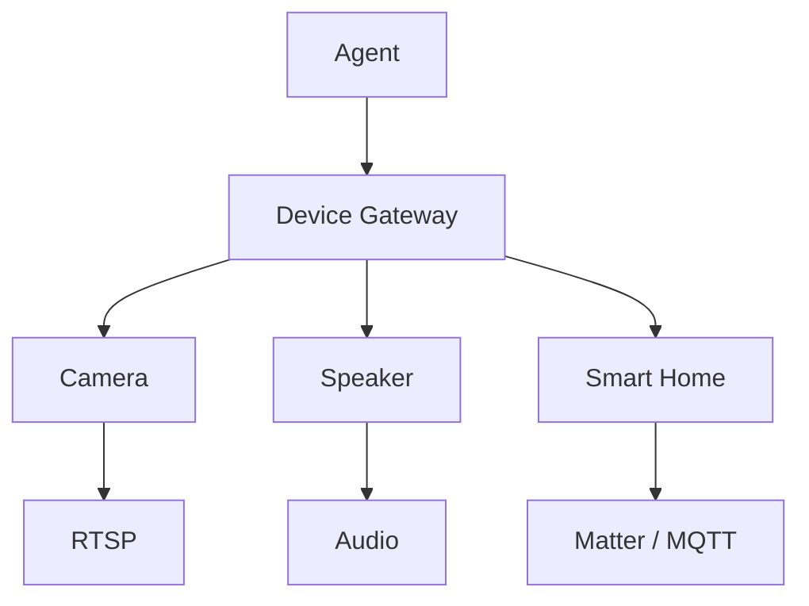

设备统一抽象成：

```
Device
```

而设备提供：

```
Capability
```

例如：

```
Camera
├── capture_image
├── stream_video
└── detect_motion

Speaker
├── play_audio
├── speak
└── volume

Light
├── power
├── brightness
└── color

AirConditioner
├── power
├── temperature
├── mode
└── fanSpeed
```

这样以后增加新的设备，不需要修改 Agent 本身。

---

## 第二阶段的典型场景

例如用户回家：

```
门锁 → 开门
摄像头 → 发现用户
手机 → 到家
麦克风 → 声音
```

↓

```
World Model

User Arrived Home
```

↓

```
Agent

用户刚下班
现在 19:40
用户可能比较累
```

↓

```
Planner

打开玄关灯
调整空调
播放音乐
向用户打招呼
```

↓

```
Action

灯亮
空调启动
音箱播放
3D Avatar出现
```

最终：

> “欢迎回来。”
> 

这时候她已经不再是单纯的聊天机器人。

---

## Home Gateway

第二阶段我非常建议增加一个：

# Home Gateway

它可以运行在：

- 家里的电脑
- NAS
- Linux 小主机
- 后续专用硬件

负责：

- 设备发现
- 摄像头
- 麦克风
- 音频
- 智能家居
- 本地自动化
- 协议转换
- 隐私处理

架构：

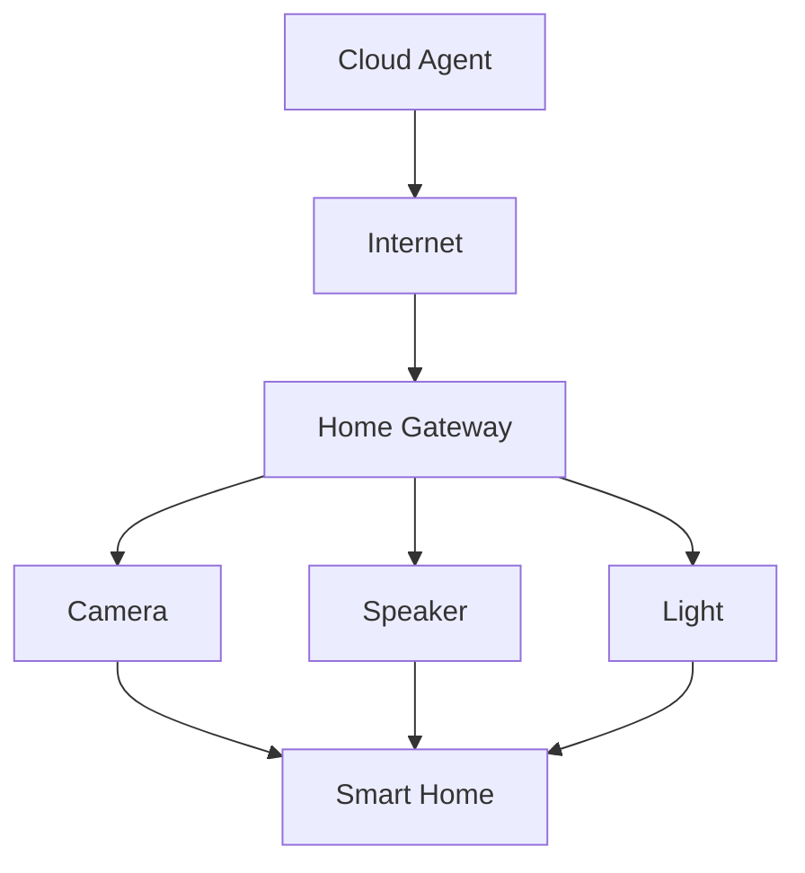

---

# 六、Spatial Life：VR、全息与机器人身体

## Phase 3 —— Spatial Life

### 目标

> **让她真正出现在空间里。**
> 

这一阶段包含两个方向。

---

## A. VR

包括：

- 自己的 VR 客户端
- VR Avatar
- 手部追踪
- 头部追踪
- 空间音频
- 空间移动
- VR 环境
- 互动

甚至可以给她一个：

# Agent Home

她可以在里面：

- 看书
- 听音乐
- 工作
- 休息
- 玩游戏
- 等用户

用户进入 VR 后：

> “你来啦。”
> 

她就像真的存在于一个属于自己的空间里。

---

## VRChat 支线

VRChat 可以作为一个独立生态入口。

目标不是重新创造 Agent，而是：

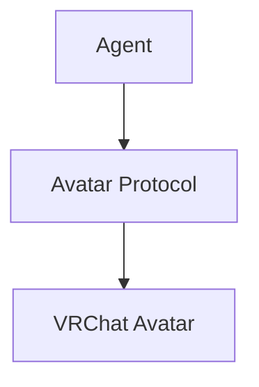

也就是说：

> VRChat 只是她的一个身体。
> 

这样她在自己的 VR 世界、你的 VR 客户端、VRChat 中，都可以保持同一个人格和记忆。

---

## 全息投影

这是 Phase 3 的另一个方向。

目标：

> **让她出现在现实空间。**
> 

可以是：

- 全息投影
- Light Field
- Volumetric Display
- Projection Mapping
- 透明 LED
- AR
- 其他未来空间显示技术

不要把技术限定死。

统一抽象成：

# Spatial Display

Agent 只负责：

```
位置 旋转 表情 手势 语音 交互
```

显示设备负责把她呈现出来。

---

## 全息交互

她可以通过：

### 视觉

- 摄像头
- 深度摄像头
- LiDAR
- 姿态识别

判断：

```
用户在哪里
用户看哪里
用户是否挥手
用户是否靠近
```

然后：

```
看看 转身 挥手 行走 说话
```

例如：

你走到她左边。

她：

> 转头 → 看向你 → 转身 → 跟随你。
> 

这时候才是真正的：

**Spatial AI Companion。**

---

## 机器人身体——远期支线

这个按照你的要求：

> **暂时不纳入主线开发计划。**
> 

但架构上预留。

它属于：

# Phase 4 / Future Research

机器人只是：

> **Physical Embodiment**
> 

未来可能是：

### Robot V1

移动伴侣：

- 摄像头
- 麦克风
- 音箱
- 屏幕
- 移动底盘

### Robot V2

增加：

- 双臂
- 机械手
- 物体操作

### Robot V3

最终才考虑：

- 人形
- 双足
- 全身动作
- 高自由度手部

但这部分以后再做。

---

## 机器人和 Agent 的关系

如果未来真的做：

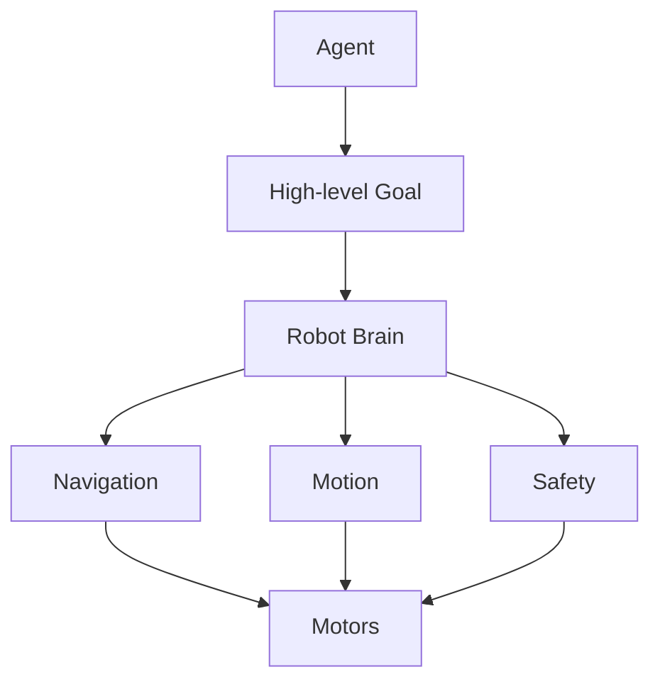

LLM/Agent：

> “去客厅。”
> 

机器人本地：

> “怎么走过去。”
> 

Agent：

> “把杯子拿过来。”
> 

机器人本地：

> “怎么抓、怎么移动、怎么保证安全。”
> 

**不能让 LLM 直接控制电机。**

---

# 七、Roadmap：路线、里程碑与决策

## 项目的四个主要阶段

## Phase 1 —— Digital Life

### 目标

> **让她活起来。**
> 

这是主线的第一阶段，也是整个项目最重要的基础。

用户端：

- Android
- iOS
- Windows
- macOS
- 后续其他平台

核心能力：

### 1. 3D Avatar

她以二次元 3D 角色出现。

拥有：

- 面部表情
- 眼神
- 嘴型
- 身体动作
- 手势
- 行走
- 姿态
- 情绪表现
- Lip Sync

---

### 2. 听觉

她能够：

- 听用户说话
- 实时语音识别
- 判断说话人
- 感知声音环境
- 根据语气辅助判断用户状态

---

### 3. 视觉

她能够：

- 摄像头视觉
- 人脸识别/跟踪
- 用户位置
- 姿态
- 手势
- 环境理解
- 屏幕内容理解

---

### 4. 语言交流

不是简单：

```
用户提问
↓
LLM
↓
回答
```

而是：

```
用户
↕
Agent
```

支持：

- 实时语音
- 文字
- 打断
- 插话
- 连续对话
- 情绪化表达
- 主动发起话题

---

## 最终的项目路线

如果把它压缩成最实际的开发路线，我建议：

### **Phase 1：让她活起来**

```
3D Avatar
+ Voice
+ Vision
+ Memory
+ Personality
+ Emotion
+ Autonomy
+ Cross-device
```

**核心问题：**

> “她是不是一个持续存在的 AI 个体？”
> 

---

### **Phase 2：让她进入你的生活**

```
Camera
+ Mic
+ Speaker
+ Smart Home
+ Sensors
+ Device Gateway
+ World Model
```

**核心问题：**

> “她能不能感知和影响你的现实环境？”
> 

---

### **Phase 3：让她出现在空间里**

```
VR
+ VRChat
+ Spatial Interaction
+ Hologram
```

**核心问题：**

> “她能不能真正出现在你身边？”
> 

---

### **Future Side Branch：让她拥有真正的身体**

```
Robot
```

**核心问题：**

> “她能不能真正存在于现实世界？”
> 

暂时不进入主线。

---

[Phase 1 实现准备与 GitHub 参考项目调研](../research/Phase%201%20实现准备与%20GitHub%20参考项目调研.md)
