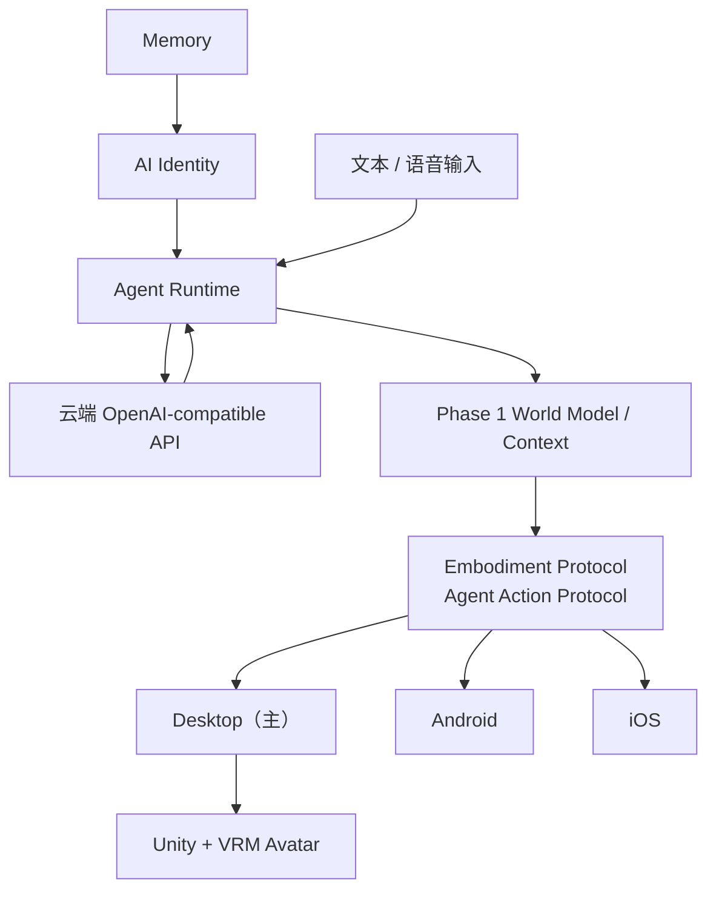

# Phase 1 实现准备与 GitHub 参考项目调研

调研入口：[调研与技术选型](调研与技术选型.md)

工程架构：[项目整体架构设计](../architecture/项目整体架构设计.md)

<aside>

本文档的唯一上位目标是 [二次元 AI 数字生命](../product/产品愿景与总纲.md)。所有范围、技术选型和实现顺序都必须服从该页面的产品愿景与架构原则；若出现冲突，以目标页面为准。

研究范围：Phase 1 / Digital Life，聚焦身份、记忆、Agent Runtime、语音和数字载体；不覆盖智能家居、VR、全息和机器人落地。

</aside>

## 零、目标对齐原则

- **AI Identity 是持续主体**：Personality、Memory、Emotion、Relationship 属于 Identity，不绑定具体模型供应商或设备。
- **Agent Runtime 是运行时**：负责感知、上下文、推理、规划和决策；云端 OpenAI-compatible API 只是可替换的模型接口。
- **Embodiment Protocol 是稳定边界**：Agent Action Protocol 是它在 Phase 1 的具体实现，Unity 和客户端只消费动作，不承载人格与记忆。
- **多平台是同一个她的不同身体**：平台包含 Desktop、Android、iOS，以 Desktop 为主，但三端共享同一 Identity 与协议契约。
- **World Model 先做最小上下文**：Phase 1 只记录会话、当前设备、活动和必要环境信息，不提前进入 Physical World。
- **远期能力不反向污染主线**：智能家居、VR、全息和机器人仅作为后续阶段约束，不进入当前实现范围。

## 一、调研结论

Phase 1 不应该从完整平台开始，而应该先完成一条可重复验证的最小闭环：



第一版的成功标准是：用户输入信息后，AI 能基于稳定人格完成回复，将重要事实写入记忆；应用重启后仍能召回，并通过 Avatar 输出语音、表情或简单动作。

## 二、需要准备的东西

### 1. 平台范围

平台包含 Desktop、Android、iOS，以 Desktop 为主平台先完成核心闭环，再通过 KMP 复用业务逻辑逐步接入 Android 和 iOS。

### 2. 模型路线

模型路线确定为云端 OpenAI-compatible API。第一版统一围绕流式输出、鉴权、错误处理和会话管理设计，不同时维护本地推理服务。

[llama.cpp](https://github.com/ggml-org/llama.cpp) 保留为后续本地模型方案的参考项目，不纳入当前 Phase 1 运行时。

### 3. AI Identity 数据

用 JSON 或数据库记录以下稳定状态：

- 人格与说话风格
- 用户偏好与禁忌
- 关系状态
- 当前情绪
- 当前目标和活动
- 自我描述与行为规则

### 4. 最小 Memory

第一版使用 SQLite 即可，至少保存：

- 用户资料
- 重要事实
- 对话事件
- 关系变化
- 可检索的记忆摘要

等记忆规模变大后，再评估 [Mem0](https://github.com/mem0ai/mem0) 的多层记忆模型或 [Qdrant](https://github.com/qdrant/qdrant) 的向量检索能力。

### 5. Embodiment Protocol 与 Agent Action Protocol

Embodiment Protocol 是 Agent 与不同数字身体之间的稳定边界；Agent Action Protocol 是它在 Phase 1 的具体动作格式。Agent 不直接调用 Unity，而是输出稳定的动作协议：

```json
{
  "actions": [
    {"type": "SPEAK", "text": "欢迎回来。"},
    {"type": "EMOTION", "value": "happy"},
    {"type": "GESTURE", "value": "wave"}
  ]
}
```

### 6. Avatar 与语音

Unity 负责 3D、Avatar、表情、动画和 Lip Sync；KMP / Compose 负责普通应用界面与业务状态。

[UniVRM](https://github.com/vrm-c/UniVRM) 是 Unity 使用 VRM 角色的首选参考，支持 VRM 1.0、glTF 和运行时导入导出。

语音建议先文字后语音。需要跨 Android、iOS、Windows 和 Kotlin 时，优先评估 [sherpa-onnx](https://github.com/k2-fsa/sherpa-onnx)；只需要本地语音识别时，可评估 [whisper.cpp](https://github.com/ggml-org/whisper.cpp)。

## 三、GitHub 参考项目

| 项目 | 适合参考的部分 | Phase 1 建议 |
| --- | --- | --- |
| [UniVRM](https://github.com/vrm-c/UniVRM) | Unity、VRM Avatar、运行时导入导出和动画载体 | 直接研究和试用 |
| [OpenAI Agents SDK](https://github.com/openai/openai-agents-python) | Agent、Session、工具调用、Guardrails、Tracing、Realtime | 参考 Runtime 设计，不作为 KMP 依赖 |
| [llama.cpp](https://github.com/ggml-org/llama.cpp) | 本地 LLM、量化、跨硬件推理和服务端 | 仅作后续本地方案参考 |
| [sherpa-onnx](https://github.com/k2-fsa/sherpa-onnx) | ASR、TTS、VAD 和 Android/iOS/Windows/Kotlin 支持 | 跨平台语音首选候选 |
| [whisper.cpp](https://github.com/ggml-org/whisper.cpp) | 轻量离线语音识别和移动端部署 | 只做 STT 时评估 |
| [LiveKit Agents](https://github.com/livekit/agents) | 实时语音、WebRTC、STT/LLM/TTS 会话管理 | 语音闭环稳定后再研究 |
| [Mem0](https://github.com/mem0ai/mem0) | 用户、Session、Agent 多层记忆 | 参考设计，先不用作硬依赖 |
| [Qdrant](https://github.com/qdrant/qdrant) | 向量检索、过滤和混合搜索 | 记忆规模变大后再引入 |
| [Open WebUI](https://github.com/open-webui/open-webui) | 聊天 UI、模型接入和本地服务交互 | 参考产品交互 |
| [SillyTavern](https://github.com/SillyTavern/SillyTavern) | 角色卡、Lorebook 和人物设定交互 | 只参考交互，复制代码前检查 AGPL 许可 |

## 四、推荐的第一版组合

```
Desktop（主平台）
├── Android / iOS：KMP 复用业务逻辑，按阶段接入
├── KMP + Compose：应用 UI、状态和业务逻辑
├── 云端 OpenAI-compatible API：文本推理
├── SQLite：Identity 与基础 Memory
├── Agent Runtime：回忆、决策和动作生成
├── Embodiment Protocol：由 Agent Action Protocol 实现，与身体解耦
├── Unity + UniVRM：Avatar、表情和动作
└── sherpa-onnx：后续接入 ASR / TTS / VAD
```

## 五、开发顺序

1. 文字对话跑通。
2. 固定 Identity 数据结构和系统提示词。
3. 保存并召回一条用户记忆。
4. 输出并校验 Agent Action Protocol。
5. Unity Avatar 接收动作并表现表情、语音和手势。
6. 接入语音输入输出。
7. 最后再加入主动行为和后台调度。

## 六、验收标准

- 用户说“我喜欢晚上喝茶”，系统能记录为长期记忆。
- 应用重启后，AI 仍能正确召回这条信息。
- AI Identity 数据模型不绑定设备；Desktop、Android、iOS 使用同一 Identity 契约，当前以 Desktop 验证。
- 一次回复可以同时产生文本、语音、表情或动作。
- Unity 不直接参与人格、记忆和模型推理。
- 云端 OpenAI-compatible 模型服务可以替换，不影响 AI Identity、Memory 和 Embodiment Protocol。
- 未引入智能家居、VR、全息、机器人等 Phase 2 以后范围。

## 七、暂不做

- 多设备实时同步
- Smart Home / Device Gateway
- VRChat 和 Spatial Display
- 机器人电机控制
- 本地模型部署（llama.cpp 仅作为后续参考）
- 自研大模型
- 复杂向量数据库和完整长期记忆平台

## 参考来源

- [UniVRM](https://github.com/vrm-c/UniVRM)
- [OpenAI Agents SDK](https://github.com/openai/openai-agents-python)
- [llama.cpp](https://github.com/ggml-org/llama.cpp)
- [sherpa-onnx](https://github.com/k2-fsa/sherpa-onnx)
- [whisper.cpp](https://github.com/ggml-org/whisper.cpp)
- [LiveKit Agents](https://github.com/livekit/agents)
- [Mem0](https://github.com/mem0ai/mem0)
- [Qdrant](https://github.com/qdrant/qdrant)
- [Open WebUI](https://github.com/open-webui/open-webui)
- [SillyTavern](https://github.com/SillyTavern/SillyTavern)
