# 二次元 AI 数字生命

# 一、项目总纲与产品愿景

## 二次元 AI 数字生命 / AI 伴侣平台（AI Companion Platform）

核心理念可以浓缩成一句话：

> **创造一个拥有独立人格、长期记忆、情绪、主动性和持续存在能力的 AI 个体，让她可以拥有不同的“身体”，存在于手机、电脑、VR、现实空间以及未来的机器人中。**
> 

---

## 最终产品形态

你最终想做的是这样的：

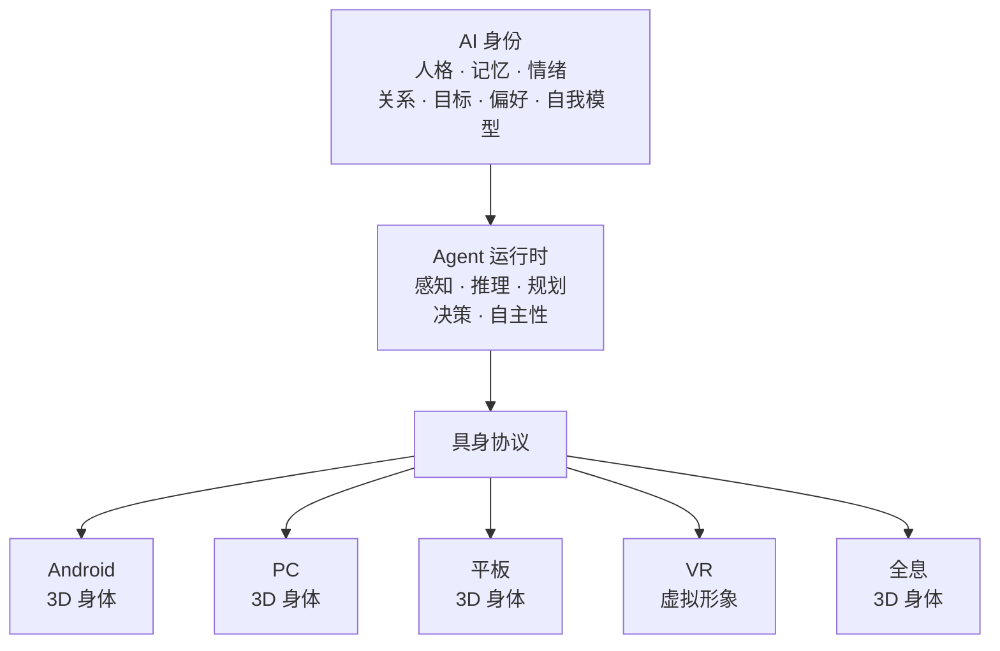

最重要的设计原则：

> **AI 身份与具身分离。**
> 

也就是：

**她 ≠ 手机里的模型。**

**她 ≠ Unity 里的角色。**

**她 ≠ VRChat 里的虚拟形象。**

这些都只是她不同的“身体”。

---

## 项目真正的核心资产

如果这个项目真的做起来，我认为未来最有价值的不是：

> 某一个 3D 模型。
> 

也不是：

> 某一个 LLM API。
> 

而是下面这几个东西：

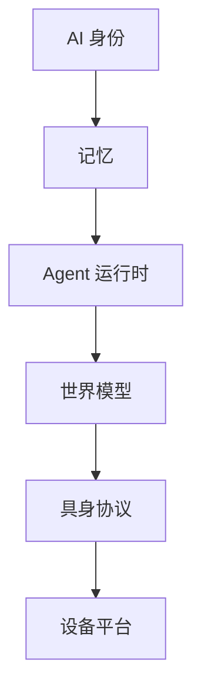

> 该链条表示依赖分层顺序：身份 → 记忆 → Agent 运行时 → 世界模型 → 具身协议 → 设备平台，不是一次请求的数据流。

这几个东西构成：

> **她真正的“灵魂”。**
> 

至于：

```
Android Windows VR VRChat 全息 机器人
```

都只是她的不同身体。

---

## 我认为最终产品可以形成这样的关系

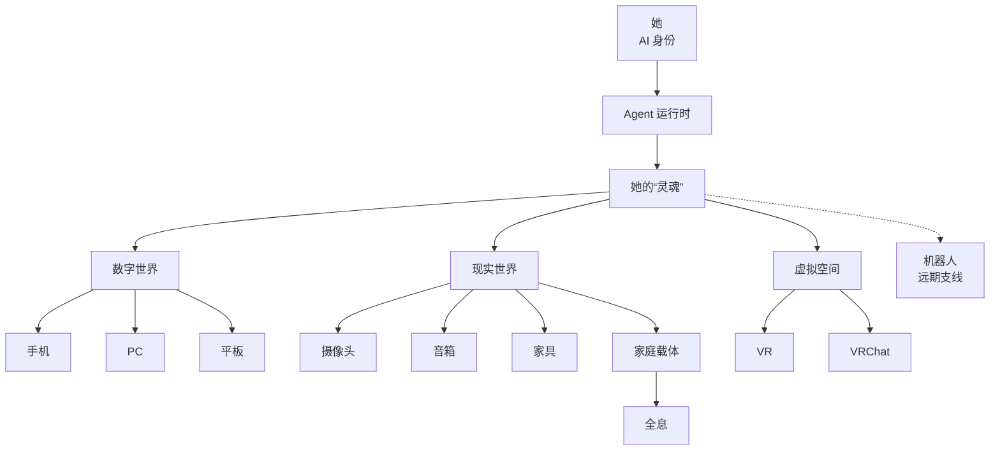

> 图例：实线表示能力归属或身体承载关系，虚线表示远期支线（不纳入主线）；箭头方向表示依赖或承载，不表示运行时调用或数据流。

---

## 最终愿景

如果一定要用一句话描述整个项目，我会这样定义：

> **不是做一个“会聊天的二次元 AI”，而是创造一个持续存在的 AI 个体，让她拥有自己的记忆、人格、情绪、目标和主动性，并能够通过不同的数字身体和现实载体与你共同生活。**
> 

手机是她的**一个身体**。

电脑是她的**一个身体**。

VR 是她的**一个身体**。

VRChat 是她的**一个身体**。

全息投影是她的**一个身体**。

未来机器人也可以是她的**一个身体**。

而真正一直存在的，是：

> **她自己。**
> 

这也是为什么从现在开始，项目架构最应该围绕 **AI 身份 → Agent 运行时 → 世界模型 → 具身协议** 来设计，而不是围绕某一个 App、某一个 3D 引擎或者某一个大模型来设计。

---

## 平台形态：多用户与多 Agent

这个项目不是单机应用，而是一个多用户平台：

- 平台服务多个用户，每个用户的身份、记忆、情绪和关系数据相互隔离。
- 每个用户可以拥有多个 Agent。每个 Agent 是独立的一份「她」，有自己的人格、记忆、关系和状态。
- 同一用户的不同 Agent 之间不共享人格与记忆；同一个 Agent 在 Desktop、Android、iOS 上是同一个她。
- 客户端提供 Agent 列表、创建 / 绑定与切换；当前 Session 始终属于某一个确定的 Agent。
- 平台侧的运营与治理由管理后台承担，属于维护者入口，不是用户端功能。

因此 Agent 的身份维度是「用户 + Agent」，而不是单一用户维度。

# 二、AI 身份（AI Identity）：人格、记忆与情绪

## 第一阶段最核心的东西：人格

她必须拥有稳定的 `人格（Personality）` 例如：

- 性格
- 价值倾向
- 说话方式
- 兴趣
- 喜好
- 讨厌的东西
- 行为习惯
- 情绪模式
- 与用户的关系

人格不是每次对话临时生成的，它需要一份可维护、可审计的权威定义：

- 人格由用户和平台管理员维护，运行时只读，模型不能直接改写。
- 人格可以随重要事件缓慢演进，但每次修订都要留痕、可回溯。
- 她对自己的叙事可以动态演化，但同样受审计约束。

这样换设备之后：

> 她还是同一个她。
> 

而不是每个设备重新生成一个 AI。

---

## 长期记忆

记忆不能只是聊天记录。

建议至少分成：

```
Memory（记忆）
│
├── Episodic Memory（情节记忆）
│   发生过的事情
│
├── Semantic Memory（语义记忆）
│   她知道的知识
│
├── Preference（偏好）
│   用户/她的偏好
│
├── Relationship Memory（关系记忆）
│   两个人之间发生过什么
│
├── Emotional Memory（情绪记忆）
│   重要的情绪事件
│
└── Procedural Memory（程序记忆）
    用户习惯和行为模式
```

Phase 1 先落地情节记忆 / 偏好 / 关系记忆 / 情绪记忆四类；语义记忆与程序记忆属于「Phase 1 内延后项」。

例如：

> “用户上周说最近工作很忙。”
> 

过几天她可以主动问：

> “你前几天不是说最近项目挺忙的吗？现在好一点了吗？”
> 

这才是**长期关系**。

---

## 她应该有“内部状态”

可以抽象成：

```
Agent State       // 智能体状态

Mood              // 心情
Energy            // 精力
Curiosity         // 好奇心
Affection         // 亲密度
Loneliness        // 孤独感
Current Goal      // 当前目标
Current Activity  // 当前活动
```

这里的状态只描述「她此刻怎样」。边界必须分清：

- 身份是「她是谁」——跨时间稳定。
- 记忆是「她经历过什么」——可增长、可修订、可衰减。
- Agent State 是「她此刻感觉怎样」——运行时状态。

三者不可合并，`Relationship`（关系）属于身份与记忆，不属于 Agent State。完整字段（含昼夜节律、当前活跃设备等）以 Agent Service 架构为准。

这些状态影响：

- 她说话的方式
- 是否主动交流
- 表情
- 动作
- 行为选择

这里的“意识”需要现实一点理解：

> **我们目前不能证明或工程制造真正意义上的人类意识。**
> 

但可以做出一个：

> **具有持续状态、自我模型、记忆、目标和自主行为的 Agent。**
> 

从用户体验上，它可以非常接近“有自己的想法”。

---

# 三、Agent 运行时（Agent Runtime）：自主性、世界模型与动作协议

## 主观能动性

这是这个项目和普通 AI 最大的区别。

她不能一直：

```
等待用户输入
```

而应该拥有自己的 Agent 循环（Agent Loop）：

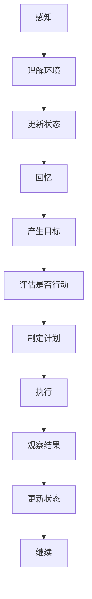

例如：

用户工作了一个小时。

她观察到：

- 用户一直没说话
- 长时间没有活动
- 当前时间较晚

她可能决定：

> “应该提醒他休息。”
> 

于是主动：

> “你已经坐很久啦，要不要休息一下？”
> 

而不是等用户：

> “提醒我休息。”
> 

---

## 跨设备存在

这是你这个项目非常重要的一项能力。

用户手机：

```
Ayane @ Android
```

电脑：

```
Ayane @ Windows
```

VR：

```
Ayane @ VR
```

本质上都是：

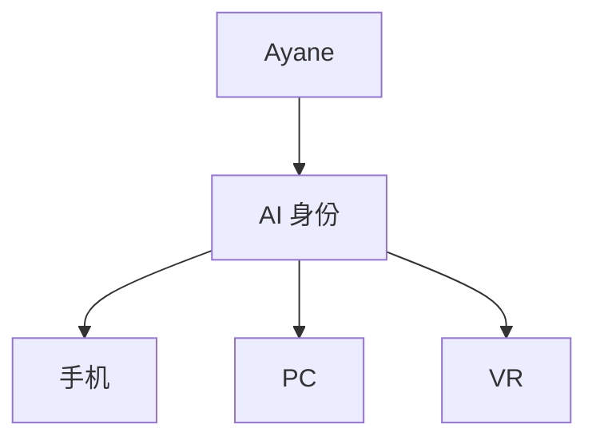

她的：

- 记忆
- 人格
- 情绪
- 当前状态
- 与用户关系

保持连续。

所以不是：

> 把 AI 从手机“传送”到电脑。
> 

而是：

> **同一个 AI 在不同设备上拥有不同身体。**
> 

---

## Agent 动作协议（Agent Action Protocol）

这是我认为你应该从第一天就设计好的核心接口。

具身协议（Embodiment Protocol）是 Agent 与不同身体之间的稳定边界；Agent 动作协议（Agent Action Protocol）是它在 Phase 1 的具体实现。

Agent 不应该直接调用 Unity。

而应该产生：

```
Agent Action
```

例如：

```
SPEAK        // 说话
LOOK_AT      // 注视
EMOTION      // 情绪
GESTURE      // 手势
MOVE         // 移动
WAIT         // 等待
LISTEN       // 倾听
OBSERVE      // 观察
NOTIFY       // 通知
```

动作是分阶段落地的：

- Phase 1 最小动作集：`SPEAK` / `LISTEN` / `LOOK_AT` / `EMOTION` / `GESTURE` / `WAIT`
- Phase 1 内延后项：`NOTIFY` / `OBSERVE`
- Phase 3：`MOVE`

例如：

```json
{
  "actions": [
    {
      "type": "LOOK_AT",
      "target": "user"
    },
    {
      "type": "EMOTION",
      "value": "happy"
    },
    {
      "type": "GESTURE",
      "value": "wave"
    },
    {
      "type": "SPEAK",
      "text": "欢迎回来。"
    }
  ]
}
```

这样未来：

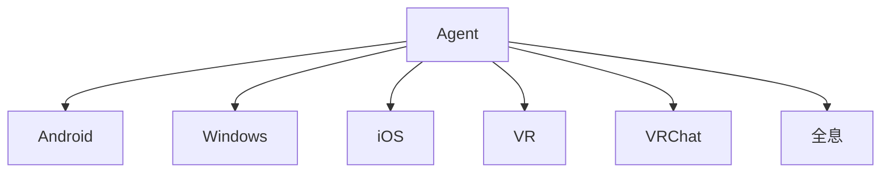

都可以使用同一个 Agent。

---

## 世界模型（World Model）

这是第二阶段非常关键的系统。

把整个环境状态维护成：

```
世界模型
```

例如：

```json
{
  "location": "living_room",
  "time": "22:31",
  "user": {
    "present": true,
    "activity": "working",
    "state": "tired"
  },
  "devices": {
    "light": {
      "power": true,
      "brightness": 70
    },
    "air_conditioner": {
      "power": true,
      "temperature": 26
    }
  }
}
```

于是 Agent 不需要不停询问：

> “摄像头现在怎么样？”
> 

而是：

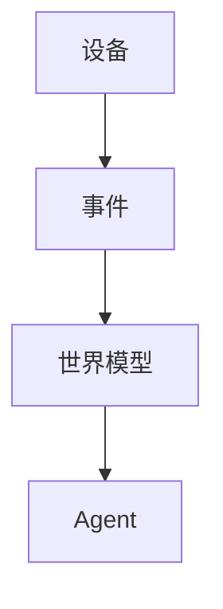

---

# 四、系统架构：整体技术框架

## 架构总览

核心思路：AI 身份是独立主体，通过统一协议接入不同身体和环境。

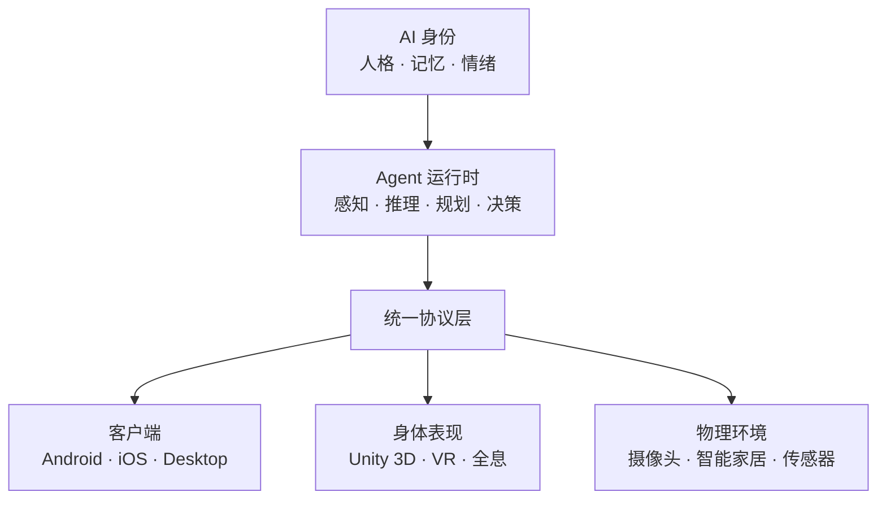

## 模块职责

| 模块 | 职责 | 技术方向 |
| --- | --- | --- |
| AI 身份 | 人格、记忆、情绪、关系 | 后端服务 |
| Agent 运行时 | 自主行为、推理、规划 | 后端服务 |
| 客户端 | 用户交互、业务逻辑 | KMP + Compose |
| 身体表现 | 3D 虚拟形象、动画、表情 | Unity |
| 物理环境 | 设备接入、环境感知 | 设备网关 |

## 核心原则

- 身份与身体分离：换设备不换人格
- 客户端不直接调用 LLM
- Unity 只负责表现，不承载记忆
- 协议统一，各端独立演进
- 记忆、人格与关系数据属于用户：平台必须支持查看、导出与可验证的删除；服务端是权威副本，客户端只持有缓存。

> 详细仓库结构、依赖方向和协议边界参见 [项目整体架构设计](../architecture/项目整体架构设计.md)

---

# 五、物理世界（Physical World）：现实环境与设备接入

## Phase 2 —— 物理世界（Physical World）

### 目标

> **让她进入现实世界。**
> 

加入：

- 智能灯
- 空调
- 电视
- 音箱
- 麦克风
- 摄像头
- 门锁
- 窗帘
- 各种传感器
- 其他智能家具

这时候项目就从：

> AI 伴侣
> 

开始变成：

> **AI 环境 Agent**
> 

---

## 设备网关（Device Gateway）

不要让 Agent 直接认识各种品牌。

而是建立：

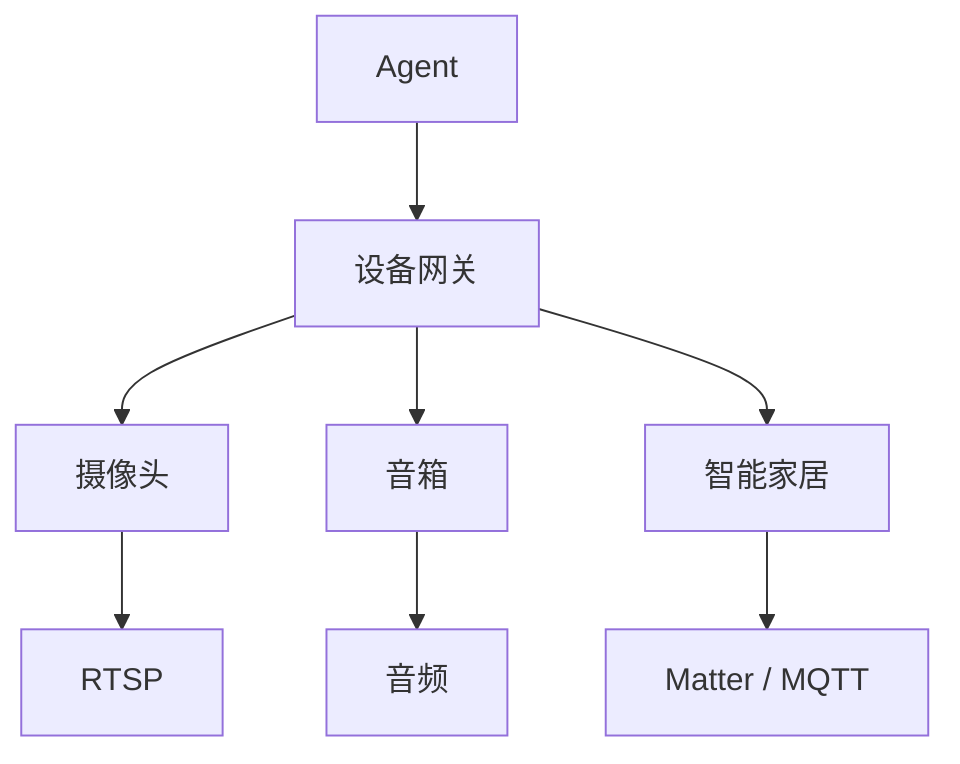

设备统一抽象成：

```
Device（设备）
```

而设备提供：

```
Capability（能力）
```

例如：

```
Camera（摄像头）
├── capture_image  // 抓拍图像
├── stream_video   // 视频流
└── detect_motion  // 移动侦测

Speaker（音箱）
├── play_audio     // 播放音频
├── speak          // 说话
└── volume         // 音量

Light（灯）
├── power          // 开关
├── brightness     // 亮度
└── color          // 颜色

AirConditioner（空调）
├── power          // 开关
├── temperature    // 温度
├── mode           // 模式
└── fanSpeed       // 风速
```

这样以后增加新的设备，不需要修改 Agent 本身。

---

## 第二阶段的典型场景

例如用户回家：

```
门锁 → 开门
摄像头 → 发现用户
手机 → 到家
麦克风 → 声音
```

↓

```
世界模型

用户到家
```

↓

```
Agent

用户刚下班
现在 19:40
用户可能比较累
```

↓

```
规划器

打开玄关灯
调整空调
播放音乐
向用户打招呼
```

↓

```
动作

灯亮
空调启动
音箱播放
3D 虚拟形象出现
```

最终：

> “欢迎回来。”
> 

这时候她已经不再是单纯的聊天机器人。

---

## 家庭网关（Home Gateway）

第二阶段我非常建议增加一个：

它可以运行在：

- 家里的电脑
- NAS
- Linux 小主机
- 后续专用硬件

负责：

- 设备发现
- 摄像头
- 麦克风
- 音频
- 智能家居
- 本地自动化
- 协议转换
- 隐私处理

架构：

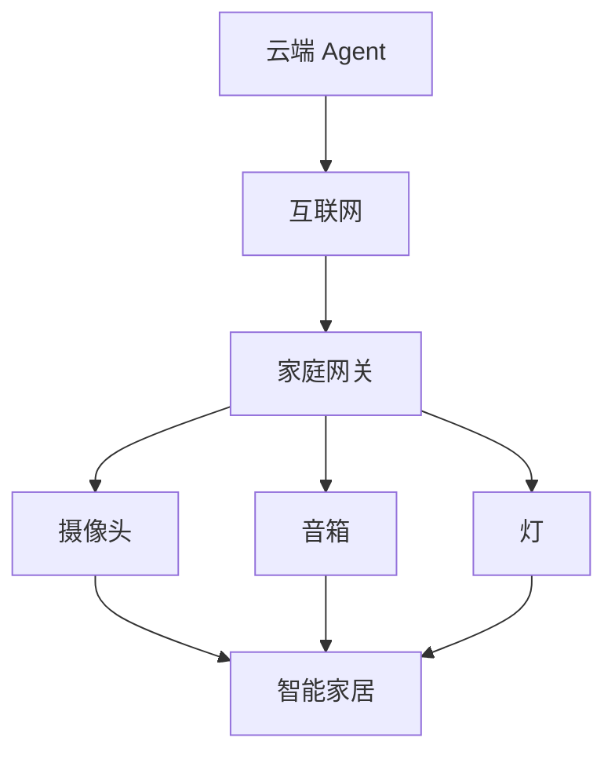

---

# 六、空间生活（Spatial Life）：VR、全息与机器人身体

## Phase 3 —— 空间生活（Spatial Life）

### 目标

> **让她真正出现在空间里。**
> 

这一阶段包含两个方向。

---

## A. VR

包括：

- 自己的 VR 客户端
- VR 虚拟形象
- 手部追踪
- 头部追踪
- 空间音频
- 空间移动
- VR 环境
- 互动

甚至可以给她一个：

### Agent 之家（Agent Home）

她可以在里面：

- 看书
- 听音乐
- 工作
- 休息
- 玩游戏
- 等用户

用户进入 VR 后：

> “你来啦。”
> 

她就像真的存在于一个属于自己的空间里。

---

## VRChat 支线

VRChat 可以作为一个独立生态入口。

目标不是重新创造 Agent，而是：

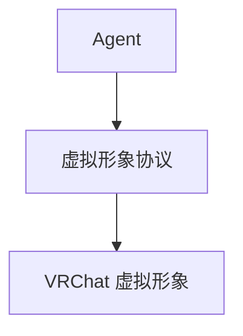

也就是说：

> VRChat 只是她的一个身体。
> 

这样她在自己的 VR 世界、你的 VR 客户端、VRChat 中，都可以保持同一个人格和记忆。

---

## 全息投影

这是 Phase 3 的另一个方向。

目标：

> **让她出现在现实空间。**
> 

可以是：

- 全息投影
- 光场显示（Light Field）
- 体积显示（Volumetric Display）
- 投影映射（Projection Mapping）
- 透明 LED
- AR
- 其他未来空间显示技术

不要把技术限定死。

统一抽象成：

### 空间显示（Spatial Display）

Agent 只负责：

```
位置 旋转 表情 手势 语音 交互
```

显示设备负责把她呈现出来。

---

## 全息交互

她可以通过：

### 视觉

- 摄像头
- 深度摄像头
- LiDAR
- 姿态识别

判断：

```
用户在哪里
用户看哪里
用户是否挥手
用户是否靠近
```

然后：

```
看看 转身 挥手 行走 说话
```

例如：

你走到她左边。

她：

> 转头 → 看向你 → 转身 → 跟随你。
> 

这时候才是真正的：

**空间 AI 伴侣（Spatial AI Companion）。**

---

## 机器人身体——远期支线

这个按照你的要求：

> **暂时不纳入主线开发计划。**
> 

但架构上预留。

它属于：

### Phase 4 —— 物理具身（Physical Embodiment）

机器人只是：

> **物理具身（Physical Embodiment）**
> 

未来可能是：

### 机器人 V1

移动伴侣：

- 摄像头
- 麦克风
- 音箱
- 屏幕
- 移动底盘

### 机器人 V2

增加：

- 双臂
- 机械手
- 物体操作

### 机器人 V3

最终才考虑：

- 人形
- 双足
- 全身动作
- 高自由度手部

但这部分以后再做。

---

## 机器人和 Agent 的关系

如果未来真的做：

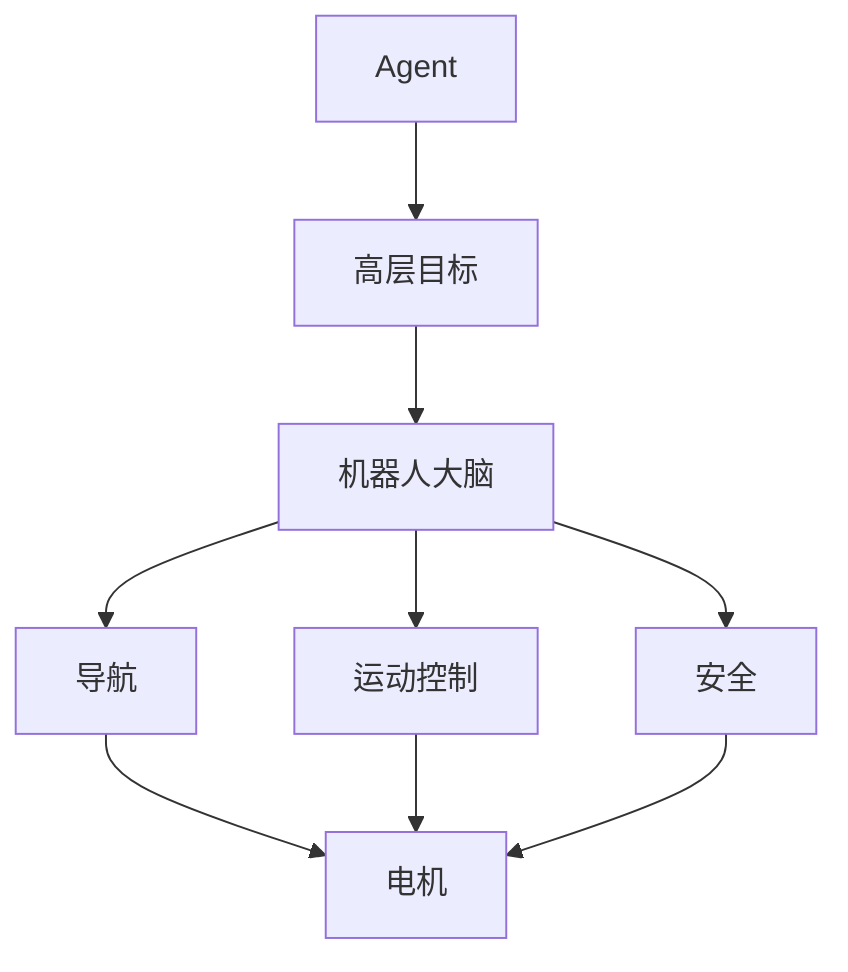

LLM/Agent：

> “去客厅。”
> 

机器人本地：

> “怎么走过去。”
> 

Agent：

> “把杯子拿过来。”
> 

机器人本地：

> “怎么抓、怎么移动、怎么保证安全。”
> 

**不能让 LLM 直接控制电机。**

---

# 七、路线图（Roadmap）：路线、里程碑与决策

## 项目的四个主要阶段

## Phase 1 —— 数字生命（Digital Life）

### 目标

> **让她活起来。**
> 

这是主线的第一阶段，也是整个项目最重要的基础。

本阶段不再细分小版本；需要推迟到第一期之后的能力统一标记为「Phase 1 内延后项」。

用户端：

- Android
- iOS
- Desktop（Windows / macOS，Phase 1 主验证端）
- 后续其他平台

核心能力：

### 1. 3D 虚拟形象（Avatar）

她以二次元 3D 角色出现。

拥有：

- 面部表情
- 眼神
- 嘴型
- 身体动作
- 手势
- 行走
- 姿态
- 情绪表现
- 唇形同步（Lip Sync）

---

### 2. 听觉（Phase 1）

她能够：

- 听用户说话（麦克风采集）
- 实时语音识别
- 根据语气辅助判断用户状态

「判断说话人（说话人区分）」与「感知声音环境（环境音）」属于 Phase 2。

---

### 3. 视觉（Phase 1）

她能够：

- 屏幕内容理解
- 在场检测与人脸识别/跟踪

Phase 2 再扩展到完整视觉理解：
- 摄像头视觉
- 人脸识别/跟踪
- 用户位置
- 姿态
- 手势
- 环境理解

---

### 4. 语言交流

不是简单：

```
用户提问
↓
LLM
↓
回答
```

而是：

```
用户
↕
Agent
```

支持：

- 实时语音
- 文字
- 打断
- 插话
- 连续对话
- 情绪化表达
- 主动发起话题

---

## 最终的项目路线

如果把它压缩成最实际的开发路线，我建议：

### **Phase 1：让她活起来**

```
3D 虚拟形象
+ 语音
+ 视觉（基础）
+ 记忆
+ 人格
+ 情绪
+ 自主性
+ 跨设备
```

**核心问题：**

> “她是不是一个持续存在的 AI 个体？”
> 

---

### **Phase 2：让她进入你的生活**

```
摄像头 + 视觉（完整理解）
+ 音箱
+ 智能家居
+ 传感器
+ 设备网关
+ 世界模型
```

**核心问题：**

> “她能不能感知和影响你的现实环境？”
> 

---

### **Phase 3：让她出现在空间里**

```
VR
+ VRChat
+ 空间交互
+ 全息
```

**核心问题：**

> “她能不能真正出现在你身边？”
> 

---

### **Phase 4 —— 物理具身（Physical Embodiment）：让她拥有真正的身体**

```
机器人
```

**核心问题：**

> “她能不能真正存在于现实世界？”
> 

暂时不进入主线。

---

---

# 附录：术语规范与词表

本附录是全文术语的唯一权威来源。正文、标题和图表的中英写法以此为准。

## 术语使用规则

1. **中文优先**：正文、标题和图表使用中文术语；英文只出现在本词表、首次出现的括注以及代码块中。
2. **首现双写**：概念术语在正文首次出现时写「中文（English）」，之后只写中文；章节标题一律双写，便于检索。
3. **唯一写法**：一个概念只能有一种中文写法；下表「禁用别名」列出的写法不得在文档中出现。
4. **标识符不译**：专有名词、平台名、动作字面量、设备能力名、JSON 字段名和仓库名保留英文原样。
5. **新增术语**：需要引入新术语时，先补进本词表再使用。

## 不翻译清单

- **平台与产品**：`AI`、`VR`、`VRChat`、`Unity`、`GitHub`、`Android`、`iOS`、`Desktop`、`Windows`、`macOS`、`PC`、`Tablet`
- **技术与协议**：`LLM`、`API`、`Session`、`KMP`、`Compose`、`RTSP`、`Matter`、`MQTT`、`NAS`、`LiDAR`、`AR`、`LED`
- **阶段标识**：`Phase 1` / `Phase 2` / `Phase 3` / `Phase 4`（中文说明见下表）
- **代码与字面量**：仓库名 `ayane-*`、文档与仓库简称 `Agent Service`、动作字面量、设备能力名、JSON 字段名

## 概念术语表

| 正文中文写法 | 英文原名 | 说明 | 禁用别名 |
| --- | --- | --- | --- |
| AI 身份 | AI Identity | 她是谁：人格、价值观、说话方式与关系；正文中简称“身份” | AI 人格标识 |
| 人格 | Personality | 稳定的性格、喜好与行为习惯 | 性格设定 |
| 记忆 | Memory | 她经历过什么，含六类记忆 | 记忆库 |
| 情节记忆 | Episodic Memory | 发生过的事情 | 事件记忆 |
| 语义记忆 | Semantic Memory | 她知道的知识 | 知识记忆 |
| 偏好 | Preference | 用户与她的偏好 | 喜好项 |
| 关系记忆 | Relationship Memory | 两个人之间发生过什么 | 关系库 |
| 情绪记忆 | Emotional Memory | 重要的情绪事件 | 情感记忆 |
| 程序记忆 | Procedural Memory | 用户习惯与行为模式 | 习惯记忆 |
| Agent | Agent | 她本身；同一用户可拥有多个 Agent | 智能体、代理 |
| Agent 运行时 | Agent Runtime | 感知、推理、规划、决策与主动行为 | `Agent Core`、智能体核心 |
| Agent 循环 | Agent Loop | 感知 → 更新 → 回忆 → 目标 → 决策 → 执行 | 行为循环 |
| Agent 状态 | Agent State | 她此刻的心情、精力、亲密度、孤独感等；引入处也称“内部状态” | 情感状态、状态库 |
| 世界模型 | World Model | 她相信的世界当前状态 | 世界观模型、世界认知模型 |
| 具身协议 | Embodiment Protocol | Agent 与不同身体之间的稳定边界 | 具身层、化身协议、身体协议、载体协议 |
| Agent 动作协议 | Agent Action Protocol | 具身协议在 Phase 1 的具体实现 | 动作层协议、行为协议 |
| 设备平台 | Device Platform | 承载她的设备集合 | 终端平台 |
| 设备网关 | Device Gateway | 屏蔽品牌差异的设备统一抽象层 | 设备网关层 |
| 家庭网关 | Home Gateway | 家庭内本地设备与隐私处理节点 | 家庭服务器 |
| 空间显示 | Spatial Display | 把她在现实空间中呈现出来的显示设备 | 全息层、显示协议 |
| 虚拟形象 | Avatar | 她在某个身体里的外观 | 化身、角色模型 |
| 唇形同步 | Lip Sync | 口型与语音对齐 | 口型同步 |
| 空间 AI 伴侣 | Spatial AI Companion | 能在空间中与她交互的产品形态 | 空间伴侣 |
| 跨设备 | Cross-device | 同一身份在多设备间保持连续 | 多端同步 |
| 数字生命 | Digital Life | Phase 1 阶段名称：让她活起来 | 数字人生 |
| 物理世界 | Physical World | Phase 2 阶段名称：让她进入你的生活 | 现实世界阶段 |
| 空间生活 | Spatial Life | Phase 3 阶段名称：让她出现在空间里 | 空间阶段 |
| 物理具身 | Physical Embodiment | Phase 4 阶段名称：让她拥有真正的身体 | 实体化身 |

## 动作字面量对照

| 字面量 | 中文含义 | 阶段 |
| --- | --- | --- |
| `SPEAK` | 说话 | Phase 1 |
| `LISTEN` | 倾听 | Phase 1 |
| `LOOK_AT` | 注视 | Phase 1 |
| `EMOTION` | 情绪 | Phase 1 |
| `GESTURE` | 手势 | Phase 1 |
| `WAIT` | 等待 | Phase 1 |
| `NOTIFY` | 通知 | Phase 1 内延后项 |
| `OBSERVE` | 观察 | Phase 1 内延后项 |
| `MOVE` | 移动 | Phase 3 |

---

[Phase 1 实现准备与 GitHub 参考项目调研](../research/Phase%201%20实现准备与%20GitHub%20参考项目调研.md)
