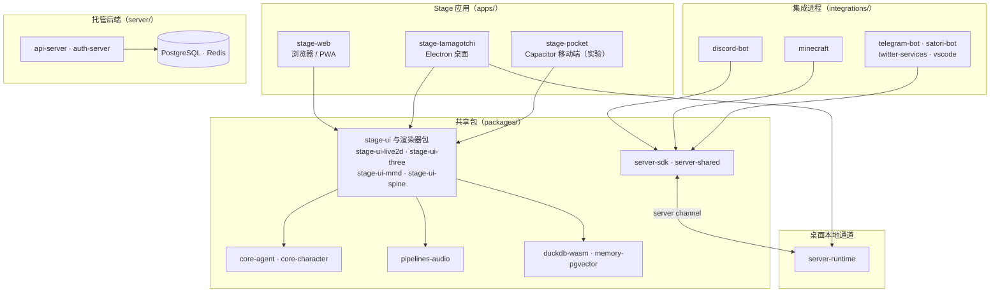

# AIRI 参考项目调研

调研入口：[调研与技术选型](调研与技术选型.md)

工程架构：[项目整体架构设计](../architecture/项目整体架构设计.md)

<aside>

本文档的唯一上位目标是 [绫音 AI 数字生命](../product/产品愿景与总纲.md)。本页只记录对同类开源项目 AIRI 的调研结论，不修改任何已确认的产品目标与架构决策；若本页结论与上位文档冲突，以上位文档为准。

研究范围：对照 AIRI 的产品形态、运行时位置、身体表现、语音、视觉、记忆和协议边界，评估它可作为绫音参考的部分与不可照搬的部分。不覆盖智能家居、VR、全息和机器人落地。

证据等级：本页结论分为【已确认】【建议】【待验证】三类。【已确认】包括 2026-09-28 对 GitHub 官方接口、仓库原始文件与发布信息的核查，以及截至 2026-09-29 对 AIRI 固定提交 `2155df934b2f4398b5e2c4642175405b866a2054` 的有限源码抽查；源码抽查只覆盖文末列出的文件，不代表完成全仓库逐行阅读或运行时全链路验证。【建议】是本页提出的参考意见，未经确认不得成为正式决策；【待验证】指尚未取得可引用来源或尚未完成行为验证的事项。

</aside>

## 一、结论摘要

1. AIRI 是一个以 TypeScript monorepo 组织的开源 AI 虚拟伴侣 / AI 虚拟主播项目，具备网页端、Electron 桌面端、Capacitor 移动端以及相对完整的工程文档和发布链路。【已确认】
2. AIRI 的主结构是客户端 / Stage 优先的 monorepo：Stage 应用通过共享包使用 `core-agent`、音频、存储和渲染器；托管后端承担账号与服务，桌面端另有 `server-runtime` 本地通道。因此不能简单概括为“所有状态、记忆和推理都在端侧”。【已确认】
3. AIRI 不能作为绫音的整体架构模板，但在五类具体工程问题上是高价值参考：`core-agent` 的运行时分层与工具轮次、模型与语音供应商适配、角色核心与渲染包解耦、插件与协议拆包、桌面端本地服务通道。【建议】
4. 反向警示仍然成立：安装包体积在 700–900MB 量级；项目持续处于 beta；端侧缓存或实验性记忆不能替代绫音“AI 身份不绑定设备、后端持有权威记忆”的原则。【已确认 + 建议】
5. 本页没有提出任何需要修改架构文档的结论。若后续决定采纳其中某项，应回到对应架构文档确认后再落地。【建议】

## 二、项目概况

| 项目 | 内容 |
| --- | --- |
| 仓库 | [moeru-ai/airi](https://github.com/moeru-ai/airi)，归属 moeru-ai 组织，衍生项目由 [@proj-airi](https://github.com/proj-airi) 组织承载 |
| 定位 | 自托管、用户自有的 AI 虚拟伴侣与 AI 虚拟主播，目标对标 Neuro-sama |
| 许可证 | MIT（[LICENSE](https://github.com/moeru-ai/airi/blob/main/LICENSE)，由 GitHub API 与仓库文件双向确认） |
| 主要语言 | TypeScript |
| 创建时间 | 2024-12-01 |
| 规模（2026-09-28） | 49,689 stars、4,946 forks、238 open issues |
| 最新版本 | [v0.12.0-beta.5](https://github.com/moeru-ai/airi/releases/tag/v0.12.0-beta.5)，2026-08-29 发布 |
| 技术栈 | Vue 3 + UnoCSS + Three.js；pnpm workspace + turbo；Electron 桌面端；Capacitor 移动端 |
| 发布产物 | Windows 安装器、macOS dmg/zip、Linux deb/rpm/flatpak、Android apk、iOS ipa |
| 文档站 | [airi.moeru.ai/docs](https://airi.moeru.ai/docs/)，另有[简体中文 README](https://github.com/moeru-ai/airi/blob/main/docs/README.zh-CN.md) |
| 本地化 | [Crowdin 翻译项目](https://crowdin.com/project/proj-airi) |

仓库结构（依据仓库根目录、`apps/`、`packages/`、`integrations/`、`engines/` 的实际枚举重绘；实线表示运行时调用或数据流，双向箭头表示双向通道）：

> 该图描述仓库与模块之间的承载与调用关系，不代表绫音的架构；`engines/` 当前只有 `stage-tamagotchi-godot`，未纳入上图。

## 三、能力范围

AIRI 用「感官 + 身体」的隐喻组织能力，README 的进度清单可归纳为：【已确认】

| 维度 | 已实现能力 |
| --- | --- |
| 大脑 | Minecraft、Factorio（PoC 在独立仓库）、Kerbal Space Program；Telegram 与 Discord 聊天；浏览器内数据库（DuckDB WASM / pglite）；Memory Alaya 仍为 WIP |
| 听觉 | 浏览器音频输入、Discord 音频输入、端侧语音识别、端侧说话检测 |
| 表达 | 多供应商语音合成：ElevenLabs、Microsoft/Azure Speech、OpenAI-compatible TTS、阿里云百炼、本地 Kokoro TTS；v0.12.0-beta.5 增加本地 VOICEVOX 与 AivisSpeech |
| 身体 | VRM 与 Live2D 模型控制、自动眨眼、自动注视、待机视线；另渲染器包中包含 MMD、Spine 与立绘方向 |
| 模型接入 | 统一走自研 [xsai](https://github.com/moeru-ai/xsai)，README 列出 32 个供应商条目，其中 29 个标记为已支持 |
| 集成 | `integrations/` 下为 discord-bot、minecraft、satori-bot、telegram-bot、twitter-services、vscode；Factorio 与 MCP 在独立仓库 |

## 四、关键设计取向

1. **三端同构，Web 技术贯穿**：`stage-web`、`stage-tamagotchi`（Electron）、`stage-pocket`（Capacitor）共用同一套 Vue 应用与 `stage-ui` 包，渲染层是浏览器内 WebGL（Live2D / VRM / MMD / Spine）。【已确认】
2. **端侧存储与权威归属需要区分**：浏览器内数据库使用 DuckDB WASM 或 pglite，仓库中另有 `duckdb-wasm`、`drizzle-duckdb-wasm`、`memory-pgvector` 等包；README 中 Memory Alaya 标为 WIP。现有证据足以确认端侧存储和实验能力存在，但不足以证明 AIRI 已形成完整的跨设备权威 Memory 链路。【已确认 + 待验证】
3. **模型接入收敛在一层**：所有 LLM 供应商通过 xsai 以 OpenAI-compatible 方式接入，`packages/provider-inference` 承载推理供应商相关定义。【已确认】
4. **语音采用端侧与多供应商并行路线**：README 明确列出端侧语音识别与端侧说话检测；语音合成为多供应商 + 本地引擎双路线。这是 AIRI 的工程事实，不等同于绫音已确认的服务端语音边界。【已确认】
5. **Agent 核心独立成包并通过 Port 分层**：`packages/core-agent/src` 下分为 `agents`、`contracts`、`runtime`、`session`、`messages`、`types`、`utils`；当前源码中的 `AgentContextPort`、`AgentSessionPort`、`AgentLLMPort` 分别隔离上下文、会话持久化和模型请求生命周期。`Conversation`、`Turn`、`AssistantTurn.rounds` 表达一次生成中的工具轮次和模型调用边界。【已确认】
6. **角色核心包目前仍是占位入口**：固定提交中的 `packages/core-character/src/index.ts` 仅导出空模块；角色表现能力不能仅依据包名认定为已完成，当前应结合 `stage-ui-*`、音频管线和驱动包阅读。【已确认】
7. **协议与插件显式拆包**：存在 `plugin-protocol`、`plugin-sdk`、`plugin-sdk-tamagotchi` 三个包，把插件协议、插件开发接口与宿主相关接口分开。【已确认】
8. **桌面端本地服务通道**：`server-runtime` 作为桌面侧本地服务，`server-sdk` 供外部集成进程以 SDK 方式接入；该层更接近插件注册、心跳和集成通信，不等同于绫音的 `ayane-agent-service`。【已确认 + 建议】
9. **托管后端承担账号**：README 结构图给出 Caddy → api-server / auth-server → PostgreSQL / Redis 的托管后端形态，`server/` 目录含 docker-compose 编排。【已确认】
10. **当前 Memory 包不能证明完整领域实现**：固定提交中的 `packages/memory-pgvector/src/index.ts` 主要初始化 `server-sdk` 客户端，`module:configure` 回调为空；它不能被解释为已经具备完整的服务端 Identity / Memory 读写模型。【已确认】
11. **发布体积很大**：v0.12.0-beta.5 的 Windows 安装器约 733MB，macOS 与 Linux 产物约 700–925MB，Android apk 约 206MB。【已确认】

### 源码抽查边界

本次源码抽查覆盖以下固定提交文件：

- `packages/core-agent/README.md`：运行时职责、Conversation / Turn / AssistantTurn rounds、Provider continuation 与展示投影。
- `packages/core-agent/src/contracts/context-port.ts`：`AgentContextPort`，负责上下文摄取、快照和重置。
- `packages/core-agent/src/contracts/session-port.ts`：`AgentSessionPort`，负责会话建立、历史消息和生成计数。
- `packages/core-agent/src/contracts/llm-port.ts`：`AgentLLMPort`，由选定的 Provider adapter 负责请求生命周期。
- `packages/core-character/src/index.ts`：当前仅导出空模块。
- `packages/memory-pgvector/src/index.ts`：当前主要初始化 `server-sdk` 客户端，未展示 Memory 读写或检索实现。

上述内容足以修正本文的模块边界判断，但不等于完成全仓库逐行阅读、实际应用启动验证、工具全链路验证或跨设备同步验证。【已确认 + 待验证】

## 五、与绫音的逐项对照

下表「绫音已确认决策」列只做定位，权威陈述见《项目整体架构设计》与各仓库架构文档；本表不替代那些文档。

| 维度 | AIRI 做法【已确认】 | 绫音已确认决策 | 差异性质 |
| --- | --- | --- | --- |
| 客户端技术栈 | Vue 3 + TypeScript，Electron 与 Capacitor 打包 | `ayane-client` 单仓库，KMP + Compose 覆盖 Desktop / Android / iOS | 路线不同，不可混用 |
| 身体表现 | 浏览器内 WebGL 渲染 Live2D / VRM / MMD / Spine | Unity 独立仓库发布版本化产物，客户端通过 Bridge 消费 | 路线不同 |
| 推理位置 | Stage 应用共享 `core-agent` 与 Provider adapter；桌面端另有本地服务通道。本次未证明 Agent 权威运行时全部由托管后端承担 | Agent 运行时在 `ayane-agent-service`，只调用云端 OpenAI-compatible API | 边界不同 |
| 记忆归属 | 端侧数据库（DuckDB WASM / pglite 等）与实验性 Memory 包并存；当前入口不足以证明完整权威 Memory | 记忆属于 AI 身份，权威读写在后端，不绑定设备 | 直接冲突 |
| 语音 | 端侧识别与说话检测，多供应商或本地合成 | 语音层在服务端统一识别与合成，端侧只采集、播放与本地打断检测 | 直接冲突 |
| 视觉 | 有屏幕与摄像头相关包的痕迹，README 未把视觉列为已完成项 | 客户端采集与在场检测，服务端视觉层做屏幕内容理解与人脸跟踪 | 部分可参考 |
| 协议边界 | `core-agent` 的 Port、Provider projection 和展示投影服务于 AIRI 运行时；`plugin-protocol` 定义插件协议 | 具身协议与 Agent 动作协议是稳定边界，契约是唯一来源，Phase 1 由 `ayane-agent-service` 的 `contracts` 模块承载 | 可参考，不复用协议 |
| 扩展机制 | 插件包 + 桌面本地服务 + 外部集成进程 | Phase 1 不做插件体系，但保留协议层演进空间 | 可参考 |
| 账号与托管 | 托管后端提供 api-server / auth-server / PostgreSQL / Redis | 账号自建、多用户多 Agent、按「用户 + Agent」隔离 | 同向，可对照 |
| 多设备一致性 | 状态可留在端侧，跨设备一致性依赖托管账号能力 | 同一 AI 身份在 Desktop / Android / iOS 上是同一个她，服务端是权威副本 | 直接冲突 |
| 发布体积 | 桌面安装包 700–900MB 量级 | 阶段验收要求 Desktop 为首个完整验证端 | 需规避 |
| 许可证 | MIT，可参考实现代码 | — | 有利 |

## 六、可作为参考的部分

以下全部为【建议】，均未采纳；每条给出与绫音哪一层相关，便于后续决定去哪个文档落地。

| 参考点 | AIRI 中的位置 | 与绫音相关的层 | 建议动作 |
| --- | --- | --- | --- |
| Agent Runtime 的 Port 与工具轮次 | `packages/core-agent/README.md`、`packages/core-agent/src/contracts/`；`Conversation` / `Turn` / `AssistantTurn.rounds` | `AgentService` Runtime、Session、Context 和模型适配边界 | 参考职责拆分和运行记录粒度，不把 AIRI 类型直接变成绫音协议 |
| Provider projection 与展示投影 | `core-agent` 的 Provider adapter、continuation 和 display projection | 模型适配层、Action Event 与客户端展示层 | 保持模型原生数据、运行时记录和客户端展示数据分层 |
| 多供应商语音适配与统一端点 | `packages/pipelines-audio`；同组织的 [`unspeech`](https://github.com/moeru-ai/unspeech) 把 `/audio/speech` 与 `/audio/transcriptions` 统一为代理端点 | 服务端语音层 | 先读接口形态，再决定绫音语音层的供应商抽象是否需要同构设计 |
| 模型供应商收敛为单一适配层 | `packages/provider-inference` 与 xsai | Agent 运行时的模型适配层 | 对照绫音「云端 OpenAI-compatible API 可替换」的验收标准，检查供应商切换的边界是否足够 |
| 角色核心与渲染包解耦 | `core-character` 与多个 `stage-ui-*` 渲染器包分离 | 具身协议与表现适配 | 作为「Agent 只输出动作、身体只消费动作」的另一种实现样本对照阅读；同时保留其当前 `core-character` 入口仍是占位的事实 |
| 协议与插件分层拆包 | `plugin-protocol` / `plugin-sdk` / `plugin-sdk-tamagotchi` | 契约与协议演进 | 参考它把「协议」「开发接口」「宿主接口」拆成三个包的做法，评估对 Agent 动作协议版本化的启发 |
| 桌面端本地服务通道 | `server-runtime` + `server-sdk`，外部集成进程通过 SDK 接入 | Desktop 客户端的集成能力 | 若 Desktop 后续要接 Discord、Minecraft 一类需要长连接或 TCP 的集成，评估该模式是否比在客户端内直接实现更清晰 |
| 端侧采集的降级策略 | 端侧说话检测与端侧识别在服务不可用时仍可工作 | 语音层与视觉层的降级要求 | 对照绫音「识别或合成不可用时退回文本」的验收标准，参考其端侧保底思路 |
| 工程工具链 | turbo + vitest 浏览器模式 + 场景截图回归（`vishot`）+ Nix flake + Crowdin 多语言 | 工程实践 | 作为多端仓库的工程质量参照，不涉及绫音架构决策 |

## 七、不建议照搬的部分

以下均为【建议】。

1. **把端侧缓存或实验性记忆当作权威 Memory**：与「AI 身份不绑定设备、服务端是权威副本」直接冲突，照搬会让跨设备一致性失去保证。
2. **把 AIRI 的端侧 Agent 运行时直接当作绫音的后端边界**：AIRI 的 `core-agent` Port 和 `server-runtime` 可以参考，但不能替代 `ayane-agent-service` 的 Identity、Memory、World Model 和 Agent Runtime 权属。
3. **用 Web 技术渲染 3D 身体**：绫音已确定 Unity 作为身体表现层，重复一套浏览器渲染只会增加维护面。
4. **把状态放在客户端缓存之外的端侧存储**：可作为离线缓存参考，但不能成为记忆的权威来源。
5. **大体积桌面打包**：AIRI 桌面产物在 700MB 以上，绫音 Desktop 是主验证端，打包体积应在早期就纳入约束。
6. **以插件体系作为 Phase 1 目标**：AIRI 的插件体系是长期演进结果，绫音 Phase 1 的范围不包含插件市场或第三方扩展。

## 八、两者共同点

抛开实现路线，AIRI 与绫音在三点上判断一致，可作为绫音方向的旁证：【建议】

- 都把「身体」视为可替换载体，角色本身与具体设备、具体引擎分离。
- 都把模型与语音供应商视为可替换的一层，不把某个具体模型当作产品本体。
- 都按「同一个她在多端出现」来组织产品，而不是每个端各做一个 AI。

## 九、待验证事项

以下事项本次未取得可引用来源或尚未完成行为验证，使用前需再核实：【待验证】

1. 桌面端本地推理（README 提到借助 candle 使用 CUDA / Metal）与仓库 `engines/` 目录的关系：`engines/` 当前只有 `stage-tamagotchi-godot`，二者是否属于同一路线尚不明确。
2. 端侧语音识别的当前实现形态：v0.12.0-beta.5 的发布说明提到旧 transcription 包及其 CI 命令已被移除，README 的「端侧语音识别」在最新版本的落点需要重新确认。
3. `core-agent` 的 Port 和运行时源码已做有限抽查，但尚未完成工具轮次、Provider continuation、展示投影与实际 Stage 应用之间的全链路追踪；它与绫音契约模块的可比性仍需在行为层验证。
4. 人格、情绪、关系是否有服务端权威实现：README 的能力清单中只有记忆相关条目，未见与绫音 AI 身份等价的分层描述。
5. 视觉能力的最新状态：README 未把视觉列入已完成项，需确认其屏幕与摄像头相关包的成熟度。
6. 第三方依赖与运行时的许可证：仓库自身为 MIT，但 Live2D 等运行时 SDK 的授权条款需要单独核实，不能按 MIT 推断。
7. 跨设备一致性做法：端侧数据库与托管账号之间如何同步，README 与结构图均未说明。

## 十、建议的深入阅读顺序

若要把 AIRI 读透，建议按下列顺序，先读与绫音决策最相关的部分：【建议】

1. 简体中文 README 与文档站总览，建立能力边界认知。
2. `packages/provider-inference` 与 xsai，理解模型供应商抽象。
3. `packages/pipelines-audio` 与 `unspeech` 仓库，理解语音层端点形态。
4. `packages/core-agent/src` 的 `agents`、`contracts`、`runtime`、`session`，理解其核心分层。
5. `packages/plugin-protocol`、`plugin-sdk`，理解协议拆包方式。
6. `packages/core-character` 与 `packages/stage-ui-live2d`，理解核心与渲染的解耦。
7. `packages/server-runtime` 与 `packages/server-sdk`，理解桌面本地服务通道。
8. `apps/stage-tamagotchi` 的构建与打包配置，理解其发布体积的构成。

## 参考来源

- [moeru-ai/airi](https://github.com/moeru-ai/airi)
- [LICENSE](https://github.com/moeru-ai/airi/blob/main/LICENSE)
- [README](https://github.com/moeru-ai/airi/blob/main/README.md) 与[简体中文 README](https://github.com/moeru-ai/airi/blob/main/docs/README.zh-CN.md)
- [package.json](https://github.com/moeru-ai/airi/blob/main/package.json)
- 目录枚举：[apps/](https://github.com/moeru-ai/airi/tree/main/apps)、[packages/](https://github.com/moeru-ai/airi/tree/main/packages)、[integrations/](https://github.com/moeru-ai/airi/tree/main/integrations)、[engines/](https://github.com/moeru-ai/airi/tree/main/engines)
- [Release v0.12.0-beta.5](https://github.com/moeru-ai/airi/releases/tag/v0.12.0-beta.5)
- [xsai](https://github.com/moeru-ai/xsai)、[unspeech](https://github.com/moeru-ai/unspeech)
- [文档站](https://airi.moeru.ai/docs/)、[DevLog 2026.03.23（移动端性能与游戏引擎探索）](https://airi.moeru.ai/docs/en/blog/DevLog-2026.03.23/)、[DevLog 2025.10.20（Electron 迁移）](https://airi.moeru.ai/docs/en/blog/DevLog-2025.10.20/)
- 源码抽查提交：[2155df9](https://github.com/moeru-ai/airi/commit/2155df934b2f4398b5e2c4642175405b866a2054)
- [core-agent README](https://github.com/moeru-ai/airi/blob/2155df934b2f4398b5e2c4642175405b866a2054/packages/core-agent/README.md)
- [core-agent contracts](https://github.com/moeru-ai/airi/tree/2155df934b2f4398b5e2c4642175405b866a2054/packages/core-agent/src/contracts)
- [core-character 入口](https://github.com/moeru-ai/airi/blob/2155df934b2f4398b5e2c4642175405b866a2054/packages/core-character/src/index.ts)
- [memory-pgvector 入口](https://github.com/moeru-ai/airi/blob/2155df934b2f4398b5e2c4642175405b866a2054/packages/memory-pgvector/src/index.ts)

以上项目能力、许可证与版本信息的元数据核查日期：2026-09-28。源码抽查日期：2026-09-29；抽查固定提交 `2155df934b2f4398b5e2c4642175405b866a2054`，范围为 `core-agent` README、三个 Port、`core-character` 入口和 `memory-pgvector` 入口。核查方式包括 GitHub 官方 API、LICENSE、package.json、目录枚举、最新 Release、README、发布说明及有限源码阅读；未完成全仓库逐行阅读、运行时全链路验证、实际设备验证或跨设备同步验证，因此超出列出文件范围的源码级结论仍标为【待验证】。
